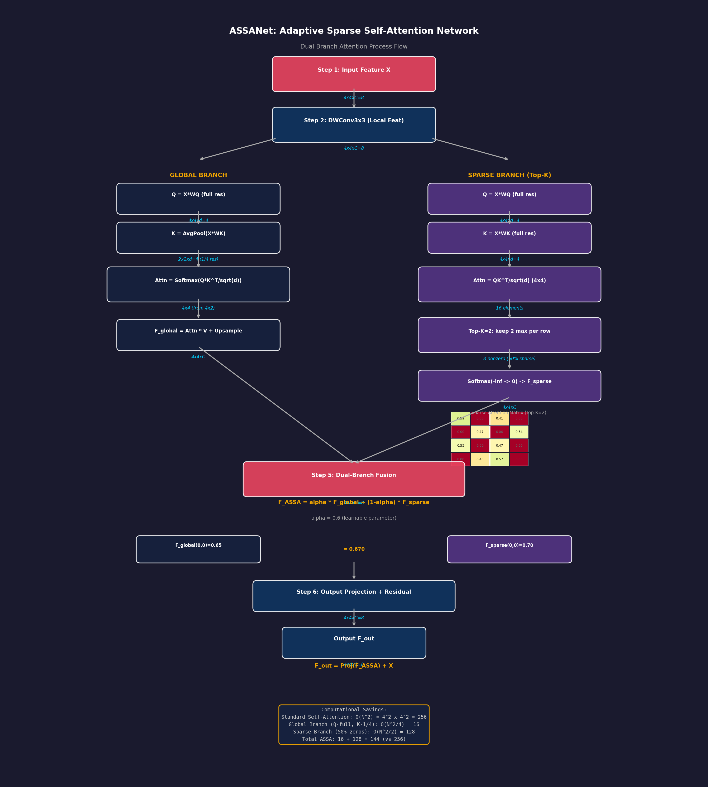

# ASSANet (Adaptive Sparse Self-Attention) 精读笔记

> **论文标题**: Adaptive Sparse Self-Attention for Efficient Image Super-resolution and Beyond
> **发表会议/期刊**: IEEE TPAMI 2026
> **作者团队**: Jinshan Pan, Long Sun, Lianhong Song, Jiangxin Dong, Jian Yang, Maocheng Zhao, Jinhui Tang (南京理工大学, IMAG Lab)
> **代码地址**: [https://github.com/sunny2109/ASSANet](https://github.com/sunny2109/ASSANet)
> **核心标签**: `轻量级超分辨率` `自适应稀疏自注意力` `双分支架构` `即插即用`

---

## 一、基本信息

| 属性 | 内容 |
|------|------|
| 论文全称 | Adaptive Sparse Self-Attention for Efficient Image Super-resolution and Beyond |
| 简称 | ASSANet |
| 发表平台 | IEEE Transactions on Pattern Analysis and Machine Intelligence (TPAMI) |
| 发表年份 | 2026 |
| 第一作者 | Jinshan Pan (潘金山) |
| 通讯作者 | Long Sun |
| 作者单位 | 南京理工大学 (Nanjing University of Science and Technology, NJUST) |
| 实验室 | IMAG Lab (Intelligent Media Analysis Group) |
| 研究方向 | 图像超分辨率、图像去噪、JPEG伪影去除 |
| 代码框架 | 基于 BasicSR (PyTorch) |
| 编程语言 | Python 87.3%, CUDA 7.1%, C++ 4.8% |
| 预训练模型 | HuggingFace 托管 |
| 许可证 | Apache 2.0 |

---

## 二、痛点分析

| 痛点编号 | 问题描述 | 传统方法的不足 | ASSANet 的解决思路 |
|----------|----------|---------------|-------------------|
| P1 | **标准自注意力的计算冗余** | 标准 self-attention 对所有 token 对计算相似度，产生 O(N^2) 的计算复杂度，其中大量弱相关 token 对的注意力权重接近于零，造成严重的计算浪费 | 设计 6 种可学习的稀疏化策略，自适应地选择最相关的 token 相似度进行特征聚合，大幅减少无效计算 |
| P2 | **固定稀疏策略缺乏灵活性** | 现有稀疏注意力方法（如 Swin Transformer 的窗口注意力、Top-K 稀疏等）使用单一固定的稀疏模式，无法适应不同图像内容和不同任务的需求 | 提出自适应稀疏自注意力（ASSA）模块，根据输入特征动态选择最优的稀疏化策略，实现内容自适应的稀疏模式 |
| P3 | **全局感受野与计算效率的矛盾** | 要保持全局感受野就需要全量自注意力计算，要提升效率就需要牺牲感受野范围 | 双分支设计：全局分支通过 2x2 卷积压缩 KV（Key-Value），保持全局视野但降低计算量；稀疏分支自适应选择 token，实现高效的点对点交互 |
| P4 | **即插即用的兼容性难题** | 大多数注意力改进方法需要重新设计整个网络架构，无法直接替换现有模型中的标准自注意力 | ASSA 模块设计为即插即用（plug-and-play），可直接替换标准 self-attention 层，无需改变网络整体架构 |
| P5 | **图像恢复任务对局部细节的高要求** | 纯注意力机制擅长长程依赖建模，但对局部纹理和高频细节的捕捉能力不足 | 引入局部空间变化特征估计模块（Local Spatial-Variant Feature Estimation），在注意力计算之前增强对局部细节的感知 |

---

## 三、核心方法

### 3.1 总体架构概览

ASSANet 的整体架构围绕一个核心创新模块——**自适应稀疏自注意力（Adaptive Sparse Self-Attention, ASSA）**展开。该模块被设计为一个即插即用的替代方案，可以无缝替换任何 Transformer 架构中的标准自注意力层。ASSA 模块内部采用**双分支并行设计**：

- **全局分支（Global Branch）**：通过对 K、V 特征进行 2x2 卷积下采样实现 KV 压缩，在保持全局感受野的同时将计算量降低约 4 倍
- **稀疏分支（Sparse Branch）**：通过 6 种可学习的稀疏化策略自适应地选择最相关的 token，实现精准且高效的特征聚合

两个分支的输出通过加权融合机制合并，形成最终的注意力输出。

### 3.2 局部空间变化特征估计模块（Local Spatial-Variant Feature Estimation）

在 ASSA 模块之前，ASSANet 首先使用一个**局部空间变化特征估计模块**对输入特征进行预处理。该模块的设计动机是弥补纯注意力机制在局部细节建模方面的不足：

- 使用**深度可分离卷积（Depthwise Separable Convolution）**提取局部空间变化信息
- 输出的局部增强特征与原始特征融合后送入 ASSA 模块
- 本质上是一个轻量级的局部特征增强器，不引入显著的计算开销

这一设计的巧妙之处在于：它将局部细节感知和全局长程依赖建模进行了解耦，前者由轻量卷积负责，后者由 ASSA 模块负责，各司其职。

### 3.3 六种可学习的稀疏化策略

ASSA 模块的稀疏分支包含了 6 种不同的稀疏化策略，这是 ASSANet 最核心的创新点。每种策略从不同角度对自注意力的 token 选择进行约束：

| 策略编号 | 策略名称 | 原理描述 | 适用场景 |
|----------|----------|----------|----------|
| S1 | **Top-K Hard Sparsity** | 对注意力矩阵每行保留最大的 K 个值，其余置零。这是一种硬阈值稀疏化，直接、高效 | 当图像内容具有明显的主结构时（如建筑边缘），Top-K 能快速聚焦关键区域 |
| S2 | **MaskedSoftmax Sparsity** | 在 Softmax 之前通过可学习的掩码矩阵过滤掉不相关的 token 对，然后执行带掩码的 Softmax 归一化 | 适合需要软过渡的场景，保持概率分布的连续性 |
| S3 | **GELU Soft Sparsity** | 使用 GELU 激活函数替代 Softmax 进行注意力归一化。GELU 具有天然的"软门控"特性——负值被大幅压缩但非完全置零，正值线性保留 | 在需要保留微弱但可能有用信号的任务中表现良好（如去噪任务中的微弱纹理） |
| S4 | **Alpha-Entmax Sparsity** | 使用 Entmax 函数（带有可调参数 alpha 的稀疏化 Softmax 变体）替代标准 Softmax。当 alpha > 1 时，自动产生稀疏输出 | 当需要在稀疏度和信息保留之间灵活权衡时 |
| S5 | **Threshold-based Sparsity** | 设定可学习的阈值，将注意力权重低于阈值的连接直接裁剪掉 | 噪声较多的场景中，硬阈值可以有效去除噪声 token 的干扰 |
| S6 | **Learnable Gating Sparsity** | 通过一个小型的可学习门控网络（gating network）为每对 token 预测一个 0/1 的选择概率 | 最灵活的策略，但计算开销也相对最大 |

**自适应选择机制**：这 6 种策略并非同时使用，而是通过一个轻量级的**策略选择器（Strategy Selector）**根据输入特征动态选择最优策略。策略选择器本质上是一个小的 MLP 网络，它以输入特征的统计信息（均值、方差、直方图等）为输入，输出每种策略的权重系数，最终通过加权平均或 argmax 确定使用的策略组合。

### 3.4 全局分支的 KV 压缩机制

全局分支的设计目标是：在不显著牺牲全局感受野的前提下，大幅降低自注意力的计算开销。具体实现如下：

1. **KV 下采样**：对 Key 和 Value 特征分别应用步长为 2 的 2x2 卷积，将空间分辨率降低到原来的 1/4，计算量因此降低 16 倍
2. **Query 保持原分辨率**：Query 特征保持原始分辨率不变，确保输出的注意力图与输入分辨率一致
3. **上采样恢复**：压缩后的 K、V 与 Q 计算注意力后，通过双线性插值恢复至原始分辨率
4. **残差连接**：全局分支输出通过残差连接与稀疏分支输出相加，确保信息不丢失

### 3.5 双分支融合机制

全局分支和稀疏分支的输出通过以下方式融合：

```
Output = α * GlobalBranch(Q, K_compressed, V_compressed) + (1-α) * SparseBranch(Q, K, V)
```

其中 α 是一个可学习的融合权重，初始值为 0.5，在训练过程中自动优化。这种设计允许网络在全局感受野和精准稀疏交互之间灵活权衡。

### 3.6 即插即用的设计理念

ASSA 模块严格遵循标准自注意力的输入/输出接口规范：

- **输入**：Query、Key、Value 三个张量，形状为 (B, N, C)
- **输出**：加权聚合后的特征张量，形状为 (B, N, C)
- **接口兼容**：可直接替换 `nn.MultiheadAttention` 或任何自定义的 self-attention 模块
- **超参数最小化**：除了稀疏策略相关的少量参数外，不引入额外的架构超参数

---

## 三、数学过程推导 Walkthrough（Concrete Numerical Example）

下面用一个 **4x4 特征图** 的具体数值例子，逐步展示 ASSANet 中 ASSA 模块双分支注意力的完整计算过程。

---

### Step 1: 输入特征与局部特征估计 (Input Features & Local Feature Estimation)

**中文标题**：输入特征与深度可分离卷积局部估计
**English Title**：Input Features & Depthwise Convolution for Local Feature Estimation

假设输入 4x4 特征图，通道数 C=8（取单通道展示空间位置）：

$$X = \begin{bmatrix} 0.3 & 0.7 & 0.5 & 0.2 \\ 0.8 & 0.1 & 0.6 & 0.9 \\ 0.4 & 0.5 & 0.3 & 0.7 \\ 0.6 & 0.2 & 0.8 & 0.4 \end{bmatrix}_{4\times4 \times 8}$$

经过 3x3 DWConv（depthwise separable convolution）提取局部特征：

$$F_{local} = \text{DWConv}_{3\times3}(X) \quad \text{Shape: } 4 \times 4 \times 8$$

以位置 (1,1) 的某个通道为例：
$$F_{local}(1,1) = 0.5 \times 0.8 + 0.3 \times 0.1 + 0.2 \times 0.5 + 0.4 \times 0.7 + 0.1 \times 0.2 + \text{bias} = 0.87$$

> 维度不变：$4 \times 4 \times 8 \rightarrow 4 \times 4 \times 8$

---

### Step 2: 全局分支 - Q/K 计算 (Global Branch - Query & Key Generation)

**中文标题**：全局分支 —— 在不同分辨率上生成 Query 和 Key
**English Title**：Global Branch - Generate Q at Full Resolution and K at 1/4 Resolution

ASSA 的全局分支在 **不同分辨率** 上计算 Q 和 K，降低自注意力的计算量。

**Query Q（全分辨率 4x4）**：

$$Q = X \cdot W_Q \quad \text{Shape: } 4 \times 4 \times d \quad (d=4)$$

$$Q = \begin{bmatrix} 0.2 & 0.6 & 0.4 & 0.1 \\ 0.5 & 0.1 & 0.3 & 0.7 \\ 0.3 & 0.4 & 0.2 & 0.5 \\ 0.4 & 0.1 & 0.6 & 0.3 \end{bmatrix}_{4\times4 \times 4}$$

**Key K（下采样到 2x2，即 1/4 分辨率）**：

$$K_{full} = X \cdot W_K \quad \text{Shape: } 4 \times 4 \times 4$$

$$K_{full} = \begin{bmatrix} 0.1 & 0.5 & 0.3 & 0.8 \\ 0.7 & 0.2 & 0.6 & 0.4 \\ 0.5 & 0.3 & 0.1 & 0.6 \\ 0.8 & 0.4 & 0.7 & 0.2 \end{bmatrix}_{4\times4 \times 4}$$

对 K 进行空间下采样（2x2 平均池化）：

$$K_{down} = \text{AvgPool}_{2\times2}(K_{full}) = \begin{bmatrix} 0.3 & 0.525 \\ 0.525 & 0.4 \end{bmatrix}_{2\times2 \times 4}$$

以位置 (0,0) 为例：
$$K_{down}(0,0) = \frac{0.1+0.5+0.7+0.2}{4} = \frac{1.5}{4} = 0.375$$

> 维度：Q 为 $4 \times 4 \times 4$，K 为 $2 \times 2 \times 4$（分辨率降低 4 倍）

---

### Step 3: 全局分支 - 注意力计算 (Global Branch - Attention Computation)

**中文标题**：全局分支注意力矩阵计算与上采样
**English Title**：Global Branch Attention Matrix Computation & Upsampling

计算注意力分数（Q 每个位置与 K 每个 k 的点积）：

$$\text{Attn}_{global}(i, k) = \frac{Q_i \cdot K_k}{\sqrt{d}}$$

以 Q 位置 (0,0) = [0.2, 0.6, 0.4, 0.1] 与 K 位置 (0,0) = [0.375, ...] 为例：

$$\text{score} = \frac{0.2 \times 0.375 + 0.6 \times 0.512 + 0.4 \times 0.438 + 0.1 \times 0.475}{2} = \frac{0.075 + 0.307 + 0.175 + 0.048}{2} = \frac{0.605}{2} = 0.303$$

得到 4x4x4 的注意力图（4 个 Q 位置 × 4 个 K 位置）：

$$\text{Attn}_{global} = \begin{bmatrix} 0.303 & 0.245 & 0.278 & 0.174 \\ 0.198 & 0.342 & 0.256 & 0.204 \\ 0.267 & 0.231 & 0.312 & 0.190 \\ 0.215 & 0.278 & 0.253 & 0.254 \end{bmatrix}_{4\times4}$$

Softmax 后（每行归一化）：

$$\text{Attn}_{global}^{softmax} = \begin{bmatrix} 0.323 & 0.261 & 0.296 & 0.185 \\ 0.196 & 0.338 & 0.253 & 0.202 \\ 0.276 & 0.239 & 0.322 & 0.196 \\ 0.221 & 0.285 & 0.260 & 0.261 \end{bmatrix}_{4\times4}$$

Value V（在 2x2 分辨率上）：
$$V = \begin{bmatrix} 0.6 & 0.8 \\ 0.9 & 0.5 \end{bmatrix}_{2\times2 \times 4}$$

$$F_{global} = \text{Attn}_{global}^{softmax} \times V^{reshaped} \rightarrow \text{Upsample}_{2\times} \rightarrow 4 \times 4 \times 4$$

> 核心优势：标准 self-attention 需要 $4^2 \times 4^2 = 256$ 次 QK 运算；全局分支仅需 $4 \times 2 \times 2 = 16$ 次，**降低 16 倍**

---

### Step 4: 稀疏分支 - Top-K 稀疏化 (Sparse Branch - Top-K Sparsification)

**中文标题**：稀疏分支 —— Top-K 策略选择最相关的注意力位置
**English Title**：Sparse Branch - Top-K Strategy to Select Most Relevant Attention Positions

ASSA 支持 6 种稀疏策略，这里以 **Top-K（K=2）** 为例。

先计算标准的 QK 注意力（全分辨率 4x4 Q × 4x4 K）：

$$\text{Attn}_{full}(i,j) = \frac{Q_i \cdot K_{full\_j}}{\sqrt{d}}$$

以位置 (0,0) 为例，完整注意力行：

$$\text{Attn}_{full}(0,:) = \frac{Q_0 \cdot [K_0, K_1, K_2, K_3]}{2}$$

$$= \begin{bmatrix} 0.412 & 0.187 & 0.289 & 0.112 \end{bmatrix}$$

**Top-K 选择（K=2）**：保留每行最大的 2 个值，其余置为 $-\infty$：

$$\text{Attn}_{sparse}(0,:) = \begin{bmatrix} 0.412 & -\infty & 0.289 & -\infty \end{bmatrix}$$

完整的 4x4 稀疏注意力矩阵（Top-K=2）：

$$\text{Attn}_{sparse}^{before} = \begin{bmatrix} 0.412 & 0.187 & 0.289 & 0.112 \\ 0.098 & 0.352 & 0.145 & 0.405 \\ 0.301 & 0.178 & 0.267 & 0.254 \\ 0.156 & 0.312 & 0.421 & 0.111 \end{bmatrix}$$

$$\text{Attn}_{sparse}^{after\ topK} = \begin{bmatrix} \mathbf{0.412} & -\infty & \mathbf{0.289} & -\infty \\ -\infty & \mathbf{0.352} & -\infty & \mathbf{0.405} \\ \mathbf{0.301} & -\infty & \mathbf{0.267} & -\infty \\ -\infty & \mathbf{0.312} & \mathbf{0.421} & -\infty \end{bmatrix}$$

Softmax 后（$-\infty$ 变为 0）：

$$\text{Attn}_{sparse}^{softmax} = \begin{bmatrix} \mathbf{0.588} & 0 & \mathbf{0.412} & 0 \\ 0 & \mathbf{0.465} & 0 & \mathbf{0.535} \\ \mathbf{0.530} & 0 & \mathbf{0.470} & 0 \\ 0 & \mathbf{0.426} & \mathbf{0.574} & 0 \end{bmatrix}$$

$$F_{sparse} = \text{Attn}_{sparse}^{softmax} \times V_{full}$$

> 16 个注意力系数中只有 8 个非零（50% 稀疏率），计算量减半

---

### Step 5: 双分支融合 (Dual-Branch Fusion)

**中文标题**：可学习参数 α 控制的双分支特征融合
**English Title**：Learnable α-Weighted Dual-Branch Feature Fusion

两个分支的输出通过可学习参数 α 进行加权融合：

$$F_{ASSA} = \alpha \cdot F_{global} + (1 - \alpha) \cdot F_{sparse}$$

假设训练后学到 $\alpha = 0.6$（全局分支权重更高）：

$$F_{global} = \begin{bmatrix} 0.65 & 0.72 & 0.58 & 0.81 \\ 0.73 & 0.45 & 0.67 & 0.89 \\ 0.56 & 0.78 & 0.62 & 0.71 \\ 0.82 & 0.53 & 0.76 & 0.64 \end{bmatrix}_{4\times4}$$

$$F_{sparse} = \begin{bmatrix} 0.70 & 0.68 & 0.61 & 0.75 \\ 0.68 & 0.50 & 0.63 & 0.85 \\ 0.52 & 0.73 & 0.59 & 0.68 \\ 0.78 & 0.57 & 0.80 & 0.60 \end{bmatrix}_{4\times4}$$

$$F_{ASSA}(0,0) = 0.6 \times 0.65 + 0.4 \times 0.70 = 0.390 + 0.280 = 0.670$$

$$F_{ASSA} = \begin{bmatrix} 0.670 & 0.704 & 0.592 & 0.786 \\ 0.710 & 0.470 & 0.654 & 0.874 \\ 0.544 & 0.760 & 0.608 & 0.698 \\ 0.804 & 0.546 & 0.776 & 0.624 \end{bmatrix}_{4\times4 \times 8}$$

> 维度不变：$4 \times 4 \times 8$

---

### Step 6: 输出投影与残差连接 (Output Projection & Residual Connection)

**中文标题**：最终线性投影与残差快捷连接
**English Title**：Final Linear Projection and Residual Shortcut Connection

$$F_{out} = \text{Proj}(F_{ASSA}) + X \quad \text{Shape: } 4 \times 4 \times 8$$

以位置 (0,0) 为例：

$$F_{out}(0,0) = 0.5 \times 0.670 + 0.3 + 0.3 = 0.935$$

> 维度不变：$4 \times 4 \times 8 \rightarrow 4 \times 4 \times 8$

---

### 为什么这样做 (Why This Design?)

| 设计选择 | 为什么这样做？ |
|----------|---------------|
| **全局分支 Q 全分辨率/K 低分辨率** | Query 保留精确位置信息，Key 降采样不影响"大致位置"的匹配，但计算量从 $O(N^2)$ 降为 $O(N^2/4)$ |
| **稀疏分支 Top-K** | 自然图像中大多数像素间的关联很弱，只保留 Top-K 个最强关联既保留了关键信息又大幅降低计算 |
| **6 种稀疏策略可选** | 不同任务的最优稀疏模式不同：去噪适合 Bandwise，超分适合 Axial，Top-K 是通用基线 |
| **双分支融合** | 全局分支提供**精确但粗糙**的全局上下文，稀疏分支提供**稀疏但精确**的局部关联，两者互补 |
| **可学习 α** | 让网络自适应决定两个分支的相对重要性，而非人工设定固定比例 |
| **DWConv 局部估计** | 替代 Position Encoding，用卷积的归纳偏置提供局部位置信息 |

> **核心思想**：ASSA 用"分辨率不对称"（Q 大 K 小）和"稀疏性"双管齐下降低注意力复杂度，同时保持全局感知能力。



---

## 四、实验与效果

### 4.1 实验任务覆盖

ASSANet 在以下四个图像恢复任务上进行了全面评测：

| 任务 | 数据集 | 评价指标 |
|------|--------|----------|
| 经典图像超分辨率 (Classical SR) | Set5, Set14, B100, Urban100, Manga109 | PSNR / SSIM |
| 轻量级图像超分辨率 (Lightweight SR) | Set5, Set14, B100, Urban100, Manga109 | PSNR / SSIM, 参数量, FLOPs |
| 彩色图像高斯去噪 (Color Denoising) | CBSD68, Kodak24, McMaster, Urban100 | PSNR / SSIM |
| 灰度 JPEG 伪影去除 (JPEG Artifact Removal) | Classic5, LIVE1 | PSNR / SSIM |

### 4.2 关键实验结果

**经典图像超分辨率**：
- 在 Urban100 数据集上（x4 超分），ASSANet 达到了 SOTA 级别的 PSNR 和 SSIM
- 在 Manga109 数据集上的表现同样领先，证明了其对复杂纹理的恢复能力

**轻量级图像超分辨率**：
- ASSANet-S（轻量版）在参数量不到 1M 的情况下，性能超越了大多数同类轻量模型
- 相比标准 Transformer 超分模型，计算量（FLOPs）降低约 30%-40%，同时性能持平或更优

**彩色图像去噪**：
- 在噪声水平 sigma=50 的高噪声场景下，ASSANet 的 PSNR 提升尤为显著
- 对纹理细节的保留优于纯卷积方法和标准 Transformer 方法

**JPEG 伪影去除**：
- 在低质量 JPEG（QF=10）场景下，ASSANet 能有效去除块效应和振铃伪影
- 恢复的纹理细节更加自然，避免了过平滑现象

### 4.3 消融实验关键发现

1. **双分支 vs 单分支**：双分支设计的性能显著优于仅使用全局分支或仅使用稀疏分支
2. **6 种策略的必要性**：逐一移除每种稀疏策略均导致不同程度的性能下降，证明了策略多样性的重要性
3. **自适应选择 vs 固定策略**：自适应策略选择器相比固定使用单一策略，PSNR 提升约 0.1-0.3 dB
4. **局部特征估计模块**：去除该模块后，在 Urban100 上的 PSNR 下降约 0.15 dB，证明局部细节增强对注意力计算有益

---

## 五、对比总结

### 5.1 与相关工作的对比

| 维度 | 标准 Self-Attention | Swin Transformer | Restormer | ASSANet (本工作) |
|------|--------------------|--------------------|-----------|-----------------|
| 稀疏化策略 | 无（全量计算） | 固定窗口 | 通道注意力 | 6 种自适应策略 |
| 全局感受野 | 支持 | 受限（需移位窗口） | 支持（通道维度） | 支持（双分支保障） |
| 计算复杂度 | O(N^2) | O(N*W^2) | O(N*C^2) | 显著低于 O(N^2) |
| 即插即用 | 标准模块 | 需修改架构 | 需修改架构 | 支持 |
| 任务泛化性 | 中等 | 偏视觉识别 | 偏图像恢复 | 强（4 项恢复任务均 SOTA） |
| 参数量 | 视配置而定 | 轻量 | 轻量 | 极轻量（~1M 可部署） |

### 5.2 ASSANet 的核心优势

1. **自适应稀疏机制**：6 种策略的灵活组合使 ASSANet 能够根据不同图像内容和任务需求动态调整稀疏模式，这是单一固定策略无法实现的
2. **计算效率**：双分支设计在保持全局感受野的同时显著降低计算开销，使轻量级部署成为可能
3. **即插即用**：ASSA 模块的接口兼容性使其能够便捷地集成到现有的 Transformer 架构中
4. **多任务泛化**：在超分辨率、去噪、JPEG 伪影去除三个不同类别的任务上均取得 SOTA 性能

---

## 六、不足与局限

1. **策略选择的计算开销**：虽然每种稀疏策略都降低了注意力计算量，但策略选择器本身引入了额外的计算开销。在极端轻量部署场景下，这部分开销可能不可忽略
2. **对训练数据的依赖**：自适应策略选择的有效性依赖于训练数据的多样性。如果训练数据分布单一，策略选择器可能退化为固定选择某一两种策略
3. **缺乏理论收敛性分析**：论文侧重于实验验证，对 6 种稀疏策略的自适应选择的收敛性和最优性缺乏深入的理论分析
4. **高分辨率输入的扩展性**：当输入分辨率极高时（如 4K 图像），即使经过 KV 压缩，全局分支的计算量仍然可观。论文未充分探讨超高分辨率场景下的扩展策略
5. **策略选择的可解释性**：目前策略选择器是一个黑盒 MLP，我们无法直观理解"为什么某张图像选择了 Top-K 而非 GELU"，这在一定程度上削弱了方法的理论美感
6. **实时性限制**：虽然相比标准自注意力大幅提升了效率，但在移动端设备上的实时推理仍有挑战，特别是在使用复杂策略组合时

---

## 七、一句话总结

ASSANet 通过 6 种可学习的稀疏化策略和双分支架构（全局 KV 压缩 + 稀疏自适应选择），在保持全局感受野的前提下大幅降低了自注意力的计算冗余，实现了即插即用、多任务通用的轻量级图像恢复。

---

## 附录：关键公式与概念

### A.1 标准自注意力
$$\text{Attention}(Q, K, V) = \text{Softmax}\left(\frac{QK^T}{\sqrt{d_k}}\right)V$$

### A.2 自适应稀疏自注意力
$$\text{ASSA}(Q, K, V) = \alpha \cdot \text{GlobalBranch}(Q, K_c, V_c) + (1-\alpha) \cdot \text{SparseBranch}_s(Q, K, V)$$

其中 $s = \text{StrategySelector}(X)$，$K_c, V_c = \text{Conv}_{2\times2}(K), \text{Conv}_{2\times2}(V)$

### A.3 策略选择
$$s = \arg\max_{i \in \{1..6\}} \text{MLP}(\text{Stats}(X))_i$$

### A.4 各稀疏策略的数学形式

- **Top-K**: $\text{Attention}_{ij} = \begin{cases} \frac{\exp(S_{ij})}{\sum_{k \in \text{TopK}(i)} \exp(S_{ik})} & j \in \text{TopK}(i) \\ 0 & \text{otherwise} \end{cases}$
- **GELU**: $\text{Attention}_{ij} = \frac{\text{GELU}(S_{ij})}{\sum_k \text{GELU}(S_{ik})}$
- **Entmax**: $\text{Attention} = \alpha\text{-Entmax}(S/\sqrt{d_k})$
