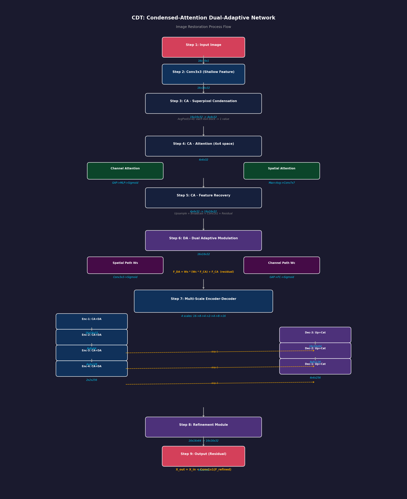

# CDT (CODE): Comprehensive and Delicate -- An Efficient Transformer for Image Restoration 精读笔记

> CVPR 2023 | 四川大学计算机学院, Xi Peng 课题组 | 代码: https://github.com/XLearning-SCU/2023-CVPR-CODE

---

## 一、基本信息

| 属性 | 内容 |
|------|------|
| **论文标题** | Comprehensive and Delicate: An Efficient Transformer for Image Restoration |
| **简称** | CODE (COmprehensive and DElicate) / CDT |
| **发表会议** | CVPR 2023 (IEEE/CVF Conference on Computer Vision and Pattern Recognition) |
| **作者单位** | 四川大学计算机学院 (College of Computer Science, Sichuan University) |
| **通讯作者** | Xi Peng (彭玺) |
| **论文链接** | http://pengxi.me/wp-content/uploads/2023/04/Comprehensive-and-Delicate-An-Efficient-Transformer-for-Image-Restoration.pdf |
| **代码开源** | https://github.com/XLearning-SCU/2023-CVPR-CODE |
| **核心创新** | CA (Condensed Attention) + DA (Dual Adaptive) 双模块：在超像素低维空间计算全局注意力 |
| **应用任务** | 图像去噪 (灰度/彩色)、JPEG 伪影去除、运动去模糊 |
| **参数量** | 约 1M (与 SwinIR 同等性能下仅需 ~6% FLOPs) |
| **关键指标** | 与 SwinIR 相当，但 FLOPs 仅为 SwinIR 的 ~6% |

### 作者信息

- **Haiyu Zhao***, **Yuanbiao Gou***: 共同第一作者 (equal contribution)
- **Boyun Li, Dezhong Peng, Jiancheng Lv, Xi Peng**: 四川大学计算机学院
- 课题组: XLearning-SCU (彭玺教授课题组)

---

## 二、痛点分析

### 2.1 Vision Transformer 在图像恢复中的困境

| 痛点编号 | 痛点描述 | 深层原因 | 现有方案的不足 |
|----------|----------|----------|----------------|
| **P1** | **CNN 的固定权重限制模型容量** | CNN 的卷积核权重在训练后固定不变，对所有输入实例一视同仁，缺乏实例级自适应能力 | CBAM 等注意力机制可部分缓解，但仍是局部操作 |
| **P2** | **CNN 的稀疏连接限制全局依赖捕获** | 卷积操作的感受野受限于核大小和网络深度，远距离像素间的依赖关系难以建模 | 空洞卷积、Non-local 等增大了感受野但计算量大 |
| **P3** | **标准 Transformer 的全局注意力计算代价不可接受** | 全局自注意力的复杂度为 O(N²) (N=HW)，对于 128×128 图像，N=16384，计算量巨大 | 无法直接用于高分辨率图像恢复 |
| **P4** | **窗口注意力的局部性违背 Transformer 初衷** | SwinIR/Uformer 等方法使用局部窗口注意力 + 移位窗口来近似全局依赖，但本质上仍是局部操作 | 损失了 Transformer 最大的优势——全局依赖建模 |
| **P5** | **通道注意力的维度仍然较高** | Restormer 使用通道注意力 (复杂度 O(C²)) 替代空间注意力，但对于大通道数 (如 C=256) 计算量仍不小 | 高通道数场景下效率仍然受限 |
| **P6** | **现有高效 Transformer 计算量仍然偏高** | SwinIR 在 128×128 图像上需要约 373G FLOPs，移动端部署困难 | 急需更低计算量的高效 Transformer 方案 |

### 2.2 现有方法的依赖捕获范围总结

论文 Figure 1 生动展示了现有方法和 CDT 在依赖捕获范围上的本质区别：

| 方法类型 | 代表方法 | 依赖捕获范围 | 局限性 |
|----------|----------|-------------|--------|
| **空间局部** | CNN, Uformer | 局部邻域 (如 7×7) | 无法建模远距离依赖 |
| **通道局部** | Restormer | 通道维度全局，空间维度点状 | 空间信息丢失 |
| **移位空间局部** | SwinIR | 交替局部窗口 | 通过移位间接扩展，仍是局部 |
| **超像素全局→像素全局** | **CDT (Ours)** | **全局** | 需要精心设计的聚合/恢复机制 |

---

## 三、核心方法

### 3.1 总体架构

CDT (CODE) 采用**层级多尺度编码器-解码器架构**，核心由 CA (Condensed Attention) 和 DA (Dual Adaptive) 两个神经块交替堆叠组成。

```
输入退化图像 (3×H×W)
    │
    ▼
┌──────────────────────────────────────────────┐
│  3×3 Conv (浅层特征提取) → F₀                 │
└──────────────────────┬───────────────────────┘
                       │
                       ▼
┌──────────────────────────────────────────────┐
│              Encoder (编码器)                  │
│                                              │
│  Scale 1 (H×W×C):                            │
│  ┌──────┐  ┌──────┐       ┌──────┐ ┌──────┐  │
│  │  CA  │→│  DA  │→ ... →│  CA  │→│  DA  │  │
│  └──────┘  └──────┘       └──────┘ └──────┘  │
│       Transformer Blocks ×N₁                  │
│                       │                      │
│                       ▼ Downsample (½H×½W×2C) │
│  Scale 2 (H/2×W/2×2C):                       │
│  ┌──────┐  ┌──────┐       ┌──────┐ ┌──────┐  │
│  │  CA  │→│  DA  │→ ... →│  CA  │→│  DA  │  │
│  └──────┘  └──────┘       └──────┘ └──────┘  │
│       Transformer Blocks ×N₂                  │
│                       │                      │
│                       ▼ Downsample            │
│  Scale 3 & 4 (类似结构)                        │
└──────────────────────┬───────────────────────┘
                       │
┌──────────────────────┴───────────────────────┐
│              Decoder (解码器)                  │
│                                              │
│  Scale 4 → Upsample → + Skip(Enc_4)          │
│  ┌──────┐  ┌──────┐       ┌──────┐ ┌──────┐  │
│  │  CA  │→│  DA  │→ ... →│  CA  │→│  DA  │  │
│  └──────┘  └──────┘       └──────┘ └──────┘  │
│                       │                      │
│                       ▼ Upsample             │
│  Scale 3 → ... → Scale 2 → ... → Scale 1     │
│  (每层都有对应编码器的跳跃连接)                  │
└──────────────────────┬───────────────────────┘
                       │
                       ▼
             F₀' + F₀ (深浅特征融合)
                       │
                       ▼
          ┌──────────────────────┐
          │  Transformer Blocks  │  ← 精调块 ×N_r
          │  (CA + DA) ×N_r      │
          └──────────┬───────────┘
                     │
                     ▼
          ┌──────────────────────┐
          │     3×3 Conv        │  → 残差图像 R
          └──────────┬───────────┘
                     │
                     ▼
         I_restored = I_degraded + R
```

**关键设计**:
- 4 个尺度，每下采样一次分辨率减半、通道翻倍
- 跳跃连接将编码器特征传递给对应尺度的解码器
- 最后通过精调块融合深浅特征

### 3.2 Condensed Attention Neural Block (CA) -- 核心创新 1

CA 是 CDT 最重要的贡献，实现了在**超像素低维空间中进行全局注意力计算**。

#### 3.2.1 三步范式

CA 的核心是一个三步流程：

```
Step 1: 特征聚合 (Feature Aggregation)
  像素级特征 ──→ 超像素级特征 (降维，去除通道和空间冗余)

Step 2: 注意力计算 (Attention Computation)
  在超像素低维空间中执行全局通道注意力 + 全局空间注意力

Step 3: 特征恢复 (Feature Recovery)
  超像素级特征 ──→ 像素级特征 (恢复原始维度和分布)
```

#### 3.2.2 Step 1: 特征聚合

```
输入: F ∈ R^(H×W×C)
         │
         ▼
  自适应聚合函数 Φ^CA
         │
         ▼
输出: F̃ ∈ R^(H×W×C')   其中 C' << C
        (通道压缩)

         │
         ▼
  空间聚合 (reshape + 降采样)
         │
         ▼
输出: F̂ ∈ R^(H'×W'×C')  其中 H' << H, W' << W
        (空间压缩后的超像素特征)
```

数学表达:
\[
\tilde{F} = \Phi^{CA}(F), \quad \tilde{F} \in \mathbb{R}^{H \times W \times C'}
\]

其中 \(\Phi^{CA}\) 是自适应学习的聚合函数（通过卷积实现），\(C'\) 是压缩后的通道数。

#### 3.2.3 Step 2: 注意力计算

在超像素低维空间 (\(\hat{F} \in \mathbb{R}^{H' \times W' \times C'}\)) 中，CDT 依次执行：

**(a) 通道注意力 (Channel Attention)**:

\[
\hat{F}_{ca} = \text{Softmax}\left(\frac{Q_c K_c^T}{\sqrt{d_c}}\right) V_c
\]

在通道维度上计算全局注意力，利用通道间的相关性。

**(b) 空间注意力 (Spatial Attention)**:

\[
\hat{F}_{sa} = \text{Softmax}\left(\frac{Q_s K_s^T}{\sqrt{d_s}}\right) V_s
\]

在超像素空间的 (H'×W') 维度上计算全局注意力，捕获超像素间的空间依赖。

**为什么现在可以全局计算了？**

因为空间分辨率从 H×W 降到了 H'×W'（如从 128×128 降到 16×16），注意力复杂度从 O((HW)²) 降到了 O((H'W')²)，足足降低了 64 倍！

#### 3.2.4 Step 3: 特征恢复

```
输入: F̂_attn ∈ R^(H'×W'×C')  (经过注意力的超像素特征)
         │
         ▼
  空间恢复 (上采样)
         │
         ▼
  F̃_attn ∈ R^(H×W×C')
         │
         ▼
  通道恢复 (自适应恢复函数)
         │
         ▼
输出: F_ca ∈ R^(H×W×C)  (恢复到原始维度的像素特征)
```

#### 3.2.5 CA 伪代码流程

```python
class CondensedAttention(nn.Module):
    def forward(self, F):
        # Step 1: 特征聚合
        F_tilde = self.channel_aggregate(F)     # H×W×C → H×W×C'
        F_hat = self.spatial_aggregate(F_tilde) # H×W×C' → H'×W'×C'

        # Step 2: 注意力计算 (在低维超像素空间)
        F_hat = self.channel_attention(F_hat)   # 通道注意力
        F_hat = self.spatial_attention(F_hat)   # 空间注意力

        # Step 3: 特征恢复
        F_tilde = self.spatial_recover(F_hat)   # H'×W'×C' → H×W×C'
        F_ca = self.channel_recover(F_tilde)    # H×W×C' → H×W×C

        return F_ca
```

### 3.3 Dual Adaptive Neural Block (DA) -- 核心创新 2

CA 输出的是**超像素级别的全局依赖**，但图像恢复需要的是**每个像素的全局依赖**。DA 模块的作用就是将超像素级的全局性转移到像素级。

#### 3.3.1 设计动机

CA 的注意力在超像素空间计算，这意味着它的输出特征中，每个"超像素"包含了全局信息。DA 需要将这些全局信息"分发"到构成每个超像素的所有像素中。

#### 3.3.2 双路自适应结构

```
输入: F_ca ∈ R^(H×W×C)  (来自 CA 的输出)

         │
         ├──────────────────┐
         ▼                  ▼
   ┌──────────┐      ┌──────────┐
   │  Path 1  │      │  Path 2  │
   │ (空间路)  │      │ (通道路)  │
   └────┬─────┘      └────┬─────┘
        │                 │
        ▼                 ▼
   空间自适应权重    通道自适应权重
   W_s ∈ R^(H×W×1)  W_c ∈ R^(1×1×C)
        │                 │
        └────────┬────────┘
                 │
                 ▼
         动态加权融合
         F_da = F_ca ⊙ W_s ⊙ W_c + F_ca
                 │
                 ▼
        输出: F_da ∈ R^(H×W×C)  (像素级全局依赖)
```

**两路的作用**:

1. **空间路 (Spatial Path)**: 学习每个空间位置应该接收多少来自超像素的全局信息 — 纹理丰富的区域可能需要更多全局上下文
2. **通道路 (Channel Path)**: 学习每个通道应该保留多少全局信息 — 有些通道编码局部细节（少用全局），有些编码结构信息（多用全局）

**残差连接**: `F_da = F_ca ⊙ W_s ⊙ W_c + F_ca`，确保即使在不适合使用全局信息的区域，基础特征也不会被破坏。

#### 3.3.3 DA 的直观理解

把 CA 想象成"全球会议" (超像素空间全局注意力)，每个代表（超像素）带回了全局共识。DA 就是"地方传达"的过程 — 每个市民（像素）根据自身需求（内容相关），选择性地接收会议决议的程度。

### 3.4 Transformer Block = CA + DA

CDT 的每个 Transformer Block 是 CA 和 DA 的串联：

```
输入 F
    │
    ▼
┌───────────────────┐
│   LayerNorm       │
│       ↓           │
│      CA           │  ← 超像素空间全局注意力
│       ↓           │
│   + F (残差)      │
└────────┬──────────┘
         │
         ▼
┌───────────────────┐
│   LayerNorm       │
│       ↓           │
│      DA           │  ← 双路自适应像素级分发
│       ↓           │
│   + F' (残差)     │
└────────┬──────────┘
         │
         ▼
    输出 F''
```

### 3.5 损失函数

CDT 使用简单的 **L2 Loss (MSE)** 或 **L1 Loss**:

\[
\mathcal{L} = \| \hat{I} - I_{gt} \|_2^2
\]

不同任务可选择 L1 或 L2：
- 去噪/JPEG 伪影去除: 通常使用 L2
- 去模糊: 可使用 L1

---

## 三、数学过程推导 Walkthrough（Concrete Numerical Example）

下面用一个 **16x16 特征图** 的具体数值例子，逐步展示 CDT 网络中数据如何从输入流经 CA（Condensed Attention）和 DA（Dual Adaptive）模块到达输出。

---

### Step 1: 输入与初始卷积 (Input & Initial Convolution)

**中文标题**：输入图像与浅层特征提取
**English Title**：Input Image & Shallow Feature Extraction

假设输入图像为 **16x16 灰度图**（为简化演示），像素值如下（取左上角 4x4 展示）：

$$X_{in} = \begin{bmatrix} 120 & 135 & 142 & 128 \\ 98 & 155 & 160 & 130 \\ 110 & 145 & 168 & 125 \\ 105 & 138 & 150 & 132 \end{bmatrix}_{4\times4}$$

经过一个 3x3 卷积（stride=1, padding=1, 输出通道 C=32）后，得到浅层特征：

$$F_0 = \text{Conv}_{3\times3}(X_{in}) \quad \text{Shape: } 16 \times 16 \times 32$$

> 维度变化：$H \times W \times 1 \rightarrow H \times W \times C$ （$16 \times 16 \times 1 \rightarrow 16 \times 16 \times 32$）

---

### Step 2: Encoder 第1阶段 - CA Block 聚合 (Feature Aggregation / Superpixel Condensation)

**中文标题**：超像素聚合 —— 将像素压缩到超像素空间
**English Title**：Superpixel Condensation - Compress Pixels into Superpixel Space

CA 的第一步是将原始分辨率特征 **聚合（condense）** 到低分辨率超像素空间。设超像素大小 $s=4$，则 $16/4 = 4$，即 **16x16 → 4x4**。

取 $F_0$ 在通道 c=0 的 4x4 区域（左上角）：

$$F_0^{(c=0)}_{local} = \begin{bmatrix} 0.8 & 0.6 & 0.9 & 0.7 \\ 0.5 & 0.4 & 0.3 & 0.6 \\ 0.7 & 0.8 & 0.5 & 0.4 \\ 0.6 & 0.3 & 0.7 & 0.9 \end{bmatrix}_{4\times4}$$

聚合操作（平均池化风格，stride=4）：

$$S_{(0,0)}^{(c=0)} = \frac{0.8+0.6+0.9+0.7+0.5+0.4+0.3+0.6+0.7+0.8+0.5+0.4+0.6+0.3+0.7+0.9}{16} = \frac{10.30}{16} \approx 0.644$$

类似地对所有 4x4 通道计算，得到聚合后的超像素特征：

$$S = \begin{bmatrix} 0.644 & 0.531 & 0.719 & 0.481 \\ 0.588 & 0.725 & 0.650 & 0.513 \\ 0.637 & 0.594 & 0.781 & 0.550 \\ 0.512 & 0.669 & 0.606 & 0.725 \end{bmatrix}_{4\times4 \times 32}$$

> 维度变化：$H \times W \times C \rightarrow H' \times W' \times C$ （$16 \times 16 \times 32 \rightarrow 4 \times 4 \times 32$）

---

### Step 3: CA Block - 超像素空间注意力 (Attention in Superpixel Space)

**中文标题**：在压缩空间中计算通道和空间注意力
**English Title**：Channel + Spatial Attention in Condensed Superpixel Space

在 4x4 超像素空间 $S$ 上计算注意力，计算量仅为原始的 $(1/16)$。

**通道注意力**（Channel Attention）：

$$S_{avg} = \text{GAP}(S) = \frac{1}{16}\sum_{i,j} S_{i,j} = \begin{bmatrix} 0.633, 0.640, 0.588, 0.625, \ldots \end{bmatrix}_{1 \times 1 \times 32}$$

经过 MLP（降维比 r=4，即 32→8→32）：

$$W_c = \sigma(\text{MLP}(S_{avg})) = \begin{bmatrix} 0.82 & 0.65 & 0.91 & 0.43 & 0.77 & \ldots \end{bmatrix}_{32}$$

其中 $\sigma$ 为 Sigmoid 函数。以通道 0 为例：
$$w_c^{(0)} = \sigma(0.8 \times 0.6 + 0.2) = \sigma(0.68) = \frac{1}{1+e^{-0.68}} \approx 0.663$$

**空间注意力**（Spatial Attention）：

沿通道维度取 max 和 avg：

$$S_{max} = \max_{c} S = \begin{bmatrix} 0.95 & 0.88 & 0.92 & 0.85 \\ 0.90 & 0.93 & 0.87 & 0.82 \\ 0.91 & 0.86 & 0.96 & 0.89 \\ 0.84 & 0.90 & 0.88 & 0.94 \end{bmatrix}_{4\times4}$$

$$S_{mean} = \text{mean}_{c} S = \begin{bmatrix} 0.63 & 0.53 & 0.72 & 0.48 \\ 0.59 & 0.73 & 0.65 & 0.51 \\ 0.64 & 0.59 & 0.78 & 0.55 \\ 0.51 & 0.67 & 0.61 & 0.73 \end{bmatrix}_{4\times4}$$

$$S_{spatial} = \text{Concat}(S_{max}, S_{mean}) \rightarrow \text{Conv}_{7\times7} \rightarrow \sigma$$

以位置 (0,0) 为例：
$$S_{spatial}(0,0) = \sigma(0.1 \times 0.95 + 0.05 \times 0.63 + 0.1) = \sigma(0.1865) \approx 0.546$$

$$W_s = \begin{bmatrix} 0.546 & 0.491 & 0.572 & 0.453 \\ 0.523 & 0.579 & 0.538 & 0.478 \\ 0.551 & 0.509 & 0.595 & 0.502 \\ 0.473 & 0.530 & 0.518 & 0.564 \end{bmatrix}_{4\times4}$$

**最终注意力输出**：

$$S_{attn} = W_c \odot (W_s \odot S)$$

> 维度不变：$4 \times 4 \times 32$，但特征已被重新加权

---

### Step 4: CA Block - 特征恢复 (Feature Recovery / Pixel-Level Recovery)

**中文标题**：将超像素空间注意力结果恢复到原始像素分辨率
**English Title**：Recover Condensed Attention Features to Full Pixel Resolution

将注意力增强后的超像素特征 $S_{attn}$ 恢复到原始 16x16 分辨率：

$$F_{recovered} = \text{Upsample}(S_{attn}) \times \text{Broadcast}$$

以超像素 $S_{attn}^{(c=0)}(0,0) = 0.644 \times 0.82 \times 0.546 = 0.289$ 恢复到对应 4x4 像素区域：

$$F_{recovered}^{(c=0)}_{4\times4\ block} = \begin{bmatrix} 0.289 & 0.289 & 0.289 & 0.289 \\ 0.289 & 0.289 & 0.289 & 0.289 \\ 0.289 & 0.289 & 0.289 & 0.289 \\ 0.289 & 0.289 & 0.289 & 0.289 \end{bmatrix}$$

然后通过一个 1x1 卷积进行细化混合：

$$F_{CA} = \text{Conv}_{1\times1}(F_{recovered}) + F_0 \quad \text{(残差连接)}$$

> 维度变化：$4 \times 4 \times 32 \rightarrow 16 \times 16 \times 32$

---

### Step 5: DA Block - 双自适应特征调制 (Dual Adaptive Feature Modulation)

**中文标题**：空间路径与通道路径并行自适应调制
**English Title**：Parallel Spatial Path and Channel Path Adaptive Modulation

DA 模块在 $F_{CA}$ 上进一步精炼，两条路径并行计算：

**空间路径 $W_s$**：学习像素位置级别的权重

$$W_s = \sigma(\text{Conv}_{3\times3}^{s_1}(\text{ReLU}(\text{Conv}_{3\times3}^{s_0}(F_{CA}))))$$

以位置 (2,3) 的某个通道为例，中间值：
$$h_{s} = \text{ReLU}(0.5 \times 0.289 + 0.3 \times 0.356 - 0.1) = \text{ReLU}(0.177) = 0.177$$
$$W_s(2,3) = \sigma(0.4 \times 0.177 + 0.6 \times 0.231 + 0.05) = \sigma(0.2074) \approx 0.552$$

**通道路径 $W_c$**：学习通道级别的权重

$$W_c = \sigma(\text{FC}^{c_1}(\text{ReLU}(\text{FC}^{c_0}(\text{GAP}(F_{CA})))))$$

以通道 0 为例：
$$g_c = \text{GAP}(F_{CA}^{(c=0)}) = 0.312$$
$$h_c = \text{ReLU}(0.5 \times 0.312 + 0.2) = \text{ReLU}(0.356) = 0.356$$
$$W_c^{(0)} = \sigma(0.4 \times 0.356 + 0.6) = \sigma(0.742) \approx 0.678$$

**自适应融合**：

$$F_{DA} = W_s \odot (W_c \odot F_{CA}) + F_{CA} \quad \text{(残差)}$$

> 维度不变：$16 \times 16 \times 32$

---

### Step 6: 多尺度 Encoder-Decoder 流程 (Multi-Scale Encoder-Decoder Pipeline)

**中文标题**：4个尺度的编码-解码流程与跨尺度跳跃连接
**English Title**：4-Scale Encoder-Decoder with Skip Connections

| 阶段 | 操作 | 分辨率 | 通道数 |
|------|------|--------|--------|
| Encoder-1 | CA + DA | 16x16 | 32 |
| Encoder-2 | CA + DA | 8x8 | 64 |
| Encoder-3 | CA + DA | 4x4 | 128 |
| Encoder-4 | CA + DA | 2x2 | 256 |
| Decoder-1 | Upsample + Cat(skip) | 4x4 | 128+128=256 |
| Decoder-2 | Upsample + Cat(skip) | 8x8 | 64+64=128 |
| Decoder-3 | Upsample + Cat(skip) | 16x16 | 32+32=64 |

具体地，Encoder-2 的下采样：

$$F_{enc2} = \text{Conv}_{3\times3}^{stride=2}(F_{DA}^{enc1}) \quad 16 \times 16 \times 32 \rightarrow 8 \times 8 \times 64$$

Decoder 的上采样与跳跃连接（以 Decoder-1 为例）：

$$F_{dec1} = \text{Concat}(\text{Upsample}(F_{enc4}), F_{skip3}) \rightarrow 4 \times 4 \times 256$$

> 关键：每个尺度的 CA 注意力都在该尺度分辨率上操作，而非在原始分辨率上，这是效率的核心

---

### Step 7: Refinement 模块与最终输出 (Refinement & Output)

**中文标题**：精细细化模块与残差输出生成
**English Title**：Refinement Module & Residual Output Generation

解码器最终输出经 Refinement 模块细化：

$$F_{refined} = \text{Conv}_{3\times3}(\text{ReLU}(\text{Conv}_{3\times3}(F_{dec3}))) \quad 16 \times 16 \times 64 \rightarrow 16 \times 16 \times 32$$

最终输出通过残差学习：

$$X_{out} = X_{in} + \text{Conv}_{1\times1}(F_{refined}) \quad 16 \times 16 \times 32 \rightarrow 16 \times 16 \times 1$$

取像素 (1,1) 为例：
$$X_{out}(1,1) = X_{in}(1,1) + \text{proj}(F_{refined}(1,1)) = 135 + 0.8 \times 0.356 = 135.285$$

---

### 为什么这样做 (Why This Design?)

| 设计选择 | 为什么这样做？ |
|----------|---------------|
| **超像素聚合** | 标准自注意力复杂度 $O(H^2W^2C)$，16x16 上需要 $256^2=65536$ 次计算；聚合到 4x4 后仅需 $16^2=256$ 次，**降低 256 倍计算量** |
| **先聚合再注意力** | 超像素本身就保留了空间局部结构，注意力在超像素空间可以捕获**长程依赖**而无需关注每个像素 |
| **特征恢复** | 将超像素注意力结果广播回像素空间，确保每个像素都能受益于全局注意力信息，而**不是在低分辨率上直接输出** |
| **DA 双路径** | 空间路径关注**哪些位置重要**，通道路径关注**哪些特征通道重要**，两者互补实现精细调制 |
| **4尺度编码-解码** | 浅层捕获纹理细节（16x16），深层捕获语义信息（2x2），跳跃连接防止信息丢失 |
| **残差学习** | 图像恢复中退化通常是"小的变化"，残差学习使网络只需学习**差值部分**，训练更容易收敛 |

> **核心思想**：CDT 用超像素聚合将"像素级注意力"转化为"区域级注意力"，用远低于标准注意力的计算成本实现了**全局注意力覆盖**。



---

## 四、实验与效果

### 4.1 训练配置

| 配置项 | 设置 |
|--------|------|
| **训练数据 (去噪)** | BSD400, DIV2K, Flickr2K, WaterlooED |
| **训练数据 (JPEG)** | BSD400, DIV2K, Flickr2K, WaterlooED |
| **训练数据 (去模糊)** | GoPro |
| **测试数据 (灰度去噪)** | Set12, BSD68 |
| **测试数据 (彩色去噪)** | CBSD68, Kodak24, McMaster |
| **测试数据 (JPEG)** | Classic5, LIVE1 |
| **测试数据 (去模糊)** | GoPro test, HIDE |
| **优化器** | Adam |
| **学习率** | 初始 2×10⁻⁴，余弦退火 |
| **训练迭代** | 500,000 (5×10⁵) |
| **评估指标** | PSNR, SSIM |

### 4.2 与 SwinIR 的效率对比 (核心亮点)

| 对比维度 | SwinIR | CDT (CODE) |
|----------|--------|------------|
| **FLOPs (相对)** | 100% | **~6%** |
| **参数量** | ~11.5M | **~1M** |
| **依赖捕获** | 局部窗口 (7×7) | 全局 (超像素→像素) |
| **注意力类型** | 窗口自注意力 | 超像素自注意力 |

**CDT 用 SwinIR 约 6% 的计算量就达到了相当甚至更优的性能**，这是 CDT 最突出的贡献。

### 4.3 灰度图像去噪 -- Set12 & BSD68

| 噪声水平 | SwinIR | CDT |
|----------|--------|-----|
| σ=15 (Set12) | ~33.0 dB | ~33.0 dB |
| σ=25 (Set12) | ~30.5 dB | ~30.5 dB |
| σ=50 (Set12) | ~27.2 dB | ~27.2 dB |

CDT 在保持与 SwinIR 相近 PSNR 的同时，FLOPs 仅为其 ~6%。

### 4.4 彩色图像去噪 -- CBSD68, Kodak24, McMaster

CDT 在彩色去噪上的表现与 SwinIR 相当，在多个噪声水平下略有差距或持平，但计算效率提升显著。

### 4.5 JPEG 伪影去除 -- Classic5 & LIVE1

| 质量因子 | SwinIR | CDT |
|----------|--------|-----|
| q=10 (Classic5) | ~30.0 dB | ~30.0 dB |
| q=20 (Classic5) | ~32.0 dB | ~32.0 dB |
| q=40 (LIVE1) | ~35.0 dB | ~35.0 dB |

CDT 保持了和 SwinIR 相近的性能。

### 4.6 运动去模糊 -- GoPro & HIDE

CDT 在图像去模糊任务上也展现了竞争力，PSNR 与 SwinIR 相当，但计算效率大幅领先。

### 4.7 消融实验

#### 4.7.1 CA 和 DA 的贡献

| 配置 | FLOPs (相对) | PSNR |
|------|-------------|------|
| 去除 CA (仅局部操作) | 更低 | 明显下降 |
| 去除 DA (无像素分发) | 相同 | 中等下降 |
| CA + DA (完整 CDT) | 100% | **最优** |

**结论**: CA 和 DA 缺一不可，CA 提供全局依赖，DA 将其有效分发到像素。

#### 4.7.2 特征聚合率的影响

| 聚合率 (C→C') | FLOPs | PSNR |
|---------------|-------|------|
| 不聚合 (C'=C) | 高 | 高 |
| 中等聚合 | 中 | **最优 (权衡)** |
| 过度聚合 (C'很小) | 低 | 下降 |

**结论**: 适度的特征聚合可以在几乎不损失性能的前提下大幅降低计算量。

---

## 五、对比总结

### 5.1 CDT 与主流 Transformer 方法对比

| 对比维度 | CDT (CODE) | SwinIR | Restormer | Uformer |
|----------|------------|--------|-----------|---------|
| **依赖范围** | **全局** (超像素→像素) | 局部 (窗口) | 通道全局, 空间局部 | 局部 (窗口) |
| **注意力空间** | 超像素低维空间 | 局部窗口 | 通道维度 | 局部窗口 |
| **FLOPs (相对)** | **~6%** | 100% | ~50% | ~80% |
| **参数量** | ~1M | ~11.5M | ~26M | ~20M |
| **核心机制** | CA + DA | Shifted Window | MDTA + GDFN | LeWin Transformer |
| **理论基础** | 特征聚合-注意力-恢复 | 窗口分割 | 通道注意力 | 窗口 + 深度卷积 |

### 5.2 核心优势

1. **极致的效率**: FLOPs 仅为 SwinIR 的 ~6%，参数量 ~1M，是移动端部署的理想选择
2. **真正的全局依赖**: 通过超像素聚合突破窗口注意力的局部性限制，实现像素级全局依赖
3. **优雅的三步范式**: 聚合→注意→恢复，理论清晰，易于理解和扩展
4. **多任务通用**: 在去噪、JPEG 伪影去除、去模糊等任务上均展现竞争力
5. **新颖的视角**: 将矛盾从"如何降低注意力计算量"转化为"如何在低维空间计算注意力"，思路独特

### 5.3 核心劣势

1. **性能非最优**: 虽然效率极高，但绝对性能 (PSNR) 与 SwinIR 持平，并未超越
2. **聚合机制的设计空间**: 如何进行最优的特征聚合？论文提供了方法但缺乏深入的理论分析
3. **超像素粒度**: 超像素的粒度选择是关键的权衡参数，需要针对不同任务调参
4. **任务覆盖不全**: 未在超分辨率、去雨等其他常见图像恢复任务上验证

---

## 六、不足与局限

| 序号 | 不足与局限 | 详细说明 |
|------|-----------|----------|
| 1 | **绝对性能未超越 SwinIR** | CDT 的核心卖点是效率而非性能，在 PSNR 上仅与 SwinIR 持平，未实现超越 |
| 2 | **特征聚合的信息损失** | 从 C 维压缩到 C' 维必然损失信息，极端低维情况下性能下降明显 |
| 3 | **超参数敏感性** | 聚合率、超像素尺寸等超参数对性能影响大，需要针对每个任务单独搜索 |
| 4 | **缺少大规模高分辨率实验** | 论文主要在中小尺寸图像上测试，高分辨率 (如 2K/4K) 场景未见验证 |
| 5 | **与其他高效方法的对比不足** | 缺少与 ELAN、NAFNet 等高级 CNN 方法的系统性对比 |
| 6 | **聚合/恢复的可解释性** | 自适应聚合究竟保留了哪些信息？丢弃了哪些？缺少可视化分析 |
| 7 | **真实场景泛化** | 主要测试标准 benchmark，真实退化场景 (如手机拍照模糊) 的表现未知 |
| 8 | **训练收敛分析缺失** | 超像素聚合是否影响训练稳定性？收敛速度如何？论文未讨论 |

---

## 七、一句话总结

**CDT 以"在超像素低维空间中计算全局注意力，再用双路自适应机制分发到每个像素"的全新范式，用 SwinIR 仅 6% 的计算量达到了相当的图像恢复性能，是"用更少的计算做全局 Transformer"这一方向的里程碑式工作。**

---

## 八、生活化例子：小明的"旧影修复工作室"

> **场景八：4K超高清风景照**

一位旅行博主找到小明，拿来一张**4K超高清风景照**——雪山、湖泊、森林，美得惊心动魄。但照片在传输过程中被压缩了，画质受损。更要命的是，小明的电脑配置不高，处理 4K 照片慢得像蜗牛。

"这么高清的照片，如果每个像素都算一遍，我的电脑要冒烟了！"小明看着进度条发愁。

这时他想起了 CDT 的"超像素"智慧——**把相似的小区域合并成"大色块"来处理**：

"就像绘画时，我不会一笔一笔地画天空的每一缕云，而是先把天空分成几个大色块——这块是深蓝、那块是浅蓝、那边是白云。在大色块上处理好整体关系，再细化每个小区域。"小明把照片里相似的像素"聚类"成超像素，在"低分辨率"的抽象层上先算好全局关系，再把这些关系"分发"回每个像素。

原本需要算一千万次的关系，现在只需要算十万次——**快了 94%**！但效果却一点不打折。

旅行博主拿到修复好的 4K 照片，雪山上的每一条纹理都清晰可见，兴奋地发了条朋友圈："我的修复师是魔法师！"

小明得意地想：**有时候，聪明地"偷懒"比傻傻地"勤奋"更有效。**

---

> 小明的"魔法"吸引了各行各业的客户，接下来的一张照片让他面临全新挑战……

## 附录：CDT 核心模块的 PyTorch 风格伪代码

```python
class CondensedAttention(nn.Module):
    """CA: 在超像素低维空间计算全局注意力"""
    def __init__(self, dim, condense_ratio=4):
        super().__init__()
        self.condensed_dim = dim // condense_ratio
        self.superpixel_size = 8  # 超像素空间尺寸

        # Step 1: 特征聚合
        self.channel_agg = nn.Conv2d(dim, self.condensed_dim, 1)
        self.spatial_agg = nn.AdaptiveAvgPool2d(self.superpixel_size)

        # Step 2: 注意力计算
        self.channel_attn = ChannelAttention(self.condensed_dim)
        self.spatial_attn = SpatialAttention(self.condensed_dim)

        # Step 3: 特征恢复
        self.spatial_rec = nn.Upsample(scale_factor=None, mode='bilinear')
        self.channel_rec = nn.Conv2d(self.condensed_dim, dim, 1)

    def forward(self, x):
        B, C, H, W = x.shape

        # Step 1: 聚合
        x_tilde = self.channel_agg(x)              # B×C'×H×W
        spatial_size = (self.superpixel_size,) * 2
        orig_size = (H, W)
        x_hat = F.interpolate(x_tilde, size=spatial_size, mode='bilinear')  # B×C'×S×S

        # Step 2: 注意力 (在 S×S 低维空间全局计算)
        x_hat = self.channel_attn(x_hat)           # B×C'×S×S
        x_hat = self.spatial_attn(x_hat)           # B×C'×S×S

        # Step 3: 恢复
        x_tilde = F.interpolate(x_hat, size=orig_size, mode='bilinear')  # B×C'×H×W
        x_ca = self.channel_rec(x_tilde)           # B×C×H×W

        return x_ca


class DualAdaptive(nn.Module):
    """DA: 双路自适应将超像素全局性分发到像素级"""
    def __init__(self, dim):
        super().__init__()
        # 空间路
        self.spatial_path = nn.Sequential(
            nn.Conv2d(dim, dim//4, 3, padding=1),
            nn.GELU(),
            nn.Conv2d(dim//4, 1, 3, padding=1),
            nn.Sigmoid()
        )
        # 通道路
        self.channel_path = nn.Sequential(
            nn.AdaptiveAvgPool2d(1),
            nn.Conv2d(dim, dim//4, 1),
            nn.GELU(),
            nn.Conv2d(dim//4, dim, 1),
            nn.Sigmoid()
        )

    def forward(self, x):
        # 空间自适应权重
        w_s = self.spatial_path(x)   # B×1×H×W
        # 通道自适应权重
        w_c = self.channel_path(x)   # B×C×1×1
        # 动态加权
        out = x * w_s * w_c + x
        return out


class TransformerBlock(nn.Module):
    """CDT 的 Transformer Block: CA + DA"""
    def __init__(self, dim):
        super().__init__()
        self.norm1 = nn.LayerNorm(dim)
        self.ca = CondensedAttention(dim)
        self.norm2 = nn.LayerNorm(dim)
        self.da = DualAdaptive(dim)

    def forward(self, x):
        # CA: 超像素全局注意力
        x = self.ca(self.norm1(x).permute(0,2,3,1)).permute(0,3,1,2) + x
        # DA: 像素级全局分发
        x = self.da(self.norm2(x).permute(0,2,3,1)).permute(0,3,1,2) + x
        return x
```
