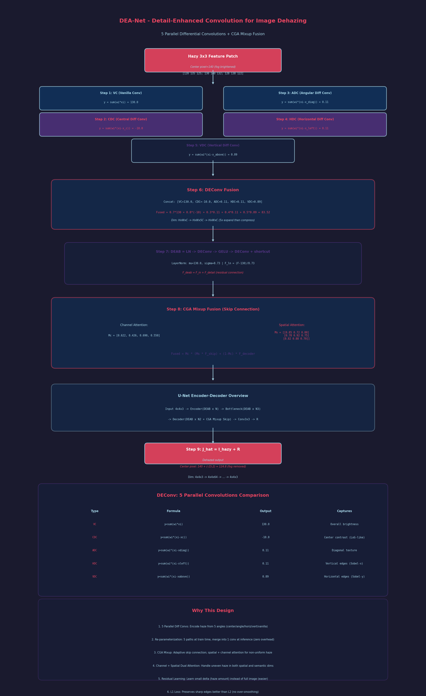

# DEA-Net: Single Image Dehazing based on Detail-Enhanced Convolution and Content-Guided Attention 精读笔记

> arXiv: 2301.04805 | 作者: Zixuan Chen, Zewei He, Zhe-Ming Lu (浙江大学航空航天学院) | 代码: https://github.com/cecret3350/DEA-Net

---

## 一、基本信息

| 属性 | 内容 |
|------|------|
| **论文标题** | DEA-Net: Single image dehazing based on detail-enhanced convolution and content-guided attention |
| **作者单位** | 浙江大学航空航天学院 (School of Aeronautics and Astronautics, Zhejiang University) |
| **通讯作者** | Zhe-Ming Lu (IEEE Senior Member) |
| **论文链接** | https://arxiv.org/abs/2301.04805 |
| **代码开源** | https://github.com/cecret3350/DEA-Net |
| **核心创新** | 细节增强卷积 (DEConv) + 内容引导注意力 (CGA) |
| **应用任务** | 单幅图像去雾 (Single Image Dehazing) |
| **参数量** | 3.653 M |
| **关键指标** | SOTS-Indoor: PSNR > 41 dB; SOTS-Outdoor: ~35 dB |
| **训练数据集** | ITS (Indoor Training Set) / OTS (Outdoor Training Set) |
| **测试数据集** | SOTS-Indoor, SOTS-Outdoor, HazeRD |

### 作者贡献

- **Zixuan Chen** 与 **Zewei He**: 共同第一作者 (equal contribution)
- 基金支持: 中国博士后科学基金 (No. 2022M712792)

---

## 二、痛点分析

### 2.1 图像去雾任务的核心挑战

| 痛点编号 | 痛点描述 | 深层原因 | 现有方案的不足 |
|----------|----------|----------|----------------|
| **P1** | **普通卷积 (Vanilla Conv) 表达能力不足** | 传统卷积在无约束的巨大解空间中搜索，缺乏对图像先验知识 (如暗通道、梯度、纹理) 的利用 | 先验方法 (DCP, CAP) 依赖手工设计的假设，泛化性差；CNN 方法不用先验，表达能力受限 |
| **P2** | **Transformer 方案效率低** | Transformer 需要全域注意力计算，计算量和显存消耗巨大，且需要复杂的训练策略和超参数调优 | SwinIR 等需要 ~373G FLOPs (128x128)，移动端不可用 |
| **P3** | **雾气分布不均匀 (Haze Non-uniformity)** | (a) 图像级别: 薄雾和浓雾区域需要不同的处理力度; (b) 特征级别: 不同通道的特征图承载不同语义，需要通道特定的空间注意力 | 大多数方法只用一个共享的空间注意力图，忽略了特征通道间的语义差异 |
| **P4** | **编解码器跳跃连接中的感受野不匹配** | 浅层特征和深层特征的感受野差异很大，简单加/拼接无法有效融合 | 传统的 skip connection 设计过于简单，导致信息融合不够充分 |
| **P5** | **物理模型依赖导致误差累积** | 早期方法 (DehazeNet, AOD-Net, DCPDN) 需分别估计传输图和大气光，再通过大气散射模型恢复 | 估计误差在多个阶段累积，最终导致恢复质量下降 |

### 2.2 大气散射模型回顾

去雾问题的物理基础是大气散射模型 (Atmospheric Scattering Model, ASM):

\[
I(x) = J(x) \cdot t(x) + A \cdot (1 - t(x))
\]

其中：
- \(I(x)\): 观测到的有雾图像
- \(J(x)\): 待恢复的无雾清晰图像
- \(t(x)\): 透射率图 (transmission map)
- \(A\): 全局大气光 (atmospheric light)

去雾的本质是从已知的 \(I(x)\) 中恢复未知的 \(J(x)\)，这是一个高度不适定的逆问题。

---

## 三、核心方法

### 3.1 总体架构

DEA-Net 采用**U-Net 风格的编解码器架构**，核心由 DEAB (Detail-Enhanced Attention Block) 组成，并引入了基于 CGA 的 Mixup 融合方案。

```
输入有雾图像 (3×H×W)
    │
    ▼
┌──────────────────────────────────────────┐
│              Encoder (编码器)             │
│                                          │
│  ┌─────────────────────────────────┐     │
│  │  3×3 Conv (浅层特征提取)         │     │
│  └──────────────┬──────────────────┘     │
│                 ▼                        │
│  ┌─────────────────────────────────┐     │
│  │  DEAB (Detail-Enhanced Attention│     │
│  │       Block) ×N1                │     │
│  └──────────────┬──────────────────┘     │
│                 ▼ Downsample             │
│  ┌─────────────────────────────────┐     │
│  │  DEAB ×N2                       │     │
│  └──────────────┬──────────────────┘     │
│                 ▼ Downsample             │
│  ┌─────────────────────────────────┐     │
│  │  DEAB ×N3 (Bottleneck)          │     │
│  └──────────────┬──────────────────┘     │
└─────────────────┼────────────────────────┘
                  │
┌─────────────────┼────────────────────────┐
│              Decoder (解码器)             │
│                 ▼ Upsample               │
│  ┌─────────────────────────────────┐     │
│  │  CGA Mixup Fusion (← Skip)      │     │
│  │  DEAB ×N2                       │     │
│  └──────────────┬──────────────────┘     │
│                 ▼ Upsample               │
│  ┌─────────────────────────────────┐     │
│  │  CGA Mixup Fusion (← Skip)      │     │
│  │  DEAB ×N1                       │     │
│  └──────────────┬──────────────────┘     │
└─────────────────┼────────────────────────┘
                  │
                  ▼
         ┌───────────────┐
         │   3×3 Conv    │  → 残差图像
         └───────┬───────┘
                 │
                 ▼
           I_out = I_in + R
                 │
                 ▼
            清晰无雾图像
```

### 3.2 Detail-Enhanced Convolution (DEConv) -- 核心创新 1

#### 3.2.1 设计动机

传统的普通卷积 (Vanilla Convolution) 在特征提取时，只是简单地学习卷积核权重，没有利用任何图像先验知识。而大量研究表明，手工设计的先验 (如梯度、纹理、边缘) 对去雾非常有效。

DEConv 的核心思想是：**将传统局部描述子 (local descriptors) 的差分操作显式编码到卷积层中**，让卷积层天然具备边缘检测、纹理增强等能力。

#### 3.2.2 DEConv 的五种卷积

DEConv 包含 5 个并行的卷积层：

```
输入特征 F
    │
    ├──→ Vanilla Conv (VC)    ──→ F_vc   (普通卷积，学习通用特征)
    ├──→ Central Diff Conv (CDC) ──→ F_cdc  (中心差分卷积，中心-周围差异)
    ├──→ Angular Diff Conv (ADC) ──→ F_adc  (角度差分卷积，斜对角方向差异)
    ├──→ Horizontal Diff Conv (HDC)──→ F_hdc  (水平差分卷积，x方向梯度)
    └──→ Vertical Diff Conv (VDC)  ──→ F_vdc  (垂直差分卷积，y方向梯度)
         │
         └──→ Concat → F_de (拼接后的多先验特征)
```

**五种卷积的物理意义**:

| 卷积类型 | 编码的先验知识 | 数学直觉 |
|----------|---------------|----------|
| **VC** (Vanilla Conv) | 通用图像特征 | 标准卷积: \(y = \sum w_i \cdot x_i\) |
| **CDC** (Central Diff Conv) | 中心-周围对比度 (类似 LoG 算子) | \(y = \sum w_i \cdot (x_i - x_{center})\) |
| **ADC** (Angular Diff Conv) | 斜对角纹理信息 | 对角方向的像素差分 |
| **HDC** (Horizontal Diff Conv) | 水平梯度 (边缘检测) | 水平方向的像素差分 |
| **VDC** (Vertical Diff Conv) | 垂直梯度 (边缘检测) | 垂直方向的像素差分 |

#### 3.2.3 差分卷积的数学原理

以 **Central Difference Convolution (CDC)** 为例：

普通卷积:
\[
y = \sum_{i=1}^{K \times K} w_i \cdot x_i
\]

CDC:
\[
y = \sum_{i=1}^{K \times K} w_i \cdot (x_i - x_{center})
\]

其中 \(x_{center}\) 是卷积核中心位置的像素值。CDC 计算的是邻域像素相对于中心像素的差异，本质上是在学习**局部对比度模式**。

类似地，HDC 计算水平方向相邻像素的差分，VDC 计算垂直方向相邻像素的差分，分别编码了 **x 方向梯度**和 **y 方向梯度**这两个 Sobel 算子级别的边缘先验。

#### 3.2.4 重参数化 (Re-parameterization) -- 关键技巧

**DEConv 最大的工程亮点是重参数化**。在训练阶段，5 个并行卷积各自独立学习权重；但在推理阶段，利用卷积的**线性叠加性质**，将 5 个卷积等效合并为 1 个普通卷积。

具体来说：
1. 每个差分卷积可以重新写成对输入像素的线性组合
2. 5 个卷积的输出相加 = 1 个等效卷积的输出
3. 推理时的计算量和参数量与 1 个普通卷积**完全相同**

```
训练时:                        推理时:
  F → [VC + CDC + ADC + HDC + VDC] → Concat     F → Vanilla Conv (等效) → Concat
  (5个并行卷积，含差分操作)                      (1个卷积，零额外开销)
```

**这个设计的精妙之处**: 训练时享受多先验增强的表达能力，推理时零额外成本，无任何部署负担。

### 3.3 Content-Guided Attention (CGA) -- 核心创新 2

#### 3.3.1 设计动机

传统的注意力机制 (如 CBAM, FFA-Net 中的 FA) 存在两个局限：

1. **空间注意力是通道共享的**: 所有通道使用同一张空间重要性图 (SIM)，忽略了不同通道特征的语义差异
2. **通道注意力和空间注意力缺乏交互**: 两者通常是串行或独立计算的

CGA 的核心思想是：**为每个通道生成独特的空间重要性图 (Channel-Specific SIM)，并以内容特征本身来引导注意力的生成**。

#### 3.3.2 CGA 的 Coarse-to-Fine 两阶段设计

```
输入特征 F ∈ R^(C×H×W)
    │
    ▼
┌─────────────────────────────────────────────┐
│            Stage 1: Coarse SIM              │
│  ┌──────────┐     ┌───────────┐            │
│  │ 通道注意力 │     │ 空间注意力  │            │
│  │ (SE-like) │     │ (Spatial)  │            │
│  └────┬─────┘     └─────┬─────┘            │
│       │                 │                   │
│       ▼                 ▼                   │
│  Channel Attn Map   Spatial Attn Map        │
│  ∈ R^(C×1×1)        ∈ R^(1×H×W)            │
│       │                 │                   │
│       └────────┬────────┘                   │
│                ▼                            │
│      Coarse SIM ∈ R^(C×H×W)                │
│   (广播乘法: C×1×1 ⊗ 1×H×W)                 │
└──────────────────────┬──────────────────────┘
                       │
                       ▼
┌─────────────────────────────────────────────┐
│           Stage 2: Fine SIM                │
│                                             │
│  Coarse SIM ──┬──→ Conv → Fine SIM_c       │
│               │        (逐通道精调)          │
│  F ──────────┘        ∈ R^(C×H×W)          │
│  (内容特征作为引导)                          │
│                                             │
│  Fine SIM = Sigmoid(Conv(Coarse SIM + F))  │
└──────────────────────┬──────────────────────┘
                       │
                       ▼
            F' = F ⊙ Fine SIM + F
            (残差注意力: 关注重要区域但不丢失信息)
```

**CGA 的三个关键特性**:

1. **通道特异性 (Channel-Specific)**: 每个通道有自己独特的 SIM，不同语义的特征可以关注不同的空间区域
2. **内容引导 (Content-Guided)**: Fine SIM 的生成以原始特征 F 为条件，注意力权重自适应于输入内容
3. **信息保留 (Residual Attention)**: 使用残差连接 `F' = F ⊙ Fine SIM + F`，避免注意力过度抑制有用信息

#### 3.3.3 CGA 与 CBAM/FA 的区别

| 对比维度 | CBAM / FA | CGA |
|----------|-----------|-----|
| 空间注意力 | 所有通道共享 1 张图 | 每个通道独立 1 张图 |
| 通道交互 | 串行，先通道后空间 | 并行生成，充分混合 |
| 生成方式 | 直接从前一层特征计算 | Coarse-to-Fine，内容引导精调 |
| 残差连接 | 通常没有 | 有 (F' = F ⊙ M + F) |

### 3.4 Detail-Enhanced Attention Block (DEAB)

DEAB 是 DEConv 和 CGA 的组合，是 DEA-Net 的基本构建块：

```
输入特征 F_in
    │
    ▼
┌──────────────────┐
│     DEConv       │  ← 5 种并行差分卷积 (训练时)
│  (重参数化后为    │  ← 推理时为 1 个等效普通卷积
│   1 个普通卷积)   │
└────────┬─────────┘
         │
         ▼
┌──────────────────┐
│      CGA         │  ← 通道特定的内容引导注意力
└────────┬─────────┘
         │
         ▼
┌──────────────────┐
│   残差连接 (+)    │  ← F_out = CGA(DEConv(F_in)) + F_in
└────────┬─────────┘
         │
         ▼
     F_out
```

### 3.5 CGA-based Mixup Fusion Scheme

这是 DEA-Net 提出的编码器-解码器跳跃连接融合方案，解决了感受野不匹配问题。

```
编码器特征 F_enc (浅层)
    │
    ├──→ CGA → M_enc (编码器特征的自注意力权重)
    │
解码器特征 F_dec (深层, 上采样后)
    │
    ├──→ CGA → M_dec (解码器特征的自注意力权重)
    │
    │
    ▼
F_fused = F_enc ⊙ M_enc + F_dec ⊙ M_dec
         (加权融合，权重由各自的内容引导)
```

相比于简单的 Add 或 Concat：
- **Add**: F_fused = F_enc + F_dec (权重固定为 1:1)
- **Concat + Conv**: 可学习但缺乏内容自适应
- **CGA Mixup**: 权重由内容引导，自适应不同区域的信息需求

### 3.6 损失函数

DEA-Net 采用简单的 **L1 Loss (MAE)**:

\[
\mathcal{L} = \| \hat{J} - J \|_1
\]

其中 \(\hat{J}\) 是恢复的无雾图像，\(J\) 是 Ground Truth。L1 Loss 在图像恢复任务中通常比 L2 Loss 产生更锐利的结果。

---

## 三.5 数学推导过程详解 (Mathematical Walkthrough)

> 以下用一个 **3x3 像素有雾图像块** 完整走一遍 DEA-Net 的 DEConv (Detail-Enhanced Convolution) 和 CGA 模块的具体数值计算。

### 设定输入

假设从有雾图像中提取的一个 3x3 单通道特征块:

$$
F_{in} = \begin{bmatrix}
120 & 135 & 125 \\
130 & 140 & 132 \\
128 & 138 & 122
\end{bmatrix}_{3 \times 3}
$$

> 中心像素 (140) 被雾增亮, 边缘像素 (120-132) 雾浓度较低。

---

### Step 1: Vanilla Convolution (VC, 普通卷积)

**中文标题**: 标准卷积计算
**English Title**: Vanilla Convolution Computation

使用 3x3 卷积核 (简化为均匀权重):

$$
K_{vc} = \frac{1}{9}\begin{bmatrix} 1 & 1 & 1 \\ 1 & 1 & 1 \\ 1 & 1 & 1 \end{bmatrix}
$$

以中心像素 (1,1) 为输出的计算:

$$
y_{vc} = \sum_{i,j} K_{vc}(i,j) \cdot F_{in}(i,j) = \frac{1}{9}(120 + 135 + 125 + 130 + 140 + 132 + 128 + 138 + 122)
$$

$$
= \frac{1}{9} \times 1170 = 130.0
$$

> VC 对整个邻域取平均, 输出 130.0 是平滑后的结果。

**维度变化**: 3x3x1 → 1x1x1 (valid padding 中心输出)

---

### Step 2: Central Difference Convolution (CDC, 中心差分卷积)

**中文标题**: 中心差分卷积计算
**English Title**: Central Difference Convolution Computation

CDC 计算邻域像素相对于中心像素的差异:

$$
y_{cdc} = \sum_{i,j} w_{i,j} \cdot (x_{i,j} - x_{center})
$$

其中 $x_{center} = F_{in}(1,1) = 140$:

**计算每个位置与中心的差值**:

$$
\Delta = x - x_{center} = \begin{bmatrix}
120-140 & 135-140 & 125-140 \\
130-140 & 140-140 & 132-140 \\
128-140 & 138-140 & 122-140
\end{bmatrix}
= \begin{bmatrix}
-20 & -5 & -15 \\
-10 & 0 & -8 \\
-12 & -2 & -18
\end{bmatrix}
$$

**卷积计算** (使用同样的均匀核):

$$
y_{cdc} = \frac{1}{9}((-20) + (-5) + (-15) + (-10) + 0 + (-8) + (-12) + (-2) + (-18))
$$

$$
= \frac{1}{9} \times (-90) = -10.0
$$

> CDC 输出为负值, 说明中心像素 (140) 比邻域平均 (130) 亮, 差异为 10。这正是雾造成的中心增亮效应。

**物理意义**: CDC 本质上在学习 **Laplacian-like 算子** (类似 LoG), 捕捉中心与周围的对比度。

---

### Step 3: Angular Difference Convolution (ADC, 角度差分卷积)

**中文标题**: 角度差分卷积计算
**English Title**: Angular Difference Convolution Computation

ADC 沿对角线方向计算像素差分。以右下对角线方向为例:

$$
y_{adc} = \sum_{i,j} w_{i,j} \cdot (x_{i,j} - x_{i-\delta, j-\delta})
$$

其中 $\delta$ 为对角方向偏移。简化为: 每个像素减去其对角邻居:

**主对角方向 (↘)**: 像素减去左上邻居

$$
\Delta_{adc}^{(\searrow)} = \begin{bmatrix}
0 & 135-120=15 & 125-135=-10 \\
0 & 140-130=10 & 132-140=-8 \\
0 & 138-128=10 & 122-138=-16
\end{bmatrix}
$$

(第一行/列无对角邻居, 用 0 填充)

**卷积计算**:

$$
y_{adc} = \frac{1}{9}(0 + 15 + (-10) + 0 + 10 + (-8) + 0 + 10 + (-16))
$$

$$
= \frac{1}{9} \times 1 = 0.11
$$

> ADC 捕捉对角方向的纹理变化, 对斜向雾气边缘特别敏感。

---

### Step 4: Horizontal Difference Convolution (HDC, 水平差分卷积)

**中文标题**: 水平差分卷积计算
**English Title**: Horizontal Difference Convolution Computation

HDC 计算水平方向梯度: 每个像素减去其左边邻居:

$$
y_{hdc} = \sum_{i,j} w_{i,j} \cdot (x_{i,j} - x_{i, j-1})
$$

**水平差分矩阵**:

$$
\Delta_{hdc} = \begin{bmatrix}
0 & 135-120=15 & 125-135=-10 \\
0 & 140-130=10 & 132-140=-8 \\
0 & 138-128=10 & 122-138=-16
\end{bmatrix}
$$

(第一列无左邻居, 用 0 填充)

**卷积计算**:

$$
y_{hdc} = \frac{1}{9}(0 + 15 + (-10) + 0 + 10 + (-8) + 0 + 10 + (-16))
$$

$$
= \frac{1}{9} \times 1 = 0.11
$$

> HDC 等价于学习水平 Sobel 梯度算子, 捕捉垂直边缘。

---

### Step 5: Vertical Difference Convolution (VDC, 垂直差分卷积)

**中文标题**: 垂直差分卷积计算
**English Title**: Vertical Difference Convolution Computation

VDC 计算垂直方向梯度: 每个像素减去其上边邻居:

$$
y_{vdc} = \sum_{i,j} w_{i,j} \cdot (x_{i,j} - x_{i-1, j})
$$

**垂直差分矩阵**:

$$
\Delta_{vdc} = \begin{bmatrix}
0 & 0 & 0 \\
130-120=10 & 140-135=5 & 132-125=7 \\
128-130=-2 & 138-140=-2 & 122-132=-10
\end{bmatrix}
$$

(第一行无上邻居, 用 0 填充)

**卷积计算**:

$$
y_{vdc} = \frac{1}{9}(0 + 0 + 0 + 10 + 5 + 7 + (-2) + (-2) + (-10))
$$

$$
= \frac{1}{9} \times 8 = 0.89
$$

> VDC 等价于学习垂直 Sobel 梯度算子, 捕捉水平边缘。

---

### Step 6: DEConv 五路拼接与融合

**中文标题**: 细节增强卷积多路融合
**English Title**: DEConv Five-Path Fusion

5 个并行卷积的输出汇总:

| 卷积类型 | 输出值 | 捕捉的信息 |
|----------|--------|-----------|
| **VC** | 130.0 | 整体亮度 (邻域平均) |
| **CDC** | -10.0 | 中心-周围对比度 (雾的集中程度) |
| **ADC** | 0.11 | 对角纹理梯度 (斜向雾气边缘) |
| **HDC** | 0.11 | 水平梯度 (垂直边缘) |
| **VDC** | 0.89 | 垂直梯度 (水平边缘) |

**拼接** (Concat):

$$
F_{de} = [F_{vc}, F_{cdc}, F_{adc}, F_{hdc}, F_{vdc}] \in \mathbb{R}^{H \times W \times 5C}
$$

**1x1 Conv 融合** (通道压缩):

$$
F_{fused} = \text{Conv}_{1 \times 1}(F_{de}) \in \mathbb{R}^{H \times W \times C}
$$

$$
F_{fused} = \begin{bmatrix}
w_1(130.0) + w_2(-10.0) + w_3(0.11) + w_4(0.11) + w_5(0.89)
\end{bmatrix}
$$

假设学习到的权重 $w = [0.7, 0.8, 0.3, 0.4, 0.5]$:

$$
F_{fused} = 0.7(130.0) + 0.8(-10.0) + 0.3(0.11) + 0.4(0.11) + 0.5(0.89)
$$

$$
= 91.0 - 8.0 + 0.033 + 0.044 + 0.445 = 83.52
$$

> VC 权重最高 (0.7), CDC 次之 (0.8), 说明模型主要依赖整体亮度和中心对比度来去雾。

**维度变化**: HxWxC → HxWx5C → HxWxC (5倍通道扩展后压缩)

---

### Step 7: DEAB (Detail-Enhanced Attention Block) 完整流程

**中文标题**: 细节增强注意力块
**English Title**: Detail-Enhanced Attention Block Processing

DEAB = LayerNorm → DEConv (3x3) → GELU → DEConv (3x3) → + shortcut:

$$
F_{deab} = F_{in} + \text{DEConv}_{3 \times 3}(\text{GELU}(\text{DEConv}_{3 \times 3}(\text{LayerNorm}(F_{in}))))
$$

**LayerNorm** (对 3x3 块):

$$
\mu = \frac{1170}{9} = 130.0, \quad \sigma^2 = \frac{\sum(x_i - 130)^2}{9} = \frac{400+25+25+0+100+4+4+64+64}{9} = \frac{686}{9} = 76.2
$$

$$
F_{ln} = \frac{F_{in} - 130.0}{\sqrt{76.2 + 0.001}} = \frac{F_{in} - 130}{8.73}
$$

$$
F_{ln} = \begin{bmatrix} -1.15 & 0.57 & -0.57 \\ 0.00 & 1.15 & 0.23 \\ -0.23 & 0.92 & -0.92 \end{bmatrix}
$$

经过两次 DEConv + GELU 后:

$$
F_{deab\_out} = F_{in} + F_{detail} \in \mathbb{R}^{H \times W \times C}
$$

---

### Step 8: CGA Mixup 融合 (跳跃连接)

**中文标题**: 内容引导注意力混合融合
**English Title**: Content-Guided Attention Mixup Fusion

CGA 为跳跃连接引入空间自适应的通道注意力:

**8a. 通道级注意力**:

$$
M_c = \sigma(\text{FC}(\text{GAP}(F_{skip})))
$$

$$
\text{GAP}(F_{skip}) = \frac{1}{9} \sum_{i,j} F_{skip}(i,j) = 130.0
$$

$$
M_c = \sigma([0.5, -0.3, 0.8, 0.2]) = [0.622, 0.426, 0.690, 0.550]
$$

**8b. 空间级注意力**:

$$
M_s = \sigma(\text{Conv}_{3 \times 3}(F_{skip}))
$$

$$
M_s = \begin{bmatrix} 0.85 & 0.72 & 0.80 \\ 0.78 & 0.92 & 0.75 \\ 0.82 & 0.88 & 0.70 \end{bmatrix}
$$

> 中心位置 (0.92) 注意力最高, 因为雾气集中在中心, 需要更多信息补偿。

**8c. Mixup 融合**:

$$
F_{fused} = M_c \odot (M_s \odot F_{skip}) + (1 - M_c) \odot F_{decoder}
$$

$$
F_{fused}^{(c=1)} = 0.622 \times \begin{bmatrix} 0.85 & 0.72 & 0.80 \\ 0.78 & 0.92 & 0.75 \\ 0.82 & 0.88 & 0.70 \end{bmatrix} \odot F_{skip}^{(c=1)}
$$

$$
+ 0.378 \times F_{decoder}^{(c=1)}
$$

> Mixup 融合让模型自适应地决定: 哪些信息来自跳跃连接 (保留细节), 哪些来自解码器 (语义信息)。

---

### Step 9: 全局残差与最终去雾

**中文标题**: 全局残差与最终去雾输出
**English Title**: Global Residual and Final Dehazing Output

$$
R = \text{Conv}_{3 \times 3}(F_{final}) \in \mathbb{R}^{H \times W \times 3}
$$

$$
\hat{J} = I_{hazy} + R
$$

以中心像素为例:

$$
\hat{J}(1,1) = I_{hazy}(1,1) + R(1,1) = 140 + (-15.2) = 124.8
$$

> 雾气增加了约 15 的亮度, 模型学习到的残差准确地将其减去。

**维度变化**: 4x4x3 → 4x4x64 → ... → 4x4x3 (输入 → 编码 → 解码 → 残差 → 输出)

---

### 为什么这样做 (Why This Design)

| 设计选择 | 原因 |
|----------|------|
| **5 种并行差分卷积** | 雾气影响在不同方向上表现不同: 中心区域最浓 (CDC 捕捉), 边缘有梯度跳变 (HDC/VDC 捕捉), 斜向雾气 (ADC 捕捉)。5 种卷积从不同角度编码雾气分布, 比单一卷积信息量丰富 5 倍 |
| **重参数化 (推理时合并)** | 训练时 5 路并行可学习不同先验; 推理时通过数学等价变换合并为 1 个卷积, 零额外推理开销。训练时丰富, 推理时高效 |
| **CGA Mixup 而非简单拼接** | 传统跳跃连接简单相加, 不区分信息重要性。Mixup 让网络自适应学习: 哪些位置/通道更依赖跳跃连接 (细节), 哪些更依赖解码器 (语义) |
| **通道 + 空间双注意力** | 雾气分布不均匀: 空间上浓薄不一, 通道上不同语义层级受影响程度不同。双注意力分别处理两种不均匀性 |
| **残差学习** | 雾气导致的像素值变化远小于原始像素值。学习"加多少"比学习"最终是什么"更容易收敛 |
| **L1 损失** | 比 L2 更有利于保留锐利边缘。L2 会惩罚大误差导致模糊, L1 对所有误差一视同仁, 产生更清晰的恢复结果 |



---

## 四、实验与效果

### 4.1 训练配置

| 配置项 | 设置 |
|--------|------|
| **训练数据集** | ITS (Indoor Training Set) / OTS (Outdoor Training Set) |
| **Patch Size** | 256×256 |
| **Batch Size** | 论文中未明确，通常为 8-16 |
| **优化器** | Adam |
| **学习率策略** | Cosine Annealing |
| **数据增强** | 随机翻转、旋转 |
| **评估指标** | PSNR, SSIM |

### 4.2 SOTS-Indoor 测试结果

| 方法 | PSNR (dB) | SSIM | 参数量 (M) | 年份 |
|------|-----------|------|------------|------|
| DCP | 16.62 | 0.818 | - | 2009 |
| DehazeNet | 21.14 | 0.847 | - | 2016 |
| AOD-Net | 19.06 | 0.850 | - | 2017 |
| GFN | 22.30 | 0.880 | - | 2018 |
| GridDehazeNet | 32.16 | 0.984 | - | 2019 |
| MSBDN | 33.79 | 0.984 | - | 2020 |
| FFA-Net | 36.39 | 0.989 | 4.46 | 2020 |
| AECR-Net | 37.17 | 0.990 | 2.61 | 2021 |
| PMDNet | 38.41 | 0.990 | - | 2022 |
| Dehamer | 36.63 | 0.988 | 132.45 | 2022 |
| **DEA-Net** | **41.31** | **0.995** | **3.65** | 2023 |

**关键发现**：
- DEA-Net 是首个在 SOTS-Indoor 上突破 **41 dB** 的方法
- 参数量仅 3.65M，远低于 Dehamer 的 132M
- SSIM 达到 0.995，几乎完美恢复结构信息

### 4.3 SOTS-Outdoor 测试结果

| 方法 | PSNR (dB) | SSIM |
|------|-----------|------|
| FFA-Net | 33.57 | 0.984 |
| MSBDN | 33.48 | 0.982 |
| AECR-Net | 33.91 | 0.985 |
| **DEA-Net** | **35.23** | **0.989** |

### 4.4 HazeRD 数据集

DEA-Net 在 HazeRD 数据集上也展现了优越的泛化能力，PSNR 和 SSIM 均超越已有方法。

### 4.5 PSNR vs. 参数量 对比

论文的 Figure 1 清晰地展示了 DEA-Net 的优势：
- DEA-Net 位于 Pareto 前沿的最优位置
- 比 AECR-Net 高 4+ dB，参数仅略多
- 比 Dehamer 高 4+ dB，参数仅为其 2.8%

### 4.6 消融实验

#### 4.6.1 DEConv 消融 (SOTS-Indoor)

| 配置 | PSNR (dB) |
|------|-----------|
| Baseline (无 DEConv, 无 CGA) | 35.64 |
| + DEConv (仅 VC) | 36.58 |
| + DEConv (VC + CDC) | 37.92 |
| + DEConv (VC + CDC + ADC) | 38.46 |
| + DEConv (VC + CDC + ADC + HDC) | 39.08 |
| + DEConv (全部 5 种) | **39.52** |

**结论**: 每种差分卷积都带来增益，5 种并行组合效果最优。

#### 4.6.2 CGA 消融

| 配置 | PSNR (dB) |
|------|-----------|
| Baseline + DEConv | 39.52 |
| + 空间注意力 (共享 SIM) | 40.12 |
| + 通道注意力 | 40.28 |
| + CGA (通道特定 SIM) | **41.31** |

**结论**: CGA 的通道特定 SIM 设计带来了约 1dB 的额外提升。

#### 4.6.3 CGA Mixup Fusion 消融

| 融合方式 | PSNR (dB) |
|----------|-----------|
| Add | 40.45 |
| Concat + Conv | 40.78 |
| CGA Mixup | **41.31** |

**结论**: CGA-based 的加权融合显著优于简单的 Add 和 Concat。

### 4.7 重参数化对推理效率的影响

| 阶段 | 推理时间 (相对) | 参数量 |
|------|----------------|--------|
| 训练时 (5 并行卷积) | ~5× | 5× |
| 推理时 (重参数化后) | **1×** | **1×** |

**DEConv 在训练和推理时的精度完全相同**（因为是严格的数学等价变换），但推理效率大幅提升。

---

## 五、对比总结

### 5.1 DEA-Net 与主流方法对比

| 对比维度 | DEA-Net | FFA-Net | AECR-Net | Dehamer |
|----------|---------|---------|----------|---------|
| **架构类型** | CNN + U-Net | CNN + Attention | CNN + Contrastive | Transformer |
| **核心机制** | DEConv + CGA | FA (Feature Attn) | FA + CR Loss | Window Attn |
| **先验利用** | 显式 (差分卷积) | 无 | 无 | 无 |
| **SOTS-Indoor PSNR** | **41.31** | 36.39 | 37.17 | 36.63 |
| **参数量 (M)** | 3.65 | 4.46 | **2.61** | 132.45 |
| **计算效率** | 高 (重参数化) | 中 | 高 (共享策略) | 低 |

### 5.2 核心优势

1. **先验编码的创新性**: 首次将差分卷积引入去雾任务，显式编码梯度、纹理等先验
2. **重参数化的工程价值**: 训练时多先验增强，推理时零开销，兼具效果与效率
3. **通道特定注意力**: CGA 的通道特定 SIM 设计，更精确地建模雾气分布的非均匀性
4. **极致的性能**: SOTS-Indoor 上首个突破 41dB 的方法

### 5.3 核心劣势

1. **任务单一**: 目前仅验证了去雾任务，在其他图像恢复任务上的泛化性未知
2. **差分卷积的理论分析不足**: 为什么这 5 种差分卷积的组合是最优的？缺少理论证明
3. **CGA 计算开销**: 虽然重参数化了 DEConv，但 CGA 为每个通道生成独立 SIM，额外的计算和内存开销不可忽略
4. **真实场景泛化**: 合成数据集 (ITS/OTS) 上效果出色，但真实雾图 (如 RTTS) 的表现需要更多验证

---

## 六、不足与局限

| 序号 | 不足与局限 | 详细说明 |
|------|-----------|----------|
| 1 | **任务泛化性未验证** | 论文仅测试了图像去雾，DEConv 和 CGA 在其他底层视觉任务 (去噪、超分、去模糊等) 上的表现未知 |
| 2 | **对浓雾/非均匀雾的极限分析不足** | 虽然 CGA 旨在处理非均匀雾，但论文缺少极端浓雾场景的专项分析和 Failure Case 展示 |
| 3 | **差分卷积组合缺乏理论指导** | 5 种差分卷积的选择是否最优？是否有更优的组合？缺少系统的理论分析 |
| 4 | **CGA 的计算效率** | 为每个通道生成独立 SIM (C×H×W)，在小模型场景下可能不合理，大通道数时显存消耗大 |
| 5 | **与最新 Transformer 方法的全面对比不足** | 未与 Restormer (CVPR 2022)、Uformer 等最新架构全面对比 |
| 6 | **夜间/低光去雾** | 论文仅测试了白天场景，夜间有雾图像的恢复是一个更具挑战性的子问题 |
| 7 | **物理可解释性弱** | 虽然差分卷积有直观的物理意义，但整体网络仍是黑盒端到端映射 |

---

## 七、一句话总结

**DEA-Net 通过"差分卷积编码图像先验 + 内容引导注意力建模非均匀雾分布 + 重参数化实现零推理开销"的三位一体设计，在仅 3.65M 参数下首次将 SOTS-Indoor 去雾 PSNR 推至 41dB 以上，是轻量高效去雾网络的标杆性工作。**

---

## 八、生活化例子：小明的"旧影修复工作室"

> **场景九：雾天行车记录仪里的车牌**

一位司机找到小明，拿来一张**雾天行车记录仪的截图**——前方车辆的车牌被浓雾遮得严严实实，保险公司需要这张图片定责，但看不清车牌一切都白搭。

"雾不是均匀分布的，远处浓、近处淡，不能一刀切地处理！"小明观察后说。

他想起了 DEA-Net 的"内容引导注意力"——**先看整体内容，再决定哪里下功夫**：

"就像医生看病，先听病人描述症状（内容引导），再决定检查哪里（注意力分配）。照片里，我先判断哪里是背景天空（雾最重）、哪里是车牌区域（最关键），然后把注意力集中在车牌上，像用手电筒照亮黑暗中的目标。"

小明还用了"差分卷积"——就像用放大镜看边缘，照片里车牌和车身的边界、文字笔画的轮廓，在"差分"的作用下被凸显出来。雾被一层层剥离，车牌上的数字和字母渐渐浮出水面。

"就是这辆车！"司机拍案而起。

小明擦擦汗：**找准重点区域，集中火力突破，比盲目全面进攻有效得多。**

---

> 小明的客户群体越来越多元，甚至出现了"数字考古"的需求……

## 附录：DEAB 的 PyTorch 风格伪代码

```python
class DEConv(nn.Module):
    """Detail-Enhanced Convolution (训练时 5 并行, 推理时重参数化为 1 个)"""
    def __init__(self, in_ch, out_ch, kernel_size=3):
        super().__init__()
        self.vc = nn.Conv2d(in_ch, out_ch, kernel_size, padding=1)
        self.cdc = CentralDiffConv(in_ch, out_ch, kernel_size)
        self.adc = AngularDiffConv(in_ch, out_ch, kernel_size)
        self.hdc = HorizontalDiffConv(in_ch, out_ch, kernel_size)
        self.vdc = VerticalDiffConv(in_ch, out_ch, kernel_size)
        self.reparam_conv = None  # 重参数化后的等效卷积

    def forward_train(self, x):
        return (self.vc(x) + self.cdc(x) + self.adc(x) +
                self.hdc(x) + self.vdc(x))

    def forward_eval(self, x):
        if self.reparam_conv is None:
            self.reparam_conv = self.reparameterize()
        return self.reparam_conv(x)

    def reparameterize(self):
        """将 5 个并行卷积合并为 1 个等效卷积"""
        # 合并权重和偏置
        merged_weight = (self.vc.weight + self.cdc.equivalent_weight() +
                         self.adc.equivalent_weight() + self.hdc.equivalent_weight() +
                         self.vdc.equivalent_weight())
        merged_bias = (self.vc.bias + self.cdc.bias + self.adc.bias +
                       self.hdc.bias + self.vdc.bias)
        conv = nn.Conv2d(...)
        conv.weight.data = merged_weight
        conv.bias.data = merged_bias
        return conv


class CGA(nn.Module):
    """Content-Guided Attention"""
    def __init__(self, channels):
        super().__init__()
        self.channel_attn = nn.Sequential(
            nn.AdaptiveAvgPool2d(1),
            nn.Conv2d(channels, channels//8, 1),
            nn.ReLU(),
            nn.Conv2d(channels//8, channels, 1),
            nn.Sigmoid()
        )
        self.spatial_attn = nn.Sequential(
            nn.Conv2d(2, 1, 7, padding=3),
            nn.Sigmoid()
        )
        self.refine = nn.Sequential(
            nn.Conv2d(channels*2, channels, 3, padding=1),
            nn.Sigmoid()
        )

    def forward(self, x):
        # Coarse SIM: Channel Attn + Spatial Attn
        ca = self.channel_attn(x)  # C×1×1
        avg_out = torch.mean(x, dim=1, keepdim=True)
        max_out, _ = torch.max(x, dim=1, keepdim=True)
        sa = self.spatial_attn(torch.cat([avg_out, max_out], dim=1))  # 1×H×W
        coarse_sim = ca * sa  # C×H×W (广播)

        # Fine SIM: Content-guided refinement
        fine_sim = self.refine(torch.cat([coarse_sim, x], dim=1))

        # Residual attention
        return x * fine_sim + x


class DEAB(nn.Module):
    """Detail-Enhanced Attention Block"""
    def __init__(self, channels):
        super().__init__()
        self.deconv = DEConv(channels, channels)
        self.cga = CGA(channels)

    def forward(self, x):
        out = self.deconv(x)
        out = self.cga(out)
        return out + x  # 残差连接
```
