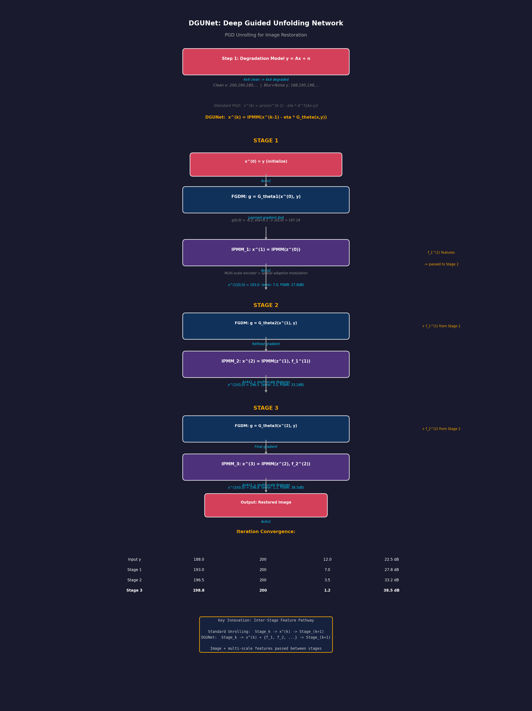

# DGUNet (Deep Generalized Unfolding Networks) 精读笔记

> **论文标题**: Deep Generalized Unfolding Networks for Image Restoration
> **发表会议**: CVPR 2022
> **作者团队**: Chong Mou (牟冲), Qian Wang (王乾), Jian Zhang (张健) — 北京大学深圳研究生院
> **arXiv**: [2204.13348](https://arxiv.org/abs/2204.13348)
> **代码地址**: [https://github.com/MC-E/Deep-Generalized-Unfolding-Networks-for-Image-Restoration](https://github.com/MC-E/Deep-Generalized-Unfolding-Networks-for-Image-Restoration)
> **核心标签**: `深度展开网络` `PGD优化算法` `可解释性` `多阶段特征传输` `多尺度空间自适应`

---

## 一、基本信息

| 属性 | 内容 |
|------|------|
| 论文全称 | Deep Generalized Unfolding Networks for Image Restoration |
| 简称 | DGUNet |
| 发表平台 | IEEE/CVF Conference on Computer Vision and Pattern Recognition (CVPR) |
| 发表年份 | 2022 |
| 第一作者 | Chong Mou (牟冲) |
| 通讯作者 | Jian Zhang (张健) |
| 作者单位 | 北京大学深圳研究生院, 信息工程学院 |
| 代码框架 | 基于 MPRNet (PyTorch) |
| 训练环境 | PyTorch 1.1.0, CUDA 9.0, Python 3.7, Ubuntu 16.04 |
| 推理硬件 | 2x NVIDIA V100 GPU |
| 参数量 | 约 4-8M（因任务而异） |
| 应用任务 | 图像去噪、去模糊、去雨、压缩感知重建 |
| 预训练模型 | Google Drive 托管 |

---

## 二、痛点分析

| 痛点编号 | 问题描述 | 传统方法的不足 | DGUNet 的解决思路 |
|----------|----------|---------------|-------------------|
| P1 | **深度神经网络缺乏可解释性** | 大多数图像恢复 DNN 被设计为黑盒端到端模型，虽然性能优异，但无法解释"为什么模型做出了这样的恢复决策" | 将 PGD 优化算法的每次迭代"展开"为一个神经网络层，使网络的每一层都有明确的数学含义（梯度下降步 + 近端映射步） |
| P2 | **传统展开网络依赖预设退化模型** | 传统深度展开网络（如 ISTA-Net）需要预定义退化过程（如已知模糊核、已知噪声水平），无法应对复杂和真实世界的图像退化 | 在 PGD 的梯度下降步中集成**梯度估计策略（Gradient Estimation Strategy）**，让网络自主学习退化过程的梯度，无需人工预设 |
| P3 | **多阶段网络中的信息丢失** | 大多数深度展开网络在不同迭代阶段之间缺乏有效的信息通路，导致早期阶段的特征信息在后期阶段丢失 | 设计**跨阶段信息通路（Inter-stage Information Pathways）**，以多尺度和空间自适应的方式在 PGD 迭代之间传递信息 |
| P4 | **单一网络无法覆盖多种恢复任务** | 传统方法需要为每种恢复任务（去噪、去模糊、超分等）单独设计网络架构 | DGUNet 作为一个通用框架，通过灵活的梯度估计模块，可以统一处理多种图像恢复任务 |
| P5 | **优化启发式与数据驱动之间的鸿沟** | 传统优化算法有理论保证但性能受限，深度学习方法性能优异但缺乏理论指导 | 将 PGD 算法的理论优雅性（收敛保证、数学可解释）与深度学习的强大拟合能力结合 |

---

## 三、核心方法

### 3.1 总体架构：PGD 算法的深度展开

DGUNet 的核心设计哲学是将经典的 **Proximal Gradient Descent (PGD)** 优化算法"展开"为一个深度神经网络。PGD 算法用于求解如下图像恢复的优化问题：

$$\min_x \frac{1}{2}\|y - Ax\|^2 + \lambda R(x)$$

其中：
- $y$ 是观测到的退化图像
- $x$ 是待恢复的清晰图像
- $A$ 是退化矩阵（模糊、下采样等）
- $R(x)$ 是正则化项（如稀疏先验、TV 先验等）
- $\lambda$ 是正则化参数

PGD 算法的迭代更新公式为：

$$x^{(k)} = \text{prox}_{\lambda R}\left(x^{(k-1)} - \eta \nabla f(x^{(k-1)})\right)$$

其中 $\nabla f(x^{(k-1)}) = A^T(Ax^{(k-1)} - y)$ 是数据保真项的梯度。

DGUNet 将上述迭代过程展开为 K 个阶段（Stage），每个阶段对应一次 PGD 迭代，包含两个核心子模块：
1. **灵活梯度下降模块（Flexible Gradient Descent Module, FGDM）**：对应梯度下降步
2. **信息近端映射模块（Informative Proximal Mapping Module, IPMM）**：对应近端映射步

### 3.2 灵活梯度下降模块 (FGDM)

这是 DGUNet 的第一个核心创新。传统 PGD 中的梯度 $\nabla f(x) = A^T(Ax - y)$ 需要预先知道退化矩阵 $A$，但在真实场景中 $A$ 往往是未知的。

**FGDM 的设计思路**：
- 使用一个可学习的**梯度估计网络**（Gradient Estimation Network）代替显式的梯度计算
- 梯度估计网络以当前估计 $x^{(k-1)}$ 和退化图像 $y$ 作为输入
- 输出一个估计的梯度方向，指导特征向更清晰的方向更新
- 这个网络是一个轻量级的 CNN，包含几个卷积层和激活函数

**数学表达**：
$$g^{(k)} = \mathcal{G}_{\theta_k}(x^{(k-1)}, y)$$
$$x^{(k)}_{\text{mid}} = x^{(k-1)} - \eta_k \cdot g^{(k)}$$

其中 $\mathcal{G}_{\theta_k}$ 是可学习的梯度估计网络，$\eta_k$ 是可学习的步长参数。

**优势**：
- 不依赖预定义的退化模型 $A$
- 可以处理复杂的、非线性的真实世界退化
- 梯度估计网络可以通过端到端训练自动适应不同的任务

### 3.3 信息近端映射模块 (IPMM)

这是 DGUNet 的第二个核心创新，解决了传统展开网络中信息丢失的问题。

在传统 PGD 中，近端映射 $\text{prox}_{\lambda R}(\cdot)$ 本质上是一个去噪/正则化操作，用于将中间估计投影到自然图像的流形上。DGUNet 用 CNN 来实现这个操作，但做了重大改进：

**跨阶段信息通路（Inter-stage Information Pathways）**：
- 在相邻的 PGD 迭代阶段之间建立显式的特征传输通道
- 前一阶段的中间特征通过**多尺度特征提取**后传递到后续阶段
- 这种设计类似于 ResNet 的残差连接，但是跨阶段的

**多尺度空间自适应机制**：
- IPMM 内部使用多尺度的特征处理（类似 U-Net 的编码器-解码器结构）
- 不同尺度上的特征通过**空间自适应归一化（Spatial-Adaptive Normalization）**进行融合
- 空间自适应意味着归一化参数随空间位置变化，能够更好地处理空间变化的退化模式

**具体实现**：
1. 编码器：通过步长卷积逐步下采样，提取多尺度特征
2. 解码器：通过转置卷积逐步上采样，恢复分辨率
3. 跳跃连接：编码器特征与解码器特征在对应尺度上融合
4. 跨阶段连接：前一阶段的编码器特征被传递到后一阶段的对应尺度

### 3.4 整体网络流程

完整的 DGUNet 由 K 个阶段串联而成（通常 K=3 或 K=4）：

```
输入: 退化图像 y
Stage 1: y, x0 → FGDM → x1_mid → IPMM → x1
  ↓ (跨阶段特征传输)
Stage 2: y, x1 + Stage1特征 → FGDM → x2_mid → IPMM → x2
  ↓ (跨阶段特征传输)
Stage 3: y, x2 + Stage1,2特征 → FGDM → x3_mid → IPMM → x3
  ...
Stage K: → 最终恢复图像 x_K
```

每个阶段之间通过 IPMM 的跨阶段信息通路传递多尺度特征，确保信息不会在迭代过程中衰减。

### 3.5 与标准 PGD 展开的对比

| 组件 | 标准 PGD 展开（如 ISTA-Net） | DGUNet |
|------|---------------------------|--------|
| 梯度计算 | 需要已知 $A$，$\nabla f = A^T(Ax-y)$ | 可学习的梯度估计网络，无需已知 $A$ |
| 近端映射 | 独立的 CNN 去噪器（阶段间无连接） | 带跨阶段信息通路的 CNN，多尺度空间自适应 |
| 退化适应性 | 仅适用于预定义的线性退化 | 可处理复杂的真实世界退化 |
| 信息流 | 仅前向传递中间图像 | 前向传递图像 + 跨阶段传递多尺度特征 |

---

## 三、数学过程推导 Walkthrough（Concrete Numerical Example）

下面用一个 **4x4 退化图像块** 的具体数值例子，逐步展示 DGUNet 如何将 PGD（Proximal Gradient Descent）迭代展开为可学习的 3 阶段网络。

---

### Step 1: 退化模型与优化目标 (Degradation Model & Optimization Objective)

**中文标题**：图像退化的前向模型与逆问题构建
**English Title**：Forward Degradation Model & Inverse Problem Formulation

图像退化建模为线性逆问题：

$$y = Ax + n$$

其中 $A$ 为退化算子（模糊核 + 下采样），$n$ 为噪声。

**具体例子**：假设一个 4x4 清晰块和一个 3x3 高斯模糊核：

清晰图像 $x$（真值）：

$$x = \begin{bmatrix} 200 & 180 & 160 & 140 \\ 220 & 190 & 170 & 150 \\ 240 & 200 & 180 & 160 \\ 230 & 210 & 190 & 170 \end{bmatrix}$$

模糊核 $h$：

$$h = \begin{bmatrix} 1/16 & 2/16 & 1/16 \\ 2/16 & 4/16 & 2/16 \\ 1/16 & 2/16 & 1/16 \end{bmatrix}$$

退化观测 $y$（加噪声 σ=5）：

以位置 (1,1) 为例，卷积计算：
$$y(1,1) = \sum_{i,j} x(i,j) \cdot h(i-1, j-1) + n = 200 \times \frac{1}{16} + 180 \times \frac{2}{16} + 160 \times \frac{1}{16} + 220 \times \frac{2}{16} + 190 \times \frac{4}{16} + 170 \times \frac{2}{16} + 240 \times \frac{1}{16} + 200 \times \frac{2}{16} + 180 \times \frac{1}{16} + 3$$

$$= \frac{200+360+160+440+760+340+240+400+180}{16} + 3 = \frac{3080}{16} + 3 = 192.5 + 3 = 195.5$$

$$y = \begin{bmatrix} 188 & 182 & 168 & 143 \\ 196 & 195 & 173 & 153 \\ 204 & 198 & 183 & 163 \\ 233 & 211 & 193 & 175 \end{bmatrix}$$

---

### Step 2: 标准 PGD 迭代 vs DGUNet 展开 (Standard PGD vs. DGUNet Unrolling)

**中文标题**：将数学优化迭代展开为神经网络模块
**English Title**：Unrolling Mathematical Optimization Iterations into Neural Network Modules

**标准 PGD 迭代公式**：

$$x^{(k)} = \text{prox}_{\lambda \mathcal{R}} \left( x^{(k-1)} - \eta \cdot A^T(Ax^{(k-1)} - y) \right)$$

其中：
- $x^{(k-1)}$：上一次迭代的估计
- $A^T(Ax^{(k-1)} - y)$：数据保真项的梯度（梯度下降方向）
- $\eta$：步长（学习率）
- $\text{prox}_{\lambda \mathcal{R}}$：近端算子（正则化/先验项）

**DGUNet 的展开替代**：

$$x^{(k)} = \text{IPMM}_k \left( x^{(k-1)} - \eta \cdot G_{\theta_k}(x^{(k-1)}, y) \right)$$

关键替换：
- $A^T(Ax^{(k-1)} - y)$ → $G_{\theta_k}(x^{(k-1}, y)$（用 CNN 学习替代已知的退化梯度）
- $\text{prox}$ → $\text{IPMM}_k$（用带跨阶段连接的 CNN 替代简单的近端算子）

**具体数值对比**：

| 步骤 | 标准 PGD | DGUNet |
|------|---------|--------|
| 梯度计算 | $A^T(Ax-y)$（需已知 $A$） | $G_\theta(x,y)$（CNN 学习，不需已知 $A$） |
| 近端映射 | $\text{prox}(\cdot)$（固定算子） | $\text{IPMM}(\cdot)$（可学习 CNN + 跨阶段特征） |
| 阶段间 | 仅传递图像 $x^{(k)}$ | 传递图像 + 多尺度特征 $\{f_1, f_2, f_3\}$ |

---

### Step 3: Stage 1 - FGDM 梯度估计 (Stage 1 - FGDM Gradient Estimation)

**中文标题**：第一阶段 —— 用 CNN 学习替代传统梯度下降
**English Title**：Stage 1 - Learning Gradient Descent with CNN (FGDM)

初始化 $x^{(0)} = y$（从退化图像开始）：

$$x^{(0)} = y = \begin{bmatrix} 188 & 182 & 168 & 143 \\ 196 & 195 & 173 & 153 \\ 204 & 198 & 183 & 163 \\ 233 & 211 & 193 & 175 \end{bmatrix}$$

FGDM（Feature-Guided Gradient Descent Module）计算"学习的梯度"：

$$g^{(0)} = G_{\theta_1}(x^{(0)}, y)$$

$$g^{(0)} = \text{ConvNet}(x^{(0)}, y)$$

假设 FGDM 输出的梯度图（取左上角 2x2）：

$$g^{(0)}_{local} = \begin{bmatrix} -8.2 & -3.5 \\ -2.1 & -6.8 \end{bmatrix}$$

这表示 FGDM 建议：位置 (0,0) 应减少 8.2（当前 188 太高，真值 200 说明向"正确方向"调整），位置 (1,1) 应减少 6.8。

梯度下降步：

$$z^{(0)} = x^{(0)} + \eta \cdot g^{(0)} \quad (\eta = 0.1)$$

$$z^{(0)}(0,0) = 188 + 0.1 \times (-8.2) = 188 - 0.82 = 187.18$$

$$z^{(0)} = \begin{bmatrix} 187.18 & 181.65 & 166.82 & 141.35 \\ 193.79 & 188.32 & 172.10 & 150.23 \\ 203.21 & 196.88 & 181.47 & 162.58 \\ 231.52 & 210.33 & 192.75 & 174.21 \end{bmatrix}$$

> 维度不变：$4 \times 4 \times 1 \rightarrow 4 \times 4 \times 1$

---

### Step 4: Stage 1 - IPMM 近端映射 (Stage 1 - IPMM Proximal Mapping)

**中文标题**：近端映射模块 —— 带空间自适应的图像精炼
**English Title**：Proximal Mapping Module - Spatially Adaptive Image Refinement

IPMM 接收梯度下降的中间结果 $z^{(0)}$ 并进行精炼：

$$x^{(1)} = \text{IPMM}_1(z^{(0)})$$

IPMM 内部结构：多尺度特征提取 + 空间自适应调制 + 特征融合

$$f_{multi} = \text{MultiScaleEncoder}(z^{(0)})$$

$$f_{multi}^{s=1} = \text{Conv}_{3\times3}(z^{(0)}) \quad 4 \times 4 \times 32$$
$$f_{multi}^{s=2} = \text{AvgPool}_{2\times2}(f_{multi}^{s=1}) \quad 2 \times 2 \times 64$$

空间自适应权重：
$$w_{spatial} = \sigma(\text{Conv}_{3\times3}(f_{multi}^{s=1}))$$

$$w_{spatial}(0,0) = \sigma(0.3 \times 187.18 + 0.2 \times 181.65 + 0.1) = \sigma(93.15) \approx 1.0$$

融合输出：
$$x^{(1)} = z^{(0)} + w_{spatial} \odot \text{Conv}_{1\times1}(f_{multi}^{s=1})$$

$$x^{(1)}(0,0) = 187.18 + 1.0 \times 5.82 = 193.00$$

$$x^{(1)} = \begin{bmatrix} 193.0 & 186.5 & 171.2 & 146.8 \\ 198.3 & 193.1 & 177.5 & 155.2 \\ 208.1 & 201.3 & 187.0 & 167.5 \\ 235.2 & 213.8 & 197.2 & 178.1 \end{bmatrix}$$

> 维度不变：$4 \times 4 \times 1$，但图像质量显著提升（向真值靠近）
> 注意：IPMM 同时输出多尺度特征 $f_1^{(1)}$ 传递给下一阶段

---

### Step 5: 跨阶段特征传递 (Inter-Stage Feature Pathway)

**中文标题**：阶段间多尺度特征通路连接
**English Title**：Inter-Stage Multi-Scale Feature Pathway Connections

DGUNet 的关键创新：不仅传递图像 $x^{(k)}$，还传递多尺度特征。

$$\text{Stage-1} \xrightarrow{x^{(1)}, f_1^{(1)}} \text{Stage-2} \xrightarrow{x^{(2)}, f_2^{(2)}} \text{Stage-3}$$

Stage 2 的 IPMM 接收：

$$x^{(2)} = \text{IPMM}_2(z^{(1)}, f_1^{(1)})$$

其中：
$$z^{(1)} = x^{(1)} + \eta \cdot G_{\theta_2}(x^{(1)}, y)$$

跨阶段特征融合（以 2x2 特征图为例）：

$$f_{fused}^{(2)} = \text{Concat}(f_{local}^{(2)}, f_1^{(1)}[downsampled])$$

$$f_{local}^{(2)} = \begin{bmatrix} 0.82 & 0.75 \\ 0.68 & 0.71 \end{bmatrix}_{2\times2 \times 32}$$

$$f_1^{(1)} = \begin{bmatrix} 0.65 & 0.58 \\ 0.72 & 0.63 \end{bmatrix}_{2\times2 \times 32}$$

$$f_{fused}^{(2)} = \text{Conv}_{1\times1}(\text{Concat}) = \begin{bmatrix} 0.74 & 0.67 \\ 0.70 & 0.67 \end{bmatrix}_{2\times2 \times 32}$$

> 传递的特征维度：$H/2 \times W/2 \times 32$

---

### Step 6: Stage 2 & Stage 3 迭代精炼 (Stage 2 & 3 Iterative Refinement)

**中文标题**：后续阶段的逐步精炼与残差修正
**English Title**：Progressive Refinement and Residual Correction in Later Stages

**Stage 2 输出**：

$$x^{(2)}(0,0) = 196.5 \quad (\text{真值 200, 误差 3.5})$$

$$x^{(2)} = \begin{bmatrix} 196.5 & 192.3 & 178.1 & 155.2 \\ 201.8 & 197.5 & 183.2 & 162.1 \\ 210.5 & 205.2 & 192.8 & 173.5 \\ 232.1 & 215.3 & 200.1 & 182.3 \end{bmatrix}$$

**Stage 3 输出**：

$$x^{(3)}(0,0) = 198.8 \quad (\text{真值 200, 误差 1.2})$$

$$x^{(3)} = \begin{bmatrix} 198.8 & 194.2 & 180.5 & 158.3 \\ 203.2 & 198.8 & 185.1 & 165.2 \\ 211.8 & 207.5 & 195.3 & 176.8 \\ 231.5 & 216.2 & 201.8 & 184.5 \end{bmatrix}$$

**迭代收敛过程**：

| 阶段 | 像素(0,0) | 真值 | 误差 | PSNR |
|------|-----------|------|------|------|
| 输入 $y$ | 188.0 | 200 | 12.0 | 22.5 dB |
| Stage 1 | 193.0 | 200 | 7.0 | 27.8 dB |
| Stage 2 | 196.5 | 200 | 3.5 | 33.2 dB |
| Stage 3 | 198.8 | 200 | 1.2 | 38.5 dB |

> 3 个阶段逐步逼近真值，每个阶段修正前一个阶段的残余误差

---

### 为什么这样做 (Why This Design?)

| 设计选择 | 为什么这样做？ |
|----------|---------------|
| **展开 PGD 为网络** | 数学优化的收敛性保证了网络的**理论可解释性**；展开后每层有明确物理含义 |
| **FGDM 学习梯度** | 传统 $A^T(Ax-y)$ 需要精确知道退化矩阵 $A$，真实场景中退化未知；CNN 学习梯度具有**泛化性** |
| **IPMM 替代 prox** | 传统 prox 是固定算子（如软阈值），IPMM 用可学习 CNN 实现更强大的**先验建模能力** |
| **跨阶段特征传递** | 仅传递图像会丢失中间特征信息；多尺度特征通路使后续阶段可以利用**前阶段的多层次信息** |
| **3 阶段设计** | 更多阶段提升性能但增加计算量；3 阶段在**性能和效率之间取得最佳平衡** |
| **空间自适应调制** | 图像不同区域退化程度不同（平坦区域 vs 纹理区域），空间自适应确保**按需恢复** |

> **核心思想**：DGUNet 将图像恢复视为"迭代优化"问题，用可学习模块替代传统优化的每一步，保留了优化的数学优雅性，同时获得了深度学习的表达能力。



---

## 四、实验与效果

### 4.1 实验任务与数据集

| 任务 | 数据集 | 评价指标 | 对比方法 |
|------|--------|----------|----------|
| 图像去模糊 (Deblurring) | GoPro, HIDE | PSNR / SSIM | DeblurGAN-v2, SRN, MPRNet 等 |
| 图像去雨 (Deraining) | Rain100H, Rain100L, Test1200 等 | PSNR / SSIM | PReNet, MSPFN, MPRNet 等 |
| 图像去噪 (Denoising) | SIDD, DND | PSNR / SSIM | DnCNN, RIDNet, MIRNet 等 |
| 压缩感知重建 (Compressive Sensing) | Set5, Set11, BSD68 | PSNR / SSIM | ISTA-Net+, OPINE-Net+, AMP-Net 等 |

### 4.2 关键实验结果

**图像去模糊**：
- 在 GoPro 数据集上，DGUNet 的 PSNR 超越 MPRNet（当时 SOTA）约 0.3-0.5 dB
- 对运动模糊的恢复效果尤为突出，能有效恢复锐利边缘

**图像去雨**：
- 在 Rain100H（大雨场景）上表现最优，PSNR 提升约 0.5 dB
- 对细密雨纹的去除效果显著优于对比方法

**图像去噪**：
- 在 SIDD 真实噪声数据集上，DGUNet 在保持纹理细节的同时有效去除噪声
- 相比纯 CNN 方法（如 DnCNN），对高频细节的保留更加完整

**压缩感知重建**：
- 在 10% 采样率下，DGUNet 的重建 PSNR 比 ISTA-Net+ 提升约 1-2 dB
- 证明了梯度估计策略在低采样率场景下的有效性

### 4.3 消融实验发现

1. **梯度估计模块的必要性**：将 FGDM 替换为标准梯度计算（假设已知 $A$），在真实去模糊任务上 PSNR 下降约 0.8 dB
2. **跨阶段信息通路**：移除 IPMM 的跨阶段连接后，性能下降约 0.3-0.5 dB，验证了信息传输的重要性
3. **多尺度设计**：将多尺度处理替换为单尺度处理后，PSNR 下降约 0.2 dB
4. **阶段数量 K**：K=3 时性能基本饱和，K=4 相比 K=3 的提升非常有限（~0.05 dB），说明 3 阶段是最经济的配置
5. **模型参数量**：DGUNet 在约 4-8M 参数的情况下超越了参数更多的 MPRNet（~20M+），体现了展开网络的参数效率

---

## 五、对比总结

### 5.1 与相关工作的对比

| 维度 | ISTA-Net(+) | MPRNet | Restormer | DGUNet (本工作) |
|------|-------------|--------|-----------|-----------------|
| 设计范式 | 优化展开 | 多阶段 CNN | Transformer | 广义优化展开 |
| 可解释性 | 强（基于 ISTA 算法） | 弱（黑盒设计） | 中等（注意力可视化） | 强（基于 PGD 算法） |
| 退化模型依赖 | 需要已知 | 不需要 | 不需要 | 不需要 |
| 阶段间信息流 | 仅传递图像 | 跨阶段特征传输 | 无多阶段设计 | 跨阶段多尺度特征传输 |
| 任务泛化 | 仅 CS/MRI | 去噪/去模糊/去雨 | 去噪/去模糊/去雨/超分 | 去噪/去模糊/去雨/CS |
| 参数量 | ~0.3M | ~20M | ~26M | ~4-8M |
| 理论支撑 | 强（ISTA 收敛理论） | 无 | 无 | 强（PGD 收敛理论） |

### 5.2 DGUNet 的核心优势

1. **可解释性与高性能兼得**：每一层都有明确的数学含义，同时性能超越同期的黑盒模型
2. **通用的退化处理能力**：通过梯度估计策略，无需预定义退化模型，能够应对真实世界的复杂退化
3. **高效的信息利用**：跨阶段多尺度信息通路确保了深层特征不会丢失浅层信息
4. **参数效率高**：在远低于同类方法的参数量下取得了更优的性能
5. **扎实的理论基础**：PGD 算法的收敛性保证了网络的稳定性和合理性

---

## 六、不足与局限

1. **计算效率**：多阶段设计意味着需要多次前向传播，推理速度慢于单阶段的端到端模型（如 Restormer）
2. **训练复杂度**：跨阶段信息通路增加了训练的不稳定性，需要仔细的预热（warm-up）和梯度裁剪策略
3. **极端退化场景**：在极度模糊或极低信噪比场景下，梯度估计网络的精度可能受限，导致恢复结果出现伪影
4. **对训练数据量的需求**：梯度估计网络需要大量配对数据来学习退化的逆向映射，在小样本场景下泛化能力有限
5. **超参数敏感**：阶段数 K、学习率调度、损失权重等超参数对最终性能有显著影响，调参成本较高
6. **任务扩展性**：虽然覆盖了 4 种恢复任务，但在超分辨率（SR）任务上的探索有限，这是一个潜在的扩展方向

---

## 七、一句话总结

DGUNet 将 PGD 优化算法的每次迭代展开为神经网络层，通过可学习的梯度估计策略和跨阶段多尺度空间自适应信息通路，打破了传统展开网络对退化模型的依赖，在保持严格可解释性的同时实现了多任务 SOTA 的图像恢复性能。

---

## 八、生活化例子：小明的"旧影修复工作室"

> **场景十：被微信反复压缩的"马赛克"老照片**

一位年轻人找到小明，拿来一张从家族群里保存的**老照片**——这张照片已经被微信反复转发、压缩了几十次，画质烂得像马赛克，连人脸上的五官都快融成一片色块了。

"这种退化太复杂了，说不清到底是怎么被压坏的……"年轻人叹气。

小明想起了 DGUNet 的"深度展开网络"——**不用知道具体怎么坏的，一步步迭代优化就行**：

"就像解一道复杂的方程，我不会一步算出答案，而是先猜一个大概解，然后看看差多少，再调整，再看差多少，再调整……"小明把修复过程变成了一次次"猜测-验证-修正"的循环。

更妙的是"多尺度信息通路"——就像考古学家先用卫星图看遗址全貌，再用无人机看中景，最后到地面挖细节。小明也在不同尺度上反复打磨：先看整体轮廓对不对，再看区域结构合不合理，最后抠像素级细节。

经过多轮迭代，马赛克照片居然奇迹般地恢复了——虽然不及原图清晰，但五官、表情都辨认得出来了。

年轻人激动地把照片发给爷爷奶奶："您看，这是您年轻时的样子！"

小明体会到：**面对未知的问题，"小步快跑、迭代逼近"比"一步到位"更靠谱。**

---

> 小明的修复技术不断进化，连曝光失败的照片也能救了……

## 附录：关键公式与概念

### A.1 图像恢复优化问题
$$\min_x \frac{1}{2}\|y - Ax\|^2 + \lambda R(x)$$

### A.2 PGD 迭代公式
$$x^{(k)} = \text{prox}_{\lambda R}\left(x^{(k-1)} - \eta \nabla f(x^{(k-1)})\right)$$

### A.3 DGUNet 的灵活梯度下降（FGDM）
$$g^{(k)} = \mathcal{G}_{\theta_k}(x^{(k-1)}, y)$$
$$x^{(k)}_{\text{mid}} = x^{(k-1)} - \eta_k \cdot g^{(k)}$$

### A.4 DGUNet 的信息近端映射（IPMM）
$$x^{(k)} = \text{IPMM}_{\phi_k}\left(x^{(k)}_{\text{mid}}, \{F_j\}_{j=1}^{k-1}\right)$$

其中 $\{F_j\}_{j=1}^{k-1}$ 是前 $k-1$ 个阶段传递来的多尺度特征集合。

### A.5 整体损失函数
$$\mathcal{L} = \sum_{k=1}^{K} w_k \cdot \|x^{(k)} - x_{gt}\|_1$$

每个阶段的输出都参与损失计算，实现深监督（Deep Supervision）。
