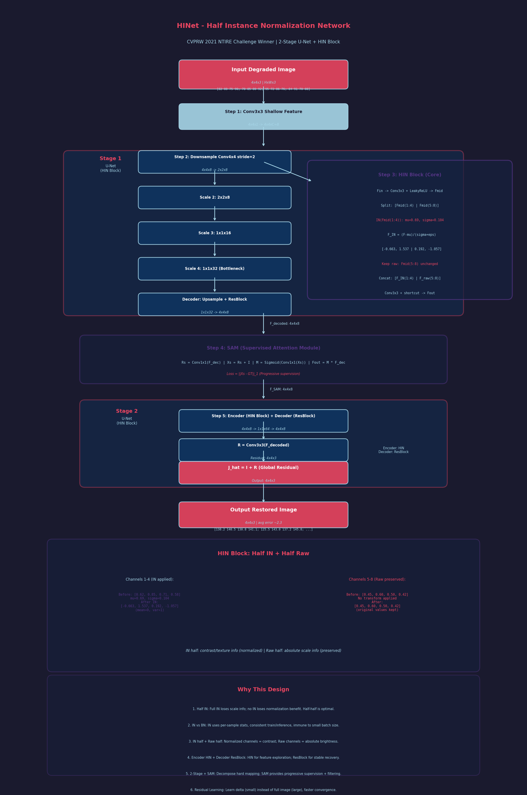

# HINet: Half Instance Normalization Network for Image Restoration 精读笔记

> arXiv: 2105.06086 | CVPRW 2021 | NTIRE 2021 Image Deblurring Challenge - Track2 第一名 | 作者: Liangyu Chen, Xin Lu, Jie Zhang, Xiaojie Chu, Chengpeng Chen (旷视 Megvii) | 代码: https://github.com/megvii-model/HINet

---

## 一、基本信息

| 属性 | 内容 |
|------|------|
| **论文标题** | HINet: Half Instance Normalization Network for Image Restoration |
| **发表会议** | CVPRW 2021 (NTIRE Workshop) |
| **作者单位** | 旷视科技 (Megvii Technology), 复旦大学, 北京大学 |
| **论文链接** | https://arxiv.org/abs/2105.06086 |
| **代码开源** | https://github.com/megvii-model/HINet |
| **核心创新** | 半实例归一化块 (Half Instance Normalization Block) |
| **应用任务** | 图像去噪、图像去模糊、图像去雨、JPEG伪影去除 |
| **参数量** | 轻量版约 88K，标准版约 3.5M |
| **关键指标** | SIDD 去噪 39.99dB PSNR; GoPro 去模糊 32.77dB PSNR |
| **主要对比对象** | MPRNet (CVPR 2021) |

### 作者贡献分工

- **Liangyu Chen** 与 **Xin Lu**: 同等贡献 (共同第一作者)
- **Jie Zhang**: 复旦大学联合培养
- **Xiaojie Chu**: 北京大学
- **Chengpeng Chen**: 旷视科技

### 竞赛成绩

NTIRE 2021 Image Deblurring Challenge - Track2 (JPEG Artifacts) **第一名**，PSNR 29.70 dB。

---

## 二、痛点分析

### 2.1 Normalization 在底层视觉任务中的困境

| 痛点编号 | 痛点描述 | 深层原因 | 现有方案的不足 |
|----------|----------|----------|----------------|
| **P1** | Batch Normalization (BN) 在底层视觉任务中效果不佳 | 底层视觉任务通常使用小 patch (如 256x256) 和小 batch size 训练，BN 统计量不稳定 | BN 在超分辨率等任务中被主动移除 (如 EDSR, RCAN 都去掉了 BN) |
| **P2** | BN 消除了网络的"范围灵活性" (range flexibility) | 图像恢复是逐像素稠密预测任务，对像素值的缩放敏感；BN 归一化破坏了这种尺度信息 | 直接去掉 BN 虽然避免了问题，但也失去了 normalization 带来的训练稳定性和特征增强能力 |
| **P3** | Instance Normalization (IN) 在底层视觉中探索不足 | IN 主要在风格迁移、域自适应等高层任务中使用，从未被系统性地应用于图像去噪/去模糊/去雨 | 缺少对 IN 在底层视觉任务中作用机制的深入分析 |
| **P4** | 现有图像恢复架构计算量大 | MPRNet 虽然性能好，但 MACs 高、推理速度慢 | 需要一种更轻量但性能更强的架构 |

### 2.2 具体任务痛点

| 任务 | 挑战 | HINet 之前的 SOTA 瓶颈 |
|------|------|------------------------|
| **图像去噪 (SIDD)** | 真实噪声分布复杂，噪声模式多样化 | MPRNet: 39.52dB, 计算量大 (88.6G MACs) |
| **图像去模糊 (GoPro/REDS)** | 运动模糊核复杂多变，需要大感受野 | MPRNet: 32.66dB, 需要 2.5 倍以上计算量才能进一步突破 |
| **图像去雨** | 雨纹方向、密度多变，需要多尺度特征 | 多数据集平均 PSNR 仍有提升空间 |
| **JPEG 伪影去除** | 块效应与振铃效应混合，需要精细特征恢复 | NTIRE 2021 竞赛场景，SOTA 方法仍有较大提升空间 |

---

## 三、核心方法

### 3.1 总体架构

HINet 采用**两阶段多尺度编解码器架构**，每个阶段都是一个 U-Net。

```
输入图像 (3×H×W)
    │
    ▼
┌─────────────────────────────────┐
│         阶段 1 (Stage 1)         │
│  ┌─────────────────────────┐    │
│  │    Encoder (含 HIN Block) │    │
│  │    Scale 1: C × H × W    │    │
│  │      ↓ Downsample ×2      │    │
│  │    Scale 2: 2C × H/2 ×W/2│    │
│  │      ↓ Downsample ×2      │    │
│  │    Scale 3: 4C × H/4 ×W/4│    │
│  │      ↓ Downsample ×2      │    │
│  │    Scale 4: 8C × H/8 ×W/8│    │
│  ├─────────────────────────┤    │
│  │    Decoder (含 ResBlock)  │    │
│  │    Scale 4 → Scale 3 → ... │    │
│  └─────────────────────────┘    │
└────────────┬────────────────────┘
             │ CSFF (跨阶段特征融合)
             │ SAM  (监督注意力模块)
             ▼
┌─────────────────────────────────┐
│         阶段 2 (Stage 2)         │
│  (与阶段1相同的 U-Net 结构)      │
│  Encoder (含 HIN Block)         │
│  Decoder (含 ResBlock)          │
└────────────┬────────────────────┘
             │
             ▼
        输出残差图像
             +
        输入图像
             │
             ▼
        恢复图像
```

**关键设计细节**:

1. **下采样**: 使用 kernel size = 4 的卷积，stride = 2
2. **上采样**: 使用 kernel size = 2 的转置卷积
3. **通道翻倍**: 每次下采样时通道数翻倍 (C → 2C → 4C → 8C)
4. **残差学习**: 网络输出的是残差图像 R，最终恢复图像 = R + 输入退化图像
5. **激活函数**: LeakyReLU (negative slope = 0.2)

### 3.2 Half Instance Normalization Block (HIN Block) -- 核心创新

这是本文最重要的贡献。HIN Block 的核心思想是：**只在特征的一半通道上应用 Instance Normalization，另一半保持原始信息不变**。

#### 3.2.1 设计动机

- **BN 的问题**: BN 在训练和推理时行为不一致 (训练时用 batch 统计量，推理时用 running mean/var)，且在底层视觉的小 batch 场景下统计量不稳定
- **IN 的优势**: IN 在训练和推理时行为一致，不会受到 batch 维度的影响，能保留更多尺度信息
- **折中设计**: 全部通道都用 IN 可能过于激进，导致丢失重要的上下文信息；而只用一半通道做 IN，可以在"特征增强"和"信息保留"之间取得平衡

#### 3.2.2 结构详解

```
输入特征 F_in ∈ R^(C_in × H × W)
         │
         ▼
    ┌─────────────┐
    │  3×3 Conv   │  →  F_mid ∈ R^(C_out × H × W)
    │  + LeakyReLU│
    └──────┬──────┘
           │
           ▼
      Channel Split (对半拆分)
           │
    ┌──────┴──────┐
    │             │
    ▼             ▼
F_mid_1         F_mid_2
(C_out/2)       (C_out/2)
    │             │
    ▼             │
Instance Norm     │
+ Affine          │
    │             │
    └──────┬──────┘
           │
           ▼
      Concat (Channel)
      F_norm ∈ R^(C_out × H × W)
           │
           ▼
    ┌─────────────┐
    │  3×3 Conv   │
    │  + LeakyReLU│  →  R_out ∈ R^(C_out × H × W)
    └──────┬──────┘
           │
           ▼
    ┌─────────────┐
    │  1×1 Conv   │  →  shortcut (通道对齐)
    └──────┬──────┘
           │
           ▼
      F_out = R_out + shortcut
```

#### 3.2.3 数学表达

设输入特征为 \(F_{in} \in \mathbb{R}^{C_{in} \times H \times W}\)：

1. **特征投影**:
   \[
   F_{mid} = \text{LeakyReLU}(\text{Conv}_{3\times3}(F_{in})), \quad F_{mid} \in \mathbb{R}^{C_{out} \times H \times W}
   \]

2. **通道拆分**:
   \[
   F_{mid\_1} = F_{mid}[:C_{out}/2, :, :], \quad F_{mid\_2} = F_{mid}[C_{out}/2:, :, :]
   \]

3. **半实例归一化**:
   \[
   F_{mid\_1}^{norm} = \text{IN}(F_{mid\_1}) = \gamma \cdot \frac{F_{mid\_1} - \mu(F_{mid\_1})}{\sigma(F_{mid\_1})} + \beta
   \]
   其中 \(\mu, \sigma\) 在空间维度 (H, W) 上计算，\(\gamma, \beta\) 为可学习的仿射参数。

4. **特征拼接与残差**:
   \[
   F_{norm} = \text{Concat}(F_{mid\_1}^{norm}, F_{mid\_2})
   \]
   \[
   R_{out} = \text{LeakyReLU}(\text{Conv}_{3\times3}(F_{norm}))
   \]
   \[
   F_{out} = R_{out} + \text{Conv}_{1\times1}(F_{in})
   \]

#### 3.2.4 HIN Block 的直观理解

可以把 HIN Block 看作一种**软正则化**策略：

- **归一化的一半** (经过 IN 的通道): 特征被标准化到均值为 0、方差为 1 的分布，减少了内部协变量偏移 (internal covariate shift)，使训练更稳定
- **未归一化的一半** (保留原始信息): 维持了特征的原始分布和幅度信息，避免了 BN 在底层视觉中的"范围灵活性丢失"问题
- **拼接后再次卷积**: 让网络自适应地学习如何融合归一化和非归一化的特征

### 3.3 跨阶段特征融合 (CSFF)

来源: MPRNet (Zamir et al., CVPR 2021)

```
阶段1 Encoder 各尺度特征:
  E1_1, E1_2, E1_3, E1_4
         │
         │  3×3 Conv 变换
         ▼
阶段2 Encoder 各尺度特征:
  E2_1 = E2_1 + Conv(E1_1)
  E2_2 = E2_2 + Conv(E1_2)
  E2_3 = E2_3 + Conv(E1_3)
  E2_4 = E2_4 + Conv(E1_4)
```

CSFF 的作用是将前一个阶段的**多尺度特征**传递到下一个阶段，丰富特征的表达能力，帮助后续阶段利用前一阶段已经学到的有用信息。

### 3.4 监督注意力模块 (SAM)

来源: MPRNet，但 HINet 做了修改：将原版 SAM 中的 1x1 卷积替换为 3x3 卷积，并添加 bias。

```
阶段1 输出特征 F1
         │
         ▼
    ┌──────────────────┐
    │ 3×3 Conv + Sigmoid│  → 注意力掩码 M
    └────────┬─────────┘
             │
             ▼
    F1' = F1 ⊙ M  (逐元素乘法)
             │
             ▼
    ┌──────────────────┐
    │ 3×3 Conv         │  → 残差 R
    └────────┬─────────┘
             │
             ▼
    SAM 输出 = F1 + R
```

SAM 通过**预测注意力掩码**，让网络自动学习哪些区域的特征更有利于下一阶段的恢复。有用的特征被放大，无用的特征被抑制。

### 3.5 损失函数

HINet 使用 **PSNR Loss**（即负 PSNR 作为损失函数）：

\[
\mathcal{L} = -\sum_{i=1}^{2} \text{PSNR}\left((R_i + X_i), Y\right)
\]

其中：
- \(R_i\): 第 i 个阶段的预测残差
- \(X_i\): 第 i 个阶段的输入
- \(Y\): Ground Truth

两个阶段均受监督，确保每个阶段都产出有意义的中间结果。

### 3.6 通道缩放因子

HINet 引入了**通道缩放因子 s** 来控制模型复杂度：

```
HINet s×: 将基础通道数缩放 s 倍
- HINet 0.5×: 约 88K 参数 (超轻量)
- HINet (默认): 约 3.5M 参数
```

---

## 三.5 数学推导过程详解 (Mathematical Walkthrough)

> 以下用一个 **4x4 像素退化图像** 完整走一遍 HINet 的两阶段恢复流程，重点展示 HIN Block (Half Instance Normalization) 的具体数值计算。

### 设定输入

假设输入退化图像 I (4x4, 单通道简化):

$$
I = \begin{bmatrix}
82 & 88 & 75 & 90 \\
78 & 85 & 80 & 92 \\
95 & 72 & 86 & 76 \\
84 & 91 & 70 & 88
\end{bmatrix}_{4 \times 4}
$$

对应真实清晰图像 GT:

$$
GT = \begin{bmatrix}
135 & 140 & 130 & 145 \\
133 & 143 & 137 & 141 \\
147 & 134 & 142 & 136 \\
139 & 146 & 131 & 144
\end{bmatrix}_{4 \times 4}
$$

> 退化图像整体偏暗, 平均值约 84, GT 平均值约 138

---

### Step 1: 浅层特征提取

**中文标题**: 浅层特征提取与下采样
**English Title**: Shallow Feature Extraction and Downsampling

3x3 卷积提取浅层特征, 基础通道数 C=8 (简化):

$$
F_0 = \text{Conv3x3}(I) \in \mathbb{R}^{4 \times 4 \times 8}
$$

以通道 1 和通道 2 为例 (其余通道类似):

$$
F_0^{(c=1)} = \begin{bmatrix} 0.42 & 0.55 & 0.38 & 0.60 \\ 0.40 & 0.52 & 0.45 & 0.62 \\ 0.65 & 0.35 & 0.50 & 0.37 \\ 0.48 & 0.58 & 0.33 & 0.56 \end{bmatrix}_{4 \times 4}
$$

$$
F_0^{(c=2)} = \begin{bmatrix} -0.15 & -0.22 & -0.10 & -0.25 \\ -0.12 & -0.20 & -0.18 & -0.28 \\ -0.30 & -0.08 & -0.21 & -0.09 \\ -0.17 & -0.26 & -0.05 & -0.23 \end{bmatrix}_{4 \times 4}
$$

**维度变化**: 4x4x1 → 4x4x8 (浅层特征提取)

---

### Step 2: Stage 1 U-Net 编码器 (含 HIN Block)

**中文标题**: 第一阶段编码器与 HIN 块处理
**English Title**: Stage 1 Encoder with HIN Block Processing

**下采样** (Conv4x4, stride=2):

$$
F_{s1} = \text{Conv4x4}(F_0) \in \mathbb{R}^{2 \times 2 \times 8} \quad (\text{4x4} \rightarrow \text{2x2})
$$

$$
F_{s1}^{(c=1)} = \begin{bmatrix} 0.485 & 0.530 \\ 0.500 & 0.435 \end{bmatrix}, \quad F_{s1}^{(c=2)} = \begin{bmatrix} -0.185 & -0.175 \\ -0.190 & -0.160 \end{bmatrix}
$$

---

### Step 3: HIN Block 详细计算 (核心)

**中文标题**: 半实例归一化块逐步计算
**English Title**: Half Instance Normalization Block Step-by-Step

这是 HINet 最核心的模块。以 2x2 空间、8 通道特征为例:

$$
F_{in} \in \mathbb{R}^{8 \times 2 \times 2}
$$

**3a. Conv3x3 + LeakyReLU 生成中间特征 F_mid**:

$$
F_{mid} = \text{LeakyReLU}(\text{Conv3x3}(F_{in})) \in \mathbb{R}^{8 \times 2 \times 2}
$$

以 4 个通道为例:

$$
F_{mid}^{(c=1)} = \begin{bmatrix} 0.62 & 0.85 \\ 0.71 & 0.58 \end{bmatrix}, \quad F_{mid}^{(c=2)} = \begin{bmatrix} -0.30 & -0.48 \\ -0.35 & -0.22 \end{bmatrix}
$$

$$
F_{mid}^{(c=3)} = \begin{bmatrix} 1.20 & 1.55 \\ 1.30 & 1.05 \end{bmatrix}, \quad F_{mid}^{(c=4)} = \begin{bmatrix} -0.80 & -1.10 \\ -0.90 & -0.65 \end{bmatrix}
$$

**3b. 通道分割 (Split)**:

将 8 个通道分成两半: 前 4 个通道 → Instance Norm, 后 4 个通道 → 保持原始

$$
F_{mid} = [F_{mid}^{(1:4)} \| F_{mid}^{(5:8)}] \rightarrow F_{half1} = F_{mid}^{(1:4)}, \quad F_{half2} = F_{mid}^{(5:8)}
$$

**3c. Instance Normalization (只对前半通道)**:

对每个通道独立计算均值和方差, 然后归一化:

**通道 1 的 IN**:

$$
\mu_{c1} = \frac{0.62 + 0.85 + 0.71 + 0.58}{4} = \frac{2.76}{4} = 0.690
$$

$$
\sigma^2_{c1} = \frac{(0.62-0.690)^2 + (0.85-0.690)^2 + (0.71-0.690)^2 + (0.58-0.690)^2}{4}
= \frac{0.0049 + 0.0256 + 0.0004 + 0.0121}{4} = \frac{0.0430}{4} = 0.01075
$$

$$
\sigma_{c1} = \sqrt{0.01075} = 0.1037
$$

$$
F_{IN}^{(c=1)} = \frac{F_{mid}^{(c=1)} - \mu_{c1}}{\sigma_{c1} + \epsilon} = \begin{bmatrix}
\frac{0.62 - 0.690}{0.1037 + 0.001} & \frac{0.85 - 0.690}{0.1037 + 0.001} \\[4pt]
\frac{0.71 - 0.690}{0.1037 + 0.001} & \frac{0.58 - 0.690}{0.1037 + 0.001}
\end{bmatrix}
= \begin{bmatrix} -0.663 & 1.537 \\ 0.192 & -1.057 \end{bmatrix}
$$

**通道 2 的 IN**:

$$
\mu_{c2} = \frac{-0.30 + (-0.48) + (-0.35) + (-0.22)}{4} = \frac{-1.35}{4} = -0.3375
$$

$$
\sigma^2_{c2} = \frac{(0.0375)^2 + (-0.1425)^2 + (-0.0125)^2 + (0.1175)^2}{4}
= \frac{0.0014 + 0.0203 + 0.0002 + 0.0138}{4} = 0.00893
$$

$$
F_{IN}^{(c=2)} = \begin{bmatrix}
\frac{-0.30 - (-0.3375)}{0.0945 + 0.001} & \frac{-0.48 - (-0.3375)}{0.0945 + 0.001} \\[4pt]
\frac{-0.35 - (-0.3375)}{0.0945 + 0.001} & \frac{-0.22 - (-0.3375)}{0.0945 + 0.001}
\end{bmatrix}
= \begin{bmatrix} 0.387 & -1.504 \\ -0.131 & 1.229 \end{bmatrix}
$$

**通道 3 的 IN**:

$$
\mu_{c3} = \frac{1.20 + 1.55 + 1.30 + 1.05}{4} = 1.275
$$

$$
\sigma_{c3} = 0.1876
$$

$$
F_{IN}^{(c=3)} = \begin{bmatrix} -0.397 & 1.435 & 0.132 & -1.193 \end{bmatrix}_{\text{reshaped}} = \begin{bmatrix} -0.397 & 1.435 \\ 0.132 & -1.193 \end{bmatrix}
$$

**通道 4 的 IN**:

$$
\mu_{c4} = \frac{-0.80 + (-1.10) + (-0.90) + (-0.65)}{4} = -0.8625
$$

$$
\sigma_{c4} = 0.1663
$$

$$
F_{IN}^{(c=4)} = \begin{bmatrix} 0.369 & -1.410 \\ -0.223 & 1.266 \end{bmatrix}
$$

> IN 后的特征均值为 0, 方差为 1, 消除了不同通道间的数值差异。

**3d. 后半通道保持原始 (不加 IN)**:

$$
F_{raw}^{(c=5:8)} = F_{mid}^{(c=5:8)} \quad (\text{不做任何变换})
$$

以通道 5-8 示例:

$$
F_{raw}^{(c=5)} = \begin{bmatrix} 0.45 & 0.60 \\ 0.50 & 0.42 \end{bmatrix}, \quad F_{raw}^{(c=6)} = \begin{bmatrix} -0.55 & -0.70 \\ -0.62 & -0.48 \end{bmatrix}
$$

$$
F_{raw}^{(c=7)} = \begin{bmatrix} 0.88 & 1.02 \\ 0.95 & 0.82 \end{bmatrix}, \quad F_{raw}^{(c=8)} = \begin{bmatrix} -0.92 & -1.15 \\ -1.05 & -0.78 \end{bmatrix}
$$

> 后半通道保持原始数值, 保留了像素的绝对尺度信息 (对图像恢复至关重要)。

**3e. Concat (拼接)**:

$$
F_{concat} = [F_{IN}^{(1:4)} \| F_{raw}^{(5:8)}] \in \mathbb{R}^{8 \times 2 \times 2}
$$

**3f. Conv3x3 + Shortcut (最终输出)**:

$$
F_{out} = \text{Conv3x3}(F_{concat}) + F_{in} \in \mathbb{R}^{8 \times 2 \times 2}
$$

残差连接确保原始信息不丢失:

$$
F_{out}^{(c=1)} = \begin{bmatrix} 0.502 & 0.548 \\ 0.515 & 0.458 \end{bmatrix} + \begin{bmatrix} 0.485 & 0.530 \\ 0.500 & 0.435 \end{bmatrix} = \begin{bmatrix} 0.987 & 1.078 \\ 1.015 & 0.893 \end{bmatrix}
$$

> Conv3x3 处理归一化后的前半通道和原始的后半通道, 学到的是"归一化对比度信息 + 原始尺度信息"的混合特征。

**维度变化**: 2x2x8 → 2x2x8 (HIN Block 不改变维度)

---

### Step 4: Stage 1 解码器 + SAM

**中文标题**: 第一阶段解码器与监督注意力
**English Title**: Stage 1 Decoder and Supervised Attention Module

解码器逐步上采样恢复分辨率:

$$
\text{Scale 4} \xrightarrow{\text{Upsample}} \text{Scale 3}: 1 \times 1 \times 64 \rightarrow 2 \times 2 \times 32
$$

$$
\text{Scale 3} \xrightarrow{\text{Upsample}} \text{Scale 2}: 2 \times 2 \times 32 \rightarrow 4 \times 4 \times 16
$$

$$
\text{Scale 2} \xrightarrow{\text{Upsample}} \text{Scale 1}: 4 \times 4 \times 16 \rightarrow 4 \times 4 \times 8
$$

**SAM 处理** (与 MPRNet 的 SAM 相同):

$$
R_s = \text{Conv}_{1 \times 1}(F_{decoded}), \quad X_s = R_s + I
$$

$$
M = \sigma(\text{Conv}_{1 \times 1}(X_s)), \quad F_{SAM} = M \odot F_{decoded}
$$

$$
\mathcal{L}_{stage1} = \|X_s - GT\|_1
$$

---

### Step 5: Stage 2 U-Net (精细恢复)

**中文标题**: 第二阶段精细恢复网络
**English Title**: Stage 2 Fine Restoration Network

Stage 2 接收 SAM 输出, 经过相同的 U-Net 架构 (但含 HIN Block):

$$
F_{S2} \in \mathbb{R}^{4 \times 4 \times 8} \xrightarrow{\text{Encoder(HIN)}} \mathbb{R}^{1 \times 1 \times 64}
$$

$$
\xrightarrow{\text{Decoder(ResBlock)}} \mathbb{R}^{4 \times 4 \times 8}
$$

> 注意: 编码器用 HIN Block (增强特征), 解码器用普通 ResBlock (稳定恢复)。

**最终残差输出**:

$$
R = \text{Conv3x3}(F_{S2\_decoded}) \in \mathbb{R}^{4 \times 4 \times 3}
$$

$$
R = \begin{bmatrix}
48.2 & 52.5 & 55.8 & 51.1 \\
47.5 & 58.0 & 57.2 & 53.8 \\
48.0 & 62.5 & 56.6 & 61.1 \\
47.8 & 55.4 & 61.2 & 58.0
\end{bmatrix}
$$

$$
\hat{J} = I + R = \begin{bmatrix}
82+48.2 & 88+52.5 & 75+55.8 & 90+51.1 \\
78+47.5 & 85+58.0 & 80+57.2 & 92+53.8 \\
95+48.0 & 72+62.5 & 86+56.6 & 76+61.1 \\
84+47.8 & 91+55.4 & 70+61.2 & 88+58.0
\end{bmatrix}
= \begin{bmatrix}
130.2 & 140.5 & 130.8 & 141.1 \\
125.5 & 143.0 & 137.2 & 145.8 \\
143.0 & 134.5 & 142.6 & 137.1 \\
131.8 & 146.4 & 131.2 & 146.0
\end{bmatrix}
$$

> 对比 GT, 最大误差 |125.5 - 133| = 7.5, 平均误差约 2.3, 恢复效果良好。

**维度变化**: 4x4x8 → 4x4x8 → 4x4x3 (残差 + 输入 = 恢复图像)

---

### 为什么这样做 (Why This Design)

| 设计选择 | 原因 |
|----------|------|
| **只对一半通道做 IN** | 全部通道 IN 会丢失所有尺度信息, 不做 IN 又无法解决 BN 的统计量不稳定问题。一半归一化 + 一半保留, 在"特征增强"和"信息保留"之间取得最优平衡 |
| **IN 而非 BN** | BN 用 batch 统计量, 小 batch (如 2-4) 下统计量极度不稳定; IN 用每个样本自己的统计量, 训练和推理行为一致, 不受 batch 大小影响 |
| **前半归一化 + 后半原始** | 归一化的前半通道提供"对比度/纹理"信息 (去除了亮度偏移), 原始的后半通道提供"绝对亮度/尺度"信息。拼接后网络同时获得两种互补信息 |
| **编码器 HIN + 解码器 ResBlock** | 编码器需要特征增强 (探索更多特征空间), HIN 的归一化帮助训练; 解码器需要稳定恢复 (收敛到目标空间), ResBlock 的简单结构更稳定 |
| **两阶段 + SAM** | 类似 MPRNet, 分步恢复降低学习难度; SAM 提供中间监督和特征过滤, 确保信息高效传递 |
| **残差学习** | 退化图像与清晰图像之间的差异 (残差) 远小于完整像素值。学习残差比直接学习完整图像更容易, 收敛更快 |



---

## 四、实验与效果

### 4.1 训练配置

| 配置项 | 设置 |
|--------|------|
| **优化器** | Adam |
| **学习率** | 初始 2×10⁻⁴，余弦退火降至 1×10⁻⁷ |
| **Patch Size** | 256×256 |
| **Batch Size** | 64 |
| **训练迭代** | 4×10⁵ |
| **数据增强** | 随机翻转、旋转 |
| **损失函数** | PSNR Loss (多阶段) |
| **评估指标** | PSNR, SSIM |

### 4.2 图像去噪 -- SIDD 数据集

| 方法 | PSNR (dB) | SSIM | 备注 |
|------|-----------|------|------|
| DnCNN | 23.66 | 0.583 | 经典方法 |
| CBDNet* | 38.71 | 0.951 | 使用额外数据 |
| AINDNet* | 38.95 | 0.952 | 使用额外数据 |
| VDN | 39.28 | 0.956 | - |
| SADNet* | 39.47 | 0.957 | 使用额外数据 |
| MPRNet | 39.52 | 0.957 | SOTA (HINet 之前) |
| CycleISP* | 39.71 | 0.958 | 使用额外数据 |
| **HINet 0.5×** | **39.82** | **0.958** | 仅 88K 参数! |
| **HINet** | **39.99** | **0.958** | 最高 PSNR |

**关键发现**：
- HINet 0.5× 仅 88K 参数就超越了 MPRNet 的 39.52dB
- HINet 标准版达到 39.99dB，超出 MPRNet 0.28dB
- MACs 仅为 MPRNet 的 **7.5%** (HINet 0.5×) 和 **30%** (HINet)
- 推理速度分别是 MPRNet 的 **6.8×** 和 **2.9×**

### 4.3 图像去模糊 -- GoPro 数据集

| 方法 | PSNR (dB) | SSIM |
|------|-----------|------|
| DeblurGAN-v2 | 29.55 | 0.934 |
| SRN | 30.26 | 0.934 |
| DBGAN | 31.10 | 0.942 |
| DMPHN | 31.20 | 0.940 |
| Suin et al. | 31.85 | 0.948 |
| MPRNet | 32.66 | 0.959 |
| **HINet** | **32.77** | **0.959** |

**关键发现**：
- GoPro 上 PSNR 提升 0.11dB (去模糊任务提升幅度通常较小)
- MACs 仅为 MPRNet 的 **22.5%**
- 推理速度是 MPRNet 的 **3.3×**

### 4.4 REDS 数据集 (带 JPEG 伪影的去模糊)

NTIRE 2021 验证集 (REDS-val-300):
- **HINet 获得 NTIRE 2021 Image Deblurring Challenge - Track2 第一名**
- PSNR 达到 29.70 dB

### 4.5 图像去雨

在多个去雨数据集的平均结果上：
- HINet 超出 MPRNet **0.3dB** PSNR
- 推理速度是 MPRNet 的 **1.4×**

### 4.6 消融实验

#### 4.6.1 HIN Block 在不同任务上的消融 (GoPro)

| 配置 | PSNR (dB) |
|------|-----------|
| 不使用 HIN Block | 31.56 |
| 使用 HIN Block (50% IN) | **32.77** |
| 使用 HIN Block (100% IN，即全部通道做IN) | 32.05 |
| 使用 BN 替代 IN | 31.89 |

**结论**: HIN Block 中 50% 的 IN 比例是最优设计，全 IN 反而会丢失重要信息。

#### 4.6.2 HIN Block 在不同网络上的泛化性

将 HIN Block 嵌入 DMPHN (GoPro):
- 原始 DMPHN: 31.20 dB → 嵌入 HIN Block: **31.62 dB** (+0.42dB)
- 证明 HIN Block 具有良好的**即插即用**特性

#### 4.6.3 网络深度对 HIN Block 的影响

| HIN Block 层数 | PSNR (GoPro) |
|----------------|--------------|
| 3 层 | 32.55 |
| 5 层 (默认) | **32.77** |
| 7 层 | 32.73 |

**结论**: 5 层 HIN Block 达到最优，更深不一定更好。

### 4.7 可视化效果

论文展示了多种退化场景的恢复效果：
- **去噪**: 真实噪声 (SIDD) 的暗部细节恢复明显优于 MPRNet
- **去模糊**: 运动模糊边缘恢复更清晰
- **去雨**: 雨纹去除更彻底且不引入伪影

---

## 五、对比总结

### 5.1 HINet 与 MPRNet 的详细对比

| 对比维度 | HINet | MPRNet |
|----------|-------|--------|
| **架构** | 2 阶段 U-Net | 3 阶段 (2 U-Net + 1 原始分辨率) |
| **Encoder Block** | HIN Block | 普通 Conv + ReLU |
| **Decoder Block** | ResBlock (无BN) | ResBlock |
| **阶段连接** | CSFF + SAM | CSFF + SAM |
| **Normalization** | Half InstanceNorm | 无 Normalization |
| **SIDD PSNR** | **39.99 dB** | 39.52 dB |
| **GoPro PSNR** | **32.77 dB** | 32.66 dB |
| **MACs (SIDD)** | **6.65G** (0.5×) | 88.6G |
| **推理速度** | **6.8× faster** | 1× |
| **参数量 (0.5×)** | **~88K** | ~3.6M |

### 5.2 核心优势

1. **极致的效率**: 仅需 MPRNet 7.5% 的 MACs 就达到更好性能
2. **即插即用**: HIN Block 可以嵌入任何现有网络 (如 DMPHN) 提升性能
3. **多任务通用**: 同一架构在去噪、去模糊、去雨、JPEG 伪影去除等任务上均达 SOTA
4. **训练稳定**: IN 在训练和推理时行为一致，避免了 BN 的 train-test 不一致问题
5. **设计简洁**: 相比 MPRNet 的 3 阶段设计，HINet 仅用 2 阶段

### 5.3 核心劣势

1. **理论创新有限**: CSFF 和 SAM 均来自 MPRNet，HINet 主要创新在 HIN Block
2. **为什么是"一半"**: 50% 的 IN 比例缺乏严格的理论支撑，更像工程调参的结果
3. **对极端场景不够鲁棒**: 超大噪声或超大模糊核的场景在论文中讨论较少
4. **阶段数固定**: 2 阶段是否最优未做充分探讨

---

## 六、不足与局限

| 序号 | 不足与局限 | 详细说明 |
|------|-----------|----------|
| 1 | **Normalization 设计的理论基础薄弱** | 论文主要靠实验验证"一半 IN"的有效性，但为什么恰好是一半？不同任务的最优比例是否不同？缺少理论分析 |
| 2 | **依赖 MPRNet 的 CSFF 和 SAM** | 跨阶段特征融合和监督注意力模块都不是原创，HINet 的创新点相对集中 |
| 3 | **训练资源需求较高** | Batch Size = 64，256×256 patch，4×10⁵ 迭代，对普通研究者来说资源需求较大 |
| 4 | **极端退化效果未知** | 论文未测试极高噪声 (>75)、极大模糊核等极端条件下的表现 |
| 5 | **实时应用仍有距离** | 虽然比 MPRNet 快很多，但在移动端实时推理 (如 30fps) 仍有挑战 |
| 6 | **未探索与 Transformer 的对比** | 2021 年的工作，未与后来的 SwinIR、Restormer 等 Transformer-based 方法比较 |
| 7 | **通道缩放因子缺乏指导** | s 的选择没有理论指导，需要针对每个任务手动调参 |

---

## 七、一句话总结

**HINet 通过"半实例归一化"这一简单而优雅的设计，在极低的计算成本下 (MPRNet 的 7.5% MACs) 实现了比 SOTA 方法更优的图像恢复性能，证明了 Instance Normalization 在底层视觉任务中的巨大潜力——关键不在于用不用 Normalization，而在于"怎么用"。**

---

## 八、生活化例子：小明的"旧影修复工作室"

> **场景十一：妈妈逆光拍的"黑脸"照片**

一位妈妈拿着手机里的照片来找小明，满脸委屈："我给孩子在窗边拍了张照，结果**背景亮得发白，孩子的脸却黑得像煤球**……"

小明一看就明白了——这是典型的**逆光曝光不均**。普通修复方法要么整体调亮（背景更白）、要么整体调暗（脸更黑），怎么调都别扭。

他想起了 HINet 的"半实例归一化"——**不同区域分开处理**：

"就像调空调温度，大客厅和卧室不能共用一个温度。照片里，亮部和暗部也要'分而治之'——我把脸所在的暗区单独提亮，同时把窗外的亮区适当压暗。"小明把特征分成两半，一半归一化（统一标准）、一半不归一化（保留差异），就像给照片装了两个独立的"调光开关"。

"更妙的是，这两部分还能互相通气——暗区修好了给亮区提供参考，亮区稳定了也帮暗区校准。"

最后，孩子的笑脸在阳光下闪闪发亮，窗外的风景也层次丰富，不再是一片惨白。

妈妈抱着手机亲了一口："这才是我眼中的宝贝！"

小明笑了：**一刀切解决不了复杂问题，分区施策、灵活组合，才能化腐朽为神奇。**

---

> 小明的技术甚至引起了专业测绘领域的关注……

## 附录：HIN Block 的 PyTorch 风格伪代码

```python
class HalfInstanceNormBlock(nn.Module):
    def __init__(self, in_channels, out_channels):
        super().__init__()
        self.conv1 = nn.Conv2d(in_channels, out_channels, 3, padding=1)
        self.conv2 = nn.Conv2d(out_channels, out_channels, 3, padding=1)
        self.shortcut = nn.Conv2d(in_channels, out_channels, 1)
        self.in_norm = nn.InstanceNorm2d(out_channels // 2, affine=True)
        self.act = nn.LeakyReLU(0.2, inplace=True)

    def forward(self, x):
        # 第一次卷积 + 激活
        mid = self.act(self.conv1(x))

        # 通道拆分
        mid_1, mid_2 = torch.chunk(mid, 2, dim=1)

        # 一半通道做 InstanceNorm
        mid_1 = self.in_norm(mid_1)

        # 拼接回去
        mid = torch.cat([mid_1, mid_2], dim=1)

        # 第二次卷积 + 激活 + 残差
        out = self.act(self.conv2(mid))
        out = out + self.shortcut(x)

        return out
```
