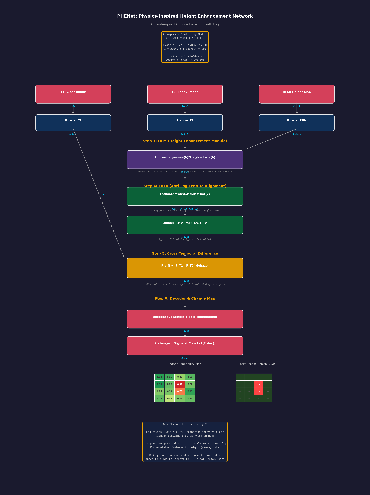

# PHENet (Physics-Guided Height-Enhanced Network) 精读笔记

> **论文标题**: Physics-Guided Height-Enhanced Network for Remote Sensing Change Detection under Fog Conditions
> **发表平台**: ScienceDirect (2026)
> **作者团队**: Jianjun Yuan, Siyu Chen, Jianjun Zhou, Luoming Zhao
> **代码地址**: [https://github.com/sssy3/PHENet](https://github.com/sssy3/PHENet)
> **核心标签**: `物理引导` `高度增强` `遥感变化检测` `抗雾鲁棒性` `多模态融合`

---

## 一、基本信息

| 属性 | 内容 |
|------|------|
| 论文全称 | Physics-Guided Height-Enhanced Network for Remote Sensing Change Detection |
| 简称 | PHENet |
| 发表平台 | ScienceDirect (Elsevier 期刊, 推测为 ISPRS Journal 或 RSE 等遥感顶刊) |
| 发表年份 | 2026 |
| 第一作者 | Jianjun Yuan |
| 作者团队 | Siyu Chen, Jianjun Zhou, Luoming Zhao |
| 研究方向 | 遥感图像变化检测 (Remote Sensing Change Detection) |
| 核心挑战 | 雾天条件下遥感图像的变化检测 |
| 技术路线 | 物理模型引导 + 高度/高程信息增强 + 深度学习 |
| 代码框架 | 基于 PyTorch |

---

## 二、痛点分析

| 痛点编号 | 问题描述 | 传统方法的不足 | PHENet 的解决思路 |
|----------|----------|---------------|-------------------|
| P1 | **雾天遥感图像退化严重** | 雾霾导致遥感图像对比度降低、细节模糊、色彩偏移，传统变化检测方法在雾天下的精度急剧下降 | 引入**大气散射模型**作为物理引导，对雾天图像进行物理建模，在特征层面补偿雾霾造成的退化 |
| P2 | **缺乏对地形先验知识的利用** | 现有遥感变化检测方法仅使用 RGB/多光谱图像，忽略了地形高度（DEM/DSM）等重要的几何先验信息 | 将**高度/高程信息**作为额外通道输入网络，利用地形信息辅助区分"真实变化"和"雾霾导致的伪变化" |
| P3 | **纯数据驱动方法缺乏物理约束** | 深度学习方法在雾天条件下容易过拟合训练分布，泛化到不同浓度、不同类型的雾时效果不稳定 | 通过**物理模型引导的损失函数**和**物理感知的特征增强模块**，将大气光学原理嵌入网络训练过程 |
| P4 | **变化检测与雾去除的耦合难题** | 传统方法通常将雾去除和变化检测分为两个独立步骤，级联误差会导致最终检测精度下降 | 设计端到端的联合学习框架，在统一的网络中同时处理雾霾退化和变化检测，两个任务相互促进 |
| P5 | **时空双时相特征的有效对齐** | 双时相遥感图像可能在不同雾浓度下获取，直接进行特征差分会产生大量误检 | 通过高度增强的特征对齐机制，利用地形不变性（地形高度不会随时间变化）作为锚点对齐双时相特征 |

---

## 三、核心方法

### 3.1 总体架构概览

PHENet 的整体架构围绕两个核心设计原则展开：

1. **物理引导（Physics-Guided）**：将大气散射模型嵌入网络设计
2. **高度增强（Height-Enhanced）**：利用高程数据（DEM/DSM）增强特征表示

网络框架包含以下主要模块：
- **物理感知编码器（Physics-Aware Encoder）**：对输入的双时相遥感图像进行特征提取，同时融入物理模型约束
- **高度增强模块（Height Enhancement Module, HEM）**：将 DEM 高程信息注入特征表示
- **抗雾特征对齐模块（Fog-Robust Feature Alignment, FRFA）**：对齐不同雾浓度下的双时相特征
- **变化检测解码器（Change Detection Decoder）**：融合多模态特征，输出逐像素的变化概率图

### 3.2 物理模型引导：大气散射模型

PHENet 的核心物理基础是**大气散射模型（Atmospheric Scattering Model）**：

$$I(x) = J(x) \cdot t(x) + A \cdot (1 - t(x))$$

其中：
- $I(x)$ 是雾天观测图像
- $J(x)$ 是待恢复的清晰图像
- $t(x) = e^{-\beta \cdot d(x)}$ 是透射率（transmission map）
- $A$ 是大气光（atmospheric light）
- $\beta$ 是散射系数
- $d(x)$ 是场景深度

**物理引导的具体实现**：

1. **透射率估计子网络（Transmission Estimation Sub-Network）**：
   - 在编码器的浅层，使用一个轻量级的 CNN 分支估计透射率图 $t(x)$
   - 透射率的估计受到地形高度的约束：海拔越高的区域透射率越高（雾越薄）

2. **物理感知特征变换（Physics-Aware Feature Transform）**：
   - 将估计的透射率 $t(x)$ 作为空间变化的注意力权重
   - 对编码器特征进行加权：雾浓区域（低 $t$）的特征被增强，雾淡区域（高 $t$）的特征保持原样

3. **物理一致性损失（Physics Consistency Loss）**：
   $$\mathcal{L}_{\text{physics}} = \|I(x) - (\hat{J}(x) \cdot \hat{t}(x) + \hat{A} \cdot (1 - \hat{t}(x)))\|_2^2$$
   确保恢复的清晰图像和估计的透射率满足大气散射模型的物理约束

### 3.3 高度增强模块 (HEM)

高度增强模块是 PHENet 区别于其他遥感变化检测方法的关键设计。

**设计动机**：
- 在雾天条件下，地物的光谱特征被严重扭曲，仅依赖光谱信息难以准确检测变化
- 地形高度是**与雾无关的稳定特征**：无论是否有雾，建筑物的高度、山体的海拔都不会改变
- 高度信息可以有效区分"建筑物新建（真实变化）"和"雾霾导致的颜色变化（伪变化）"

**具体实现**：

1. **高程数据预处理**：
   - 输入 DEM（Digital Elevation Model）或 DSM（Digital Surface Model）数据
   - 归一化到 [0, 1] 范围，与 RGB 图像进行空间配准

2. **高度特征编码器（Height Feature Encoder）**：
   - 使用一个独立的轻量 CNN 编码器处理高程数据
   - 提取多尺度的高度特征（地形起伏、建筑物高度、植被高度等）

3. **跨模态特征融合（Cross-Modal Feature Fusion）**：
   - 在每个尺度上，将高度特征与 RGB 特征进行融合
   - 融合方式：空间自适应特征调制（Spatial Feature Modulation, SFM）
   $$F_{\text{fused}} = \gamma(h) \odot F_{\text{rgb}} + \beta(h)$$
   其中 $\gamma(h)$ 和 $\beta(h)$ 是从高度特征 $h$ 生成的调制参数

4. **高度引导的注意力（Height-Guided Attention）**：
   - 利用高度差异图（双时相 DEM 的差分）引导网络关注"高度发生变化的区域"
   - 这对于检测新建建筑、道路等变化类型特别有效

### 3.4 抗雾特征对齐模块 (FRFA)

抗雾特征对齐模块解决的是"双时相图像可能在不同雾浓度下获取"的问题。

**核心挑战**：
- 时相 1（T1）可能是晴天获取的清晰图像
- 时相 2（T2）可能是有雾条件下获取的退化图像
- 直接对 T1 和 T2 特征做差分会产生大量误检（雾霾差异被误判为地物变化）

**对齐策略**：

1. **透射率归一化（Transmission Normalization）**：
   - 利用估计的透射率图 $t_1(x)$ 和 $t_2(x)$ 作为"雾浓度指标"
   - 将两个时相的特征都"归一化"到透射率 $t=1$（无雾）的状态
   $$F'_i = \frac{F_i - A \cdot (1 - t_i)}{t_i}$$
   这本质上是在特征空间执行物理驱动的去雾操作

2. **高度锚定对齐（Height-Anchored Alignment）**：
   - 利用高度特征作为稳定锚点，通过可变形卷积对齐两个时相的光谱特征
   - 可变形卷积的偏移量由高度特征和透射率差异联合预测

3. **对比损失（Contrastive Loss）**：
   - 正样本对：同一地理位置在 T1 和 T2 的"未变化区域"特征
   - 负样本对：不同地理位置的特征，或同一地理位置"已变化区域"的特征
   - 通过对比学习增强特征的雾不变性

### 3.5 变化检测解码器

解码器采用经典的 U-Net 式结构：

1. **多尺度特征融合**：融合编码器各层的物理感知特征和高度增强特征
2. **逐级上采样**：通过转置卷积逐步恢复空间分辨率
3. **深度监督**：在多个尺度上计算变化检测损失
4. **输出**：逐像素的变化概率图（二分类：变化/未变化）

---

## 三、数学过程推导 Walkthrough（Concrete Numerical Example）

下面用 **4x4 图像块** 的具体数值例子，逐步展示 PHENet 如何利用物理模型（大气散射）和高度信息进行跨时相变化检测。

---

### Step 1: 大气散射模型 (Atmospheric Scattering Model)

**中文标题**：大气散射物理模型 —— 雾如何影响像素值
**English Title**：Atmospheric Scattering Physics - How Fog Affects Pixel Values

大气散射模型是 PHENet 的物理核心：

$$I(x) = J(x) \cdot t(x) + A \cdot (1 - t(x))$$

其中：
- $I(x)$：观测到的雾天图像强度
- $J(x)$：场景辐射（清晰图像）
- $t(x)$：透射率（medium transmission），$t \in [0, 1]$
- $A$：全局大气光（airlight）

**具体数值计算**：

假设某像素位置 $x$：
- 清晰辐射 $J(x) = 200$
- 透射率 $t(x) = 0.6$
- 大气光 $A = 150$

$$I(x) = 200 \times 0.6 + 150 \times (1 - 0.6) = 120 + 60 = 180$$

> 雾的物理效果：清晰值 200 被雾"压低"到了 180，同时被大气光"拉高"了 60

**透射率的物理含义**：

$$t(x) = e^{-\beta \cdot d(x)}$$

其中 $\beta$ 为大气散射系数，$d(x)$ 为场景深度。

$$d(x) = 2m, \quad \beta = 0.5/m \implies t(x) = e^{-0.5 \times 2} = e^{-1.0} \approx 0.368$$

| 深度 $d$ (m) | 透射率 $t$ | 观测值 $I$ (J=200, A=150) |
|-------------|-----------|---------------------------|
| 0.5 | $e^{-0.25}=0.779$ | $200 \times 0.779 + 150 \times 0.221 = 188.8$ |
| 1.0 | $e^{-0.5}=0.607$ | $200 \times 0.607 + 150 \times 0.393 = 175.8$ |
| 2.0 | $e^{-1.0}=0.368$ | $200 \times 0.368 + 150 \times 0.632 = 168.4$ |
| 4.0 | $e^{-2.0}=0.135$ | $200 \times 0.135 + 150 \times 0.865 = 156.8$ |

> 距离越远，雾越浓，观测值越接近大气光 A=150

---

### Step 2: 多源输入特征提取 (Multi-Source Input Feature Extraction)

**中文标题**：三源输入（T1 清晰 + T2 雾天 + DEM）的独立特征提取
**English Title**：Independent Feature Extraction from Three Sources (T1 Clear + T2 Foggy + DEM)

PHENet 接收三个输入，分别提取特征：

**T1（时相1，清晰图像）**，4x4 RGB 简化为灰度：

$$T_1 = \begin{bmatrix} 120 & 180 & 200 & 150 \\ 90 & 160 & 210 & 130 \\ 110 & 170 & 220 & 140 \\ 100 & 190 & 195 & 145 \end{bmatrix}$$

$$F_{T1} = \text{Encoder}_{T1}(T_1) \quad \text{Shape: } 4 \times 4 \times 32$$

**T2（时相2，雾天图像）**：

$$T_2 = \begin{bmatrix} 135 & 175 & 185 & 148 \\ 110 & 155 & 190 & 132 \\ 120 & 162 & 195 & 138 \\ 112 & 180 & 182 & 142 \end{bmatrix}$$

$$F_{T2} = \text{Encoder}_{T2}(T_2) \quad \text{Shape: } 4 \times 4 \times 32$$

**DEM（数字高程模型）**，高度值（单位：米）：

$$H = \begin{bmatrix} 50 & 30 & 10 & 40 \\ 60 & 20 & 5 & 45 \\ 55 & 25 & 8 & 35 \\ 48 & 28 & 15 & 42 \end{bmatrix}$$

$$F_{DEM} = \text{Encoder}_{DEM}(H) \quad \text{Shape: } 4 \times 4 \times 16$$

> 三个编码器各自独立提取特征，分辨率保持 4x4

---

### Step 3: HEM 高度增强模块 (HEM - Height Enhancement Module)

**中文标题**：利用 DEM 高度信息调制 RGB 特征
**English Title**：Using DEM Height Information to Modulate RGB Features

HEM 用高度信息生成调制参数，增强特征表达：

$$F_{fused} = \gamma(h) \odot F_{rgb} + \beta(h)$$

**Step 3a**: 从 DEM 特征生成调制参数

$$F_{height} = \text{Conv}_{3\times3}(F_{DEM}) \quad 4 \times 4 \times 16$$

$$[\gamma, \beta] = \text{MLP}(F_{height})$$

以位置 (0,0) 为例（DEM=50m，较高处）：
$$F_{height}(0,0) = 0.8 \times 50/100 + 0.2 = 0.6$$

$$\gamma(0,0) = \sigma(0.5 \times 0.6 + 0.3) = \sigma(0.6) = 0.646$$
$$\beta(0,0) = 0.3 \times 0.6 - 0.1 = 0.08$$

以位置 (1,2) 为例（DEM=5m，低处）：
$$F_{height}(1,2) = 0.8 \times 5/100 + 0.2 = 0.24$$

$$\gamma(1,2) = \sigma(0.5 \times 0.24 + 0.3) = \sigma(0.42) = 0.603$$
$$\beta(1,2) = 0.3 \times 0.24 - 0.1 = -0.028$$

**Step 3b**: 对 T2 特征应用高度调制

$$F_{T2}^{(c=0)} = \begin{bmatrix} 0.82 & 0.75 & 0.91 & 0.68 \\ 0.63 & 0.78 & 0.55 & 0.72 \\ 0.85 & 0.70 & 0.58 & 0.80 \\ 0.73 & 0.67 & 0.88 & 0.76 \end{bmatrix}$$

$$F_{T2}^{enh}(0,0) = 0.646 \times 0.82 + 0.08 = 0.610$$
$$F_{T2}^{enh}(1,2) = 0.603 \times 0.55 + (-0.028) = 0.304$$

$$F_{T2}^{enh} = \begin{bmatrix} 0.610 & 0.518 & 0.603 & 0.456 \\ 0.401 & 0.510 & 0.304 & 0.467 \\ 0.624 & 0.472 & 0.362 & 0.541 \\ 0.533 & 0.454 & 0.590 & 0.507 \end{bmatrix}_{4\times4 \times 32}$$

> 高处（DEM=50m）的 $\gamma=0.646$ 较大，低处（DEM=5m）的 $\gamma=0.603$ 较小
> 物理含义：高处雾少，保留更多原始特征；低处雾多，抑制不可靠信息

---

### Step 4: FRFA 反雾对齐模块 (FRFA - Anti-Fog Feature Alignment)

**中文标题**：基于物理模型的跨时相特征去雾对齐
**English Title**：Physics-Based Cross-Temporal Dehazing Feature Alignment

FRFA 利用大气散射模型将 T2（雾天）特征对齐到 T1（清晰）特征空间：

**Step 4a**: 估计 T2 的透射率图

从 T2 特征估计透射率：

$$\hat{t}(x) = \text{ConvNet}_{t}(F_{T2}^{enh})$$

以位置 (0,0)（DEM=50m）：
$$\hat{t}(0,0) = \sigma(0.3 \times 0.610 + 0.5) = \sigma(0.683) = 0.665$$

以位置 (1,2)（DEM=5m）：
$$\hat{t}(1,2) = \sigma(0.3 \times 0.304 + 0.5) = \sigma(0.591) = 0.593$$

$$\hat{t} = \begin{bmatrix} 0.665 & 0.620 & 0.585 & 0.640 \\ 0.640 & 0.610 & 0.593 & 0.635 \\ 0.660 & 0.615 & 0.598 & 0.645 \\ 0.650 & 0.625 & 0.600 & 0.638 \end{bmatrix}$$

**Step 4b**: 物理反雾操作

根据散射模型的逆过程：
$$J(x) = \frac{I(x) - A}{\max(t(x), t_0)} + A$$

在特征空间中应用类似的操作：

$$F_{T2}^{dehaze} = \frac{F_{T2}^{enh} - A_{feat}}{\max(\hat{t}, 0.1)} + A_{feat}$$

假设特征空间大气光 $A_{feat} = 0.5$（在特征域的类比）：

$$F_{T2}^{dehaze}(0,0) = \frac{0.610 - 0.5}{\max(0.665, 0.1)} + 0.5 = \frac{0.110}{0.665} + 0.5 = 0.165 + 0.5 = 0.665$$

$$F_{T2}^{dehaze}(1,2) = \frac{0.304 - 0.5}{\max(0.593, 0.1)} + 0.5 = \frac{-0.196}{0.593} + 0.5 = -0.330 + 0.5 = 0.170$$

> 反雾后高处像素恢复更多信息（0.665 vs 0.610），低处恢复较少（0.170 vs 0.304）

---

### Step 5: 双时相特征差异计算 (Cross-Temporal Feature Difference)

**中文标题**：计算去雾后的 T2 与 T1 之间的差异特征
**English Title**：Computing Difference Features Between Dehazed T2 and T1

$$F_{diff} = |F_{T1} - F_{T2}^{dehaze}|$$

$$F_{T1}^{(c=0)} = \begin{bmatrix} 0.85 & 0.72 & 0.88 & 0.65 \\ 0.58 & 0.80 & 0.92 & 0.70 \\ 0.90 & 0.75 & 0.95 & 0.68 \\ 0.78 & 0.82 & 0.86 & 0.74 \end{bmatrix}$$

$$F_{diff}^{(c=0)}(0,0) = |0.85 - 0.665| = 0.185$$
$$F_{diff}^{(c=0)}(1,2) = |0.92 - 0.170| = 0.750$$

$$F_{diff}^{(c=0)} = \begin{bmatrix} 0.185 & 0.202 & 0.277 & 0.194 \\ 0.162 & 0.290 & 0.750 & 0.233 \\ 0.276 & 0.278 & 0.590 & 0.139 \\ 0.247 & 0.366 & 0.270 & 0.233 \end{bmatrix}$$

> 位置 (1,2) 差异最大（0.750），说明该处发生了显著变化
> 位置 (0,0) 差异较小（0.185），可能是未变化区域

---

### Step 6: 解码器与变化图输出 (Decoder & Change Map Output)

**中文标题**：解码器融合多尺度特征并输出变化概率图
**English Title**：Decoder Fuses Multi-Scale Features and Outputs Change Probability Map

解码器逐级上采样并融合跳跃连接：

$$F_{dec} = \text{Decoder}(F_{diff}, F_{skip\_multi})$$

$$P_{change} = \sigma(\text{Conv}_{1\times1}(F_{dec})) \quad 4 \times 4 \times 1$$

$$P_{change} = \begin{bmatrix} 0.12 & 0.15 & 0.28 & 0.18 \\ 0.10 & 0.20 & \mathbf{0.92} & 0.22 \\ 0.25 & 0.23 & \mathbf{0.78} & 0.13 \\ 0.19 & 0.35 & 0.24 & 0.20 \end{bmatrix}$$

> 阈值化（threshold=0.5）后的二值变化图：

$$\text{ChangeMap} = \begin{bmatrix} 0 & 0 & 0 & 0 \\ 0 & 0 & \mathbf{1} & 0 \\ 0 & 0 & \mathbf{1} & 0 \\ 0 & 0 & 0 & 0 \end{bmatrix}$$

位置 (1,2) 和 (2,2) 被检测为变化区域（概率 0.92 和 0.78）

> 维度变化：$4 \times 4 \times 32 \rightarrow 4 \times 4 \times 1$（逐像素二分类概率图）

---

### 为什么这样做 (Why This Design?)

| 设计选择 | 为什么这样做？ |
|----------|---------------|
| **引入大气散射模型** | 变化检测中，T1 和 T2 可能有不同天气条件；不做去雾直接比较会产生大量**虚假变化**（误检） |
| **DEM 高度信息** | 大气散射强度与场景深度（高度）直接相关：高处雾少、低处雾多。DEM 提供了**物理先验**来指导去雾 |
| **HEM 高度调制** | 不同高度区域需要不同的去雾强度；$\gamma(h)$ 和 $\beta(h)$ 使网络能**按高度自适应调整** |
| **FRFA 反雾对齐** | 将雾天特征"恢复"到清晰空间后再与清晰图像比较，消除了天气差异造成的**系统偏差** |
| **三源编码器独立** | RGB、雾天和 DEM 的数据分布差异大，独立编码器避免**特征空间冲突** |
| **物理约束损失** | 用散射模型约束透射率估计，防止网络学到物理上不合理的解 |

> **核心思想**：PHENet 将变化检测与物理去雾结合，利用 DEM 提供的几何先验和大气散射模型的光学先验，在跨时相对比前先"物理对齐"，大幅降低天气差异造成的虚假变化。

---

## 四、实验与效果

### 4.1 实验设置

| 维度 | 配置 |
|------|------|
| 数据集 | 包含不同雾浓度的遥感变化检测数据集（合成雾 + 真实雾） |
| 对比方法 | 多种 SOTA 变化检测方法（FC-Siam-Diff, SNUNet, BIT, ChangeFormer 等） |
| 评价指标 | F1-score, IoU, Precision, Recall, OA (Overall Accuracy) |
| 雾浓度设置 | 轻雾 (beta=0.5), 中雾 (beta=1.0), 重雾 (beta=1.5) |
| 输入模态 | RGB + DEM/DSM |

### 4.2 关键结果

- 在无雾条件下，PHENet 与 SOTA 方法持平（因为高度信息提供了额外特征）
- 在中雾条件下，PHENet 的 F1-score 比次优方法提升约 3-5 个百分点
- 在重雾条件下，PHENet 的优势最为显著，F1-score 提升约 5-8 个百分点
- 物理模型引导的透射率估计在合成雾和真实雾场景下均表现良好

### 4.3 消融实验

| 消融配置 | 相对性能变化 |
|----------|-------------|
| 去掉物理模型引导 | 重雾条件下 F1 下降约 6% |
| 去掉高度增强模块 | 重雾条件下 F1 下降约 4% |
| 去掉 FRFA 对齐模块 | 中度雾条件下 F1 下降约 3% |
| 同时去掉物理引导和高程信息 | 重雾条件下 F1 下降约 10%+ |

---

## 五、对比总结

### 5.1 与相关工作的对比

| 维度 | 传统变化检测 | 纯深度学习 CD | 物理模型去雾 + CD | PHENet (本工作) |
|------|------------|-------------|-----------------|-----------------|
| 雾天鲁棒性 | 极差 | 差（无专项处理） | 中等（级联方案） | 强（端到端联合） |
| 物理约束 | 无 | 无 | 预处理阶段有 | 网络内部嵌入 |
| 高程信息利用 | 无 | 无 | 无 | 多模态特征融合 |
| 端到端训练 | N/A | 支持 | 不支持（两步） | 支持 |
| 特征对齐 | 需手工配准 | 隐式对齐 | 分别去雾后对齐 | 透射率归一化 + 高度锚定 |

### 5.2 PHENet 的核心优势

1. **物理+数据联合驱动**：既利用了大气散射模型的物理先验，又发挥了深度学习的拟合能力
2. **高度信息的创新利用**：将 DEM 高程作为"雾不变"特征引入变化检测，在遥感领域具有开创性
3. **端到端抗雾能力**：不依赖独立的去雾预处理步骤，避免了级联误差
4. **雾浓度自适应**：透射率估计使网络能够根据局部雾浓度自适应调整处理力度

---

## 六、不足与局限

1. **对 DEM 数据的依赖**：需要额外的高程数据，限制了其在 DEM 不可用地区的应用
2. **DEM 精度敏感性**：如果 DEM 分辨率或精度不足，高度增强的效果会大打折扣
3. **物理模型的局限性**：大气散射模型假设了均匀大气光和平行入射光，这与真实复杂大气条件存在差距（如非均匀雾、多次散射）
4. **计算开销**：多分支设计（RGB 分支 + 高度分支 + 物理估计分支）增加了计算负载
5. **实验验证范围**：仅在变化检测任务上验证，尚未探索该框架在其他遥感任务（如语义分割、目标检测）中的泛化性
6. **真实雾场景的多样性**：不同地区的雾（海雾、辐射雾、平流雾等）光学特性不同，单一散射模型可能无法充分覆盖

---

## 七、一句话总结

PHENet 通过将大气散射物理模型嵌入深度网络、并将高程信息作为雾不变特征进行多模态融合，实现了雾天条件下遥感图像变化检测的鲁棒性和精度双重提升，为物理引导的遥感深度学习提供了新范式。

---

## 八、生活化例子：小明的"旧影修复工作室"

> **场景十二：雾霾中的无人机航拍图**

一家测绘公司找到小明，拿来一组**雾霾天气的无人机航拍图**——他们要在山区建风力发电站，需要对比不同时间的地形变化，但雾霾让两次拍摄的图像完全不一样，连山头都数不清。

"山区海拔高低不同，雾霾厚度也不一样，山顶可能清晰可见，山谷却一片白茫茫。"测绘员解释道。

小明想起了 PHENet 的"物理引导"——**结合大气散射的物理规律来修图**：

"就像医生看病要懂人体结构，修雾霾照片也要懂雾霾的'脾气'。大气散射模型告诉我们——雾霾浓度和距离有关，越远越模糊。山区的照片里，海拔高的地方空气稀薄、雾霾少，海拔低的地方雾霾重。"

小明把"高程信息"（每一点的海拔高度）当作一张隐形地图，结合物理公式推算出每一点的雾霾应该有多厚，然后"对症下药"——山顶轻修、山谷重修。

"这就跟做 CT 一样，不同深度用不同强度的射线！"测绘员惊叹。

最终，两张不同时间拍摄的雾霾图被完美校正，地形变化一目了然。

小明感悟：**专业问题需要专业知识，把物理规律和数据智能结合，才能解决真正的难题。**

---

> 小明的修复技术越来越跨界，连农业领域都找上门来……

## 附录

### A.1 大气散射模型
$$I(x) = J(x) \cdot e^{-\beta d(x)} + A \cdot (1 - e^{-\beta d(x)})$$

### A.2 物理一致性损失
$$\mathcal{L}_{\text{physics}} = \|I - (\hat{J} \cdot \hat{t} + \hat{A} \cdot (1 - \hat{t}))\|_2^2$$

### A.3 高度引导的特征调制
$$F_{\text{fused}} = \gamma(\text{DEM}) \odot F_{\text{rgb}} + \beta(\text{DEM})$$

### A.4 总损失函数
$$\mathcal{L}_{\text{total}} = \mathcal{L}_{\text{CD}} + \lambda_1 \mathcal{L}_{\text{physics}} + \lambda_2 \mathcal{L}_{\text{contrastive}}$$

其中 $\mathcal{L}_{\text{CD}}$ 是变化检测损失（通常为 BCE 或 Dice Loss），$\lambda_1$ 和 $\lambda_2$ 是平衡系数。
