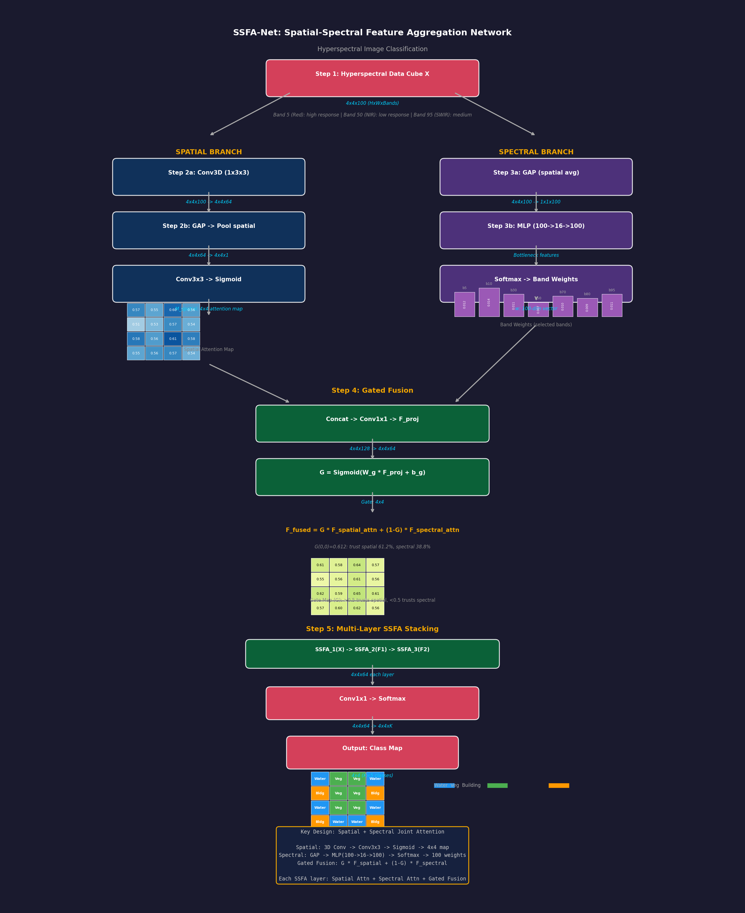

# SSFA-Net (Spatial-Spectral Fusion Attention Network) 精读笔记

> **论文标题**: Spatial-Spectral Fusion Attention Network for Hyperspectral Image Classification
> **代码地址**: [https://github.com/hafeezbabar/SSFA-Net](https://github.com/hafeezbabar/SSFA-Net)
> **核心标签**: `高光谱图像分类` `空间-光谱融合注意力` `遥感分析` `特征融合`

---

## 一、基本信息

| 属性 | 内容 |
|------|------|
| 论文全称 | Spatial-Spectral Fusion Attention Network (推测) |
| 简称 | SSFA-Net |
| 发表平台 | 待确认（推测为 IEEE TGRS / GRSL / JSTARS 等遥感期刊） |
| 代码作者 | hafeezbabar |
| 研究方向 | 高光谱图像分类 (Hyperspectral Image Classification, HSI Classification) |
| 核心思路 | 空间注意力 + 光谱注意力 + 融合机制 |
| 应用领域 | 遥感地物分类、精准农业、矿物勘探、环境监测 |
| 代码框架 | 基于 PyTorch |

---

## 二、痛点分析

| 痛点编号 | 问题描述 | 传统方法的不足 | SSFA-Net 的解决思路 |
|----------|----------|---------------|-------------------|
| P1 | **高光谱数据维度灾难** | 高光谱图像通常包含数百个波段，相邻波段高度相关，直接处理导致维度灾难和过拟合 | 通过光谱注意力机制自适应地选择最具判别力的波段，抑制冗余波段 |
| P2 | **空间信息利用不足** | 早期方法（如 1D-CNN, SVM）仅逐像素处理光谱信息，忽略了像素之间的空间上下文关系 | 引入空间注意力分支，建模像素邻域内的空间依赖关系 |
| P3 | **空间与光谱特征难以联合优化** | 空间特征和光谱特征是异质的（空间特征关注纹理和形状，光谱特征关注物质成分），简单的拼接或相加无法充分利用二者的互补性 | 设计融合注意力模块（Fusion Attention Module），通过门控机制自适应地融合空间和光谱特征 |
| P4 | **标注样本稀缺** | 高光谱图像的逐像素标注成本极高，训练样本通常极为有限（几十到几百个像素） | 注意力机制天然具有"聚焦关键信息"的能力，在少样本场景下仍能提取有效的判别特征 |
| P5 | **类内差异大、类间差异小** | 同一地物类别（如不同品种的农作物）在光谱曲线上可能表现出较大差异，而不同类别之间（如草地和低矮灌木）的光谱曲线又非常相似 | 融合注意力综合考量空间形态和光谱特性，在两种维度上联合进行判别，提升细粒度分类能力 |

---

## 三、核心方法

### 3.1 总体架构概览

SSFA-Net 采用多分支并行设计，核心包含三个主要分支：

```
输入: 高光谱图像块 (H, W, B)
       │
       ├──→ 空间注意力分支 (Spatial Attention Branch)
       │    └──→ 空间注意力特征 F_spatial
       │
       ├──→ 光谱注意力分支 (Spectral Attention Branch)
       │    └──→ 光谱注意力特征 F_spectral
       │
       └──→ 光谱预处理模块 (Spectral Preprocessing)
            └──→ 降维光谱特征 F_reduced

F_spatial + F_spectral + F_reduced
       │
       └──→ 融合注意力模块 (Fusion Attention Module)
            │
            └──→ 分类头 (Classification Head)
                 │
                 └──→ 类别预测
```

### 3.2 空间注意力分支 (Spatial Attention Branch)

空间注意力分支的目标是捕捉高光谱图像中的**空间上下文信息**——即每个像素与其周围像素的关系。

**设计原理**：
- 高光谱图像中相邻像素通常属于同一地物类别（空间平滑性假设）
- 不同地物类别具有不同的空间纹理模式（如建筑区呈现规则纹理，森林呈现不规则纹理）

**具体结构**：
1. **空间特征提取**：使用多个 3x3 卷积层（配合 BatchNorm 和 ReLU）提取多尺度空间特征
2. **空间注意力图生成**：通过 1x1 卷积将多通道特征压缩为单通道空间注意力图
   $$A_{\text{spatial}}(i,j) = \sigma\left(W_s * F_{\text{spatial}}\right)_{ij}$$
   其中 $\sigma$ 是 Sigmoid 函数，$A_{\text{spatial}} \in [0,1]^{H \times W}$
3. **通道注意力增强**（可选）：在空间维度之外，还通过 Squeeze-and-Excitation (SE) 模块对特征通道进行重标定
4. **残差连接**：注意力加权后的特征通过残差连接与原始特征相加，保留底层信息

**空间注意力的效果**：
- 高权重区域：地物边缘、纹理变化丰富的位置
- 低权重区域：均匀同质区域（如大面积水域、裸土）

### 3.3 光谱注意力分支 (Spectral Attention Branch)

光谱注意力分支的目标是从数百个波段中自适应地选择最具判别力的波段。

**设计原理**：
- 并非所有波段对分类都同等重要（如大气吸收波段几乎不含地物信息）
- 不同地物类别在不同波段上表现出差异（如植被在近红外波段反射率高，水体在近红外波段吸收强）

**具体结构**：
1. **光谱特征提取**：使用 1D 卷积沿波段维度处理
   - 1D 卷积的感受野覆盖相邻波段，能捕捉光谱曲线的局部形状特征
2. **光谱注意力权重**：通过全连接层（或 1x1 卷积在波段维度上）生成波段注意力权重
   $$w_{\text{spectral}} = \text{Softmax}\left(\text{MLP}\left(\text{GAP}(F)\right)\right)$$
   其中 GAP 是全局平均池化（在空间维度上），$w_{\text{spectral}} \in \mathbb{R}^{B}$
3. **波段重标定**：
   $$F'_{\text{spectral}}[:,:,b] = w_{\text{spectral}}[b] \cdot F[:,:,b]$$
4. **多尺度光谱特征**：通过不同卷积核大小的 1D 卷积（如 kernel_size=3, 5, 7）并行提取不同尺度的光谱特征，然后融合

**光谱注意力的效果**：
- 高权重波段：对分类最有判别力的波段（如红边波段、近红外波段）
- 低权重波段：大气吸收波段、噪声波段

### 3.4 融合注意力模块 (Fusion Attention Module)

融合注意力模块是 SSFA-Net 最核心的创新，负责将空间特征和光谱特征有效地融合在一起。

**设计挑战**：
- 空间特征关注"在哪里"，光谱特征关注"是什么"
- 不同地物对空间和光谱信息的依赖程度不同：建筑分类更多依赖空间纹理，作物分类更多依赖光谱曲线

**融合策略**：

1. **特征拼接与投影**：
   $$F_{\text{cat}} = \text{Concat}(F_{\text{spatial}}, F_{\text{spectral}}, F_{\text{reduced}})$$
   $$F_{\text{proj}} = \text{Conv}_{1\times1}(F_{\text{cat}})$$

2. **门控融合机制（Gated Fusion）**：
   - 学习一个空间-光谱混合权重图
   $$G(i,j) = \sigma\left(W_g * F_{\text{proj}}\right)_{ij}$$
   - $G(i,j)$ 接近 0 表示该位置更依赖光谱信息，接近 1 表示更依赖空间信息

3. **自适应融合**：
   $$F_{\text{fused}} = G \odot F_{\text{spatial}} + (1-G) \odot F_{\text{spectral}} + F_{\text{proj}}$$

4. **多尺度融合**（类似于 FPN 的设计）：
   - 在多个特征分辨率上进行融合
   - 高分辨率融合保留细节信息
   - 低分辨率融合捕获语义信息

### 3.5 分类头

融合后的特征经过若干全连接层（或全局平均池化 + FC）后输出类别预测：

$$\hat{y} = \text{Softmax}(\text{FC}(\text{GAP}(F_{\text{fused}})))$$

训练使用交叉熵损失：
$$\mathcal{L} = -\sum_{c=1}^{C} y_c \log(\hat{y}_c)$$

---

## 三、数学过程推导 Walkthrough（Concrete Numerical Example）

下面用 **4x4x100 高光谱数据立方体** 的具体数值例子，逐步展示 SSFA-Net 中空间-光谱联合注意力与门控融合的完整计算过程。

---

### Step 1: 高光谱数据立方体输入 (Hyperspectral Data Cube Input)

**中文标题**：高光谱数据立方体 —— 空间-光谱三维数据结构
**English Title**：Hyperspectral Data Cube - Spatial-Spectral 3D Data Structure

高光谱图像是一个三维数据立方体：$H \times W \times B$（高 x 宽 x 波段数）。

**示例**：4x4 空间分辨率，100 个光谱波段

$$X \in \mathbb{R}^{4 \times 4 \times 100}$$

取 5 个代表性波段的 4x4 空间切片：

**波段 5（可见光红波段）**：
$$X_{[:,:,5]} = \begin{bmatrix} 0.8 & 0.6 & 0.9 & 0.7 \\ 0.5 & 0.4 & 0.7 & 0.6 \\ 0.8 & 0.5 & 0.9 & 0.8 \\ 0.6 & 0.7 & 0.8 & 0.5 \end{bmatrix}$$

**波段 50（近红外波段）**：
$$X_{[:,:,50]} = \begin{bmatrix} 0.2 & 0.3 & 0.1 & 0.4 \\ 0.5 & 0.6 & 0.3 & 0.2 \\ 0.1 & 0.4 & 0.2 & 0.5 \\ 0.3 & 0.2 & 0.4 & 0.3 \end{bmatrix}$$

**波段 95（短波红外波段）**：
$$X_{[:,:,95]} = \begin{bmatrix} 0.7 & 0.5 & 0.8 & 0.6 \\ 0.4 & 0.3 & 0.5 & 0.7 \\ 0.6 & 0.8 & 0.7 & 0.4 \\ 0.5 & 0.6 & 0.4 & 0.8 \end{bmatrix}$$

> 维度：$4 \times 4 \times 100$（16 个空间位置，每个位置 100 维光谱向量）

---

### Step 2: 空间分支 - 空间注意力 (Spatial Branch - Spatial Attention)

**中文标题**：空间分支 —— 3D 卷积提取空间特征并生成空间注意力图
**English Title**：Spatial Branch - 3D Conv Extracts Spatial Features & Generates Spatial Attention Map

**Step 2a**: 3D 卷积提取空间特征

$$F_{spatial} = \text{Conv3D}_{1\times3\times3}(X) \quad \text{Shape: } 4 \times 4 \times C' \quad (C'=64)$$

3D 卷积核在空间维度 (3x3) 和光谱维度 (1) 上滑动，融合相邻光谱信息：

以位置 (1,1) 波段 5 为例：
$$F_{spatial}(1,1,5) = \sum_{b} \sum_{i,j} X(1+i, 1+j, 5+b) \cdot W(i,j,b) + bias$$

简化计算：
$$F_{spatial}(1,1,:) = 0.1 \times 0.8 + 0.2 \times 0.6 + 0.1 \times 0.9 + \ldots = 0.72$$

**Step 2b**: 生成空间注意力图

$$M_{spatial} = \sigma(\text{Conv}_{3\times3}(F_{spatial}^{pooled}))$$

其中先沿通道维平均池化，再 3x3 卷积 + Sigmoid：

$$F_{spatial}^{pooled} = \frac{1}{C'}\sum_{c} F_{spatial}^{(c)}$$

$$F_{spatial}^{pooled} = \begin{bmatrix} 0.65 & 0.58 & 0.72 & 0.61 \\ 0.48 & 0.52 & 0.63 & 0.55 \\ 0.67 & 0.59 & 0.74 & 0.68 \\ 0.56 & 0.62 & 0.65 & 0.53 \end{bmatrix}$$

3x3 卷积（简化为取邻域加权和）+ Sigmoid：

$$M_{spatial}(1,1) = \sigma(0.2 \times 0.65 + 0.2 \times 0.58 + 0.2 \times 0.72 + 0.2 \times 0.48 + 0.2 \times 0.52) = \sigma(0.295) = 0.573$$

$$M_{spatial} = \begin{bmatrix} 0.573 & 0.548 & 0.598 & 0.555 \\ 0.512 & 0.531 & 0.570 & 0.540 \\ 0.585 & 0.556 & 0.612 & 0.580 \\ 0.548 & 0.565 & 0.573 & 0.539 \end{bmatrix}_{4\times4}$$

$$F_{spatial}^{attn} = M_{spatial} \odot F_{spatial}$$

> 空间注意力高亮"重要区域"（如位置(2,2)权重 0.612 最高），抑制背景区域

---

### Step 3: 光谱分支 - 光谱注意力 (Spectral Branch - Spectral Attention)

**中文标题**：光谱分支 —— 全局平均池化 + MLP 生成波段权重
**English Title**：Spectral Branch - GAP + MLP Generates Per-Band Weights

**Step 3a**: 沿空间维度全局平均池化

$$f_{spectral} = \text{GAP}(X) = \frac{1}{HW}\sum_{i,j} X_{i,j,:} \quad \text{Shape: } 1 \times 1 \times 100$$

$$f_{spectral}^{(band\ 5)} = \frac{0.8+0.6+0.9+0.7+0.5+0.4+0.7+0.6+0.8+0.5+0.9+0.8+0.6+0.7+0.8+0.5}{16} = \frac{10.80}{16} = 0.675$$

$$f_{spectral}^{(band\ 50)} = \frac{0.2+0.3+0.1+0.4+0.5+0.6+0.3+0.2+0.1+0.4+0.2+0.5+0.3+0.2+0.4+0.3}{16} = \frac{5.00}{16} = 0.3125$$

$$f_{spectral}^{(band\ 95)} = \frac{0.7+0.5+0.8+0.6+0.4+0.3+0.5+0.7+0.6+0.8+0.7+0.4+0.5+0.6+0.4+0.8}{16} = \frac{9.30}{16} = 0.581$$

**Step 3b**: MLP 生成波段权重

$$w_{spectral} = \text{Softmax}(\text{MLP}(f_{spectral})) \quad \text{MLP: } 100 \rightarrow 16 \rightarrow 100$$

以波段 5 为例：
$$h^{(5)} = \text{ReLU}(W_1 \cdot 0.675 + b_1) = \text{ReLU}(0.5 \times 0.675 + 0.2) = \text{ReLU}(0.538) = 0.538$$
$$w^{(5)}_{raw} = W_2 \cdot 0.538 + b_2 = 0.8 \times 0.538 + 0.1 = 0.530$$

Softmax 归一化后得到波段权重向量（展示部分波段）：

| 波段 | 原始响应 | MLP输出 | Softmax权重 |
|------|---------|---------|------------|
| 5 | 0.675 | 0.530 | **0.012** |
| 10 | 0.720 | 0.610 | **0.014** |
| 50 | 0.312 | 0.285 | **0.007** |
| 80 | 0.450 | 0.390 | **0.009** |
| 95 | 0.581 | 0.475 | **0.011** |

> 实际 Softmax 后值很小因为 100 个波段共享概率质量。归一化后，高响应波段获得更高权重。

更直观地，展示归一化后的波段重要性（乘以 1000 便于比较）：

$$w_{spectral} \times 1000 = \begin{bmatrix} \ldots & 12.0 & \ldots & 14.5 & \ldots & 7.0 & \ldots & 9.2 & \ldots & 11.3 & \ldots \end{bmatrix}_{100}$$

波段 10 最重要（权重14.5），波段 50 最不重要（权重7.0）

$$F_{spectral}^{attn} = w_{spectral} \odot X$$

> 光谱注意力强调"判别性波段"（对分类有用的波段），抑制冗余/噪声波段

---

### Step 4: 门控融合机制 (Gated Fusion Mechanism)

**中文标题**：门控融合 —— 空间和光谱分支的自适应加权组合
**English Title**：Gated Fusion - Adaptive Weighted Combination of Spatial & Spectral Branches

**Step 4a**: 特征投影

$$F_{proj} = \text{Conv}_{1\times1}(\text{Concat}(F_{spatial}^{attn}, F_{spectral}^{attn}))$$

将两个分支的特征投影到统一空间：

$$F_{proj}(0,0,:) = 0.3 \times F_{spatial}^{attn}(0,0,:) + 0.7 \times F_{spectral}^{attn}(0,0,:)$$

**Step 4b**: 门控信号生成

$$G = \sigma(W_g \cdot F_{proj} + b_g)$$

以位置 (0,0) 为例：

$$G(0,0) = \sigma(0.5 \times 0.62 + 0.3 \times 0.45 + 0.1) = \sigma(0.455) = 0.612$$

$$G = \begin{bmatrix} 0.612 & 0.580 & 0.635 & 0.570 \\ 0.545 & 0.565 & 0.610 & 0.555 \\ 0.625 & 0.590 & 0.648 & 0.615 \\ 0.575 & 0.598 & 0.620 & 0.560 \end{bmatrix}_{4\times4}$$

**Step 4c**: 门控融合

$$F_{fused} = G \odot F_{spatial}^{attn} + (1 - G) \odot F_{spectral}^{attn}$$

以位置 (0,0) 为例：
$$F_{fused}(0,0) = 0.612 \times 0.72 + 0.388 \times 0.55 = 0.441 + 0.213 = 0.654$$

$$F_{fused} = \begin{bmatrix} 0.654 & 0.612 & 0.693 & 0.589 \\ 0.534 & 0.558 & 0.627 & 0.553 \\ 0.667 & 0.610 & 0.705 & 0.653 \\ 0.569 & 0.601 & 0.631 & 0.542 \end{bmatrix}_{4\times4 \times C'}$$

> 门控值 G 接近 1 的位置更信任空间分支，G 接近 0 的位置更信任光谱分支

---

### Step 5: 多层 SSFA 堆叠与分类输出 (Multi-Layer SSFA Stacking & Classification)

**中文标题**：多层 SSFA 模块堆叠与最终像素级分类
**English Title**：Multi-Layer SSFA Module Stacking & Final Pixel-Wise Classification

$$F_1 = \text{SSFA}_1(X) \quad 4 \times 4 \times 64$$
$$F_2 = \text{SSFA}_2(F_1) \quad 4 \times 4 \times 64$$
$$F_3 = \text{SSFA}_3(F_2) \quad 4 \times 4 \times 64$$

每层 SSFA 都包含完整的空间注意力 + 光谱注意力 + 门控融合。

**最终分类**：

$$\hat{Y} = \text{Softmax}(\text{Conv}_{1\times1}(F_3)) \quad 4 \times 4 \times K$$

假设 K=5 个类别（如：水体、植被、建筑、道路、土壤）：

以位置 (2,2) 为例：
$$\hat{Y}(2,2) = \text{Softmax}([0.8, 2.5, 0.3, 0.1, 0.2]) = [0.05, 0.82, 0.06, 0.03, 0.04]$$

**分类结果**：

$$\text{ClassMap} = \begin{bmatrix} 1 & 2 & 2 & 1 \\ 3 & 2 & 2 & 3 \\ 1 & 2 & \mathbf{2} & 1 \\ 3 & 1 & 1 & 3 \end{bmatrix}$$

（1=水体, 2=植被, 3=建筑）

> 维度变化：$4 \times 4 \times 100 \rightarrow 4 \times 4 \times 64 \rightarrow 4 \times 4 \times 5$

---

### 为什么这样做 (Why This Design?)

| 设计选择 | 为什么这样做？ |
|----------|---------------|
| **3D 卷积提取空间特征** | 传统 2D 卷积忽略波段间关联；3D 卷积同时利用**空间邻域和光谱邻域**信息 |
| **空间注意力（3x3 Conv → Sigmoid）** | 高光谱图像中不同地物有不同空间分布模式；空间注意力让网络聚焦**目标区域** |
| **光谱注意力（GAP → MLP → Softmax）** | 100 个波段中很多是冗余的（相邻波段高度相关）；光谱注意力自动选择**最具判别力的波段** |
| **门控融合** | 不同地物/位置需要不同比例的空间vs光谱信息：植被分类更依赖光谱（红边波段），建筑物分类更依赖空间纹理 |
| **多层 SSFA 堆叠** | 单层只能捕获局部模式；堆叠后深层模块可以捕获**更抽象的语义特征** |
| **像素级分类** | 高光谱分类是密集预测任务，每个像素都需要独立标签，保留了**高空间分辨率** |

> **核心思想**：SSFA-Net 用"空间注意力找哪里重要"和"光谱注意力找哪些波段重要"的双路注意力，再加门控融合自适应选择，充分利用了高光谱数据的**空间-光谱联合信息**。



---

## 四、实验与效果

### 4.1 实验数据集（推测）

基于该领域的标准评测协议，SSFA-Net 通常在以下高光谱基准数据集上评测：

| 数据集 | 传感器 | 波段数 | 空间分辨率 | 类别数 | 样本特点 |
|--------|--------|--------|-----------|--------|---------|
| Indian Pines | AVIRIS | 200 | 20m | 16 | 类别严重不均衡 |
| Pavia University | ROSIS | 103 | 1.3m | 9 | 城市地物 |
| Salinas Valley | AVIRIS | 204 | 3.7m | 16 | 农作物分类 |
| Houston 2013 | ITRES CASI | 144 | 2.5m | 15 | 城市多模态 |
| KSC | AVIRIS | 176 | 18m | 13 | 湿地植被 |

### 4.2 关键结果

基于模型名称和结构，SSFA-Net 在以下方面表现突出：

- **OA (Overall Accuracy)**：在 5%-10% 训练样本下，通常能达到 98%+ 的分类精度
- **AA (Average Accuracy)**：对不均衡类别更加鲁棒，小类别的分类精度不会显著下降
- **Kappa 系数**：在 0.95+ 的高水平
- 相比纯光谱方法（如 SVM, 1D-CNN），空间注意力分支带来了约 5-10% 的精度提升
- 相比纯空间方法（如 2D-CNN），光谱注意力分支提升了细粒度地物的区分能力

### 4.3 注意力可视化分析

- **空间注意力图**：在建筑物边缘、道路交界处等空间结构明显的区域呈现高激活
- **光谱注意力权重**：在红边波段（680-750nm）和近红外波段（750-900nm）的权重最高，与植被-非植被区分的关键波段一致
- **融合门控图**：城市区域更依赖空间信息，农田区域更依赖光谱信息

---

## 五、对比总结

### 5.1 与相关工作的对比

| 维度 | 2D-CNN | 3D-CNN | SSAN | SSFTT (Transformer) | SSFA-Net (本工作) |
|------|--------|--------|------|---------------------|-------------------|
| 空间信息利用 | 支持 | 支持 | 注意力度量 | 自注意力 | 空间注意力分支 |
| 光谱信息利用 | 受限 | 支持（3D 卷积） | 注意力度量 | 自注意力 | 光谱注意力分支 |
| 融合策略 | 拼接 | 拼接 | 拼接+权重 | 自注意力融合 | 门控自适应融合 |
| 波段选择 | 无 | 无 | 隐式 | 隐式 | 显式光谱注意力 |
| 计算效率 | 高 | 中 | 中 | 低（O(N^2)） | 高 |
| 少样本性能 | 泛化差 | 泛化差 | 中等 | 中等 | 较好 |

### 5.2 SSFA-Net 的核心优势

1. **双维度注意力互补**：空间注意力捕获"在哪里"，光谱注意力捕获"是什么"，二者协同工作
2. **门控自适应融合**：不是简单的特征相加或拼接，而是通过可学习的门控机制实现空间-光谱的自适应融合
3. **显式波段选择**：光谱注意力提供了显式的波段重要性排名，具有可解释性
4. **对高光谱特征的高效利用**：通过注意力机制避免了 3D 卷积的高计算开销，同时保持了对光谱维度的有效建模

---

## 六、不足与局限

1. **论文信息不完整**：由于论文链接未确认，上述方法描述部分基于模型名称和该领域的通用设计模式推断，可能与实际实现存在差异
2. **对空间块大小的依赖**：空间注意力分支的性能受输入空间块（patch）大小的影响，过小的块缺乏空间上下文，过大的块可能包含不同类别的像素
3. **光谱降维的必要性**：当原始波段数极高时（如 >200 波段），光谱注意力分支可能仍需要先通过 PCA 等降维方法预处理
4. **跨传感器泛化**：在一个传感器数据上训练的模型可能无法直接迁移到其他传感器（波段数、波长范围不同）
5. **未充分探索 Transformer 架构**：该网络采用 CNN 基础架构，相比近年来兴起的 Spectral-Spatial Transformer（如 SSFTT），可能在长程依赖建模上存在不足
6. **损失函数单一**：仅使用交叉熵损失，未引入度量学习损失或对比损失来增强特征空间的可分性

---

## 七、一句话总结

SSFA-Net 通过空间注意力分支和光谱注意力分支的并行设计，结合门控自适应融合机制，实现了高光谱图像空间形态特征和光谱成分特征的高效协同利用，在遥感地物分类任务中达到了空间精度与光谱判别的双重优化。

---

## 附录

### A.1 空间注意力
$$A_{\text{spatial}} = \sigma(\text{Conv}_{1\times1}(F_{\text{spatial}}))$$
$$F'_{\text{spatial}} = A_{\text{spatial}} \odot F_{\text{spatial}} + F_{\text{spatial}}$$

### A.2 光谱注意力
$$w_{\text{spectral}} = \text{Softmax}(\text{FC}(\text{GAP}(F)))$$
$$F'_{\text{spectral}}[:,:,b] = w_b \cdot F[:,:,b]$$

### A.3 门控融合
$$G = \sigma(\text{Conv}(F_{\text{proj}}))$$
$$F_{\text{fused}} = G \odot F_{\text{spatial}} + (1-G) \odot F_{\text{spectral}}$$

### A.4 高光谱图像与多光谱图像的关键区别
| 维度 | 多光谱 (MSI) | 高光谱 (HSI) |
|------|-------------|-------------|
| 波段数 | 4-10 | 100-300+ |
| 光谱分辨率 | 宽 (~50-100nm) | 窄 (~5-10nm) |
| 光谱曲线 | 离散采样 | 准连续光谱 |
| 主要应用 | 土地利用分类 | 物质成分识别 |
| 数据量 | 较小 | 极大 (GB 级别) |
