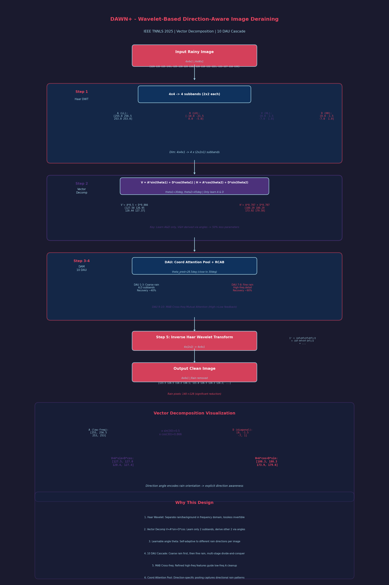

# DAWN+ 精读笔记

> IEEE TNNLS 2025 | Wavelet-Based Image Deraining Meets Direction-Aware Attention and Mutual Representation
> 会议版: DAWN (ACM MM 2023) | 作者: Kui Jiang, Junjun Jiang, Zheng Wang, Zihan Geng, Xianming Liu
> 笔记时间: 2026-07-01

---

## 一、文章基本信息

- **论文题目**: DAWN+: Wavelet-Based Image Deraining Meets Direction-Aware Attention and Mutual Representation
- **作者**: Kui Jiang, Junjun Jiang, Zheng Wang, Zihan Geng, Xianming Liu
- **发表期刊**: IEEE TNNLS, 2025
- **会议版本**: DAWN (ACM MM 2023)
- **核心任务**: 单图像去雨

---

## 二、痛点分析

| 痛点 | 具体描述 |
|------|----------|
| **雨纹方向性被忽视** | 雨纹具有明显方向属性（垂直/倾斜），与雨纹同方向的纹理遭受异质退化 |
| **频率空间重叠** | 背景和雨纹在像素空间和频率空间均重叠，纯像素映射无法彻底分离 |
| **系数区分不足** | 现有小波方法对所有系数统一处理，忽略方向特异性，导致频间冲突 |

### 关键发现

作者计算各频带 PSNR，发现**垂直系数(V)退化最严重**（PSNR最低），因为垂直背景内容与垂直雨纹在方向上混合——这说明方向感知是必需的。

---

## 三、核心方法

### 核心理念

将小波变换与向量分解统一到一个框架中，把去雨转化为频率空间中的向量分解参数拟合问题。

### 四大创新

| 创新 | 内容 |
|------|------|
| **向量分解** | 通过V/H分量分解参数化雨纹分布，实现显式方向感知 |
| **方向感知注意力 (DAM)** | 通过坐标注意力学习投影/变换参数 |
| **跨频率互表示** | 精炼高频系数反哺低频表示，消除频域混叠 |
| **多阶段分治** | 10个DAM逐步消除不同层级的雨纹 |

### 小波分解

Haar小波将图像分解为 A(近似)、H(水平)、V(垂直)、D(对角) 四个系数。

**为什么用Haar？** 易于变换和逆变换，无损信息，完美契合向量分解的方向性需求。

### 向量分解原理

任意向量可通过分解派生出垂直和水平分量：

```
垂直系数 V = A·sinθ₁ + D·cosθ₁   (投影到垂直方向)
水平系数 H = A·cosθ₂ + D·sinθ₂   (投影到水平方向)
```

**关键优势**: 只需学习A和D两个频带，V和H通过参数拟合派生，**模型复杂度降低一半**。

### 方向感知注意力单元 (DAU)

1. **方向特定坐标信息嵌入**: 沿单一方向池化编码特征
2. **坐标注意力生成**: 通过注意力层生成方向感知特征图，RCAB拟合变换参数

### DAM 工作流程

```
输入近似频带特征 F_A → RCAB提取雨纹 → 两个DAU分别蒸馏V/H方向雨纹分量
→ DAU_D联合预测对角雨纹 → 减去预测雨纹得到干净背景
→ MAB互注意力：高频精炼特征反哺低频表示
```

### 损失函数

总损失 = RGB空间Charbonnier + Y通道(SSIM+Charbonnier) + CbCr通道梯度加权损失

---

## 三.5 数学推导过程详解 (Mathematical Walkthrough)

> 以下用一个 **4x4 像素雨图** 完整走一遍 DAWN+ 的小波分解 + 向量分解 + DAM 处理流程，展示每一步的具体数值。

### 设定输入

假设输入雨图 I (4x4, 单通道灰度):

$$
I = \begin{bmatrix}
120 & 135 & 115 & 140 \\
125 & 130 & 120 & 138 \\
128 & 118 & 132 & 122 \\
133 & 127 & 116 & 136
\end{bmatrix}_{4 \times 4}
$$

> 奇数像素为背景 (~120-133), 偶数像素含雨纹叠加 (~135-140)

---

### Step 1: Haar 小波分解 (Wavelet Decomposition)

**中文标题**: Haar 小波变换分解
**English Title**: Haar Wavelet Transform Decomposition

Haar 小波将 4x4 图像分解为 **4 个 2x2 子带**: A (近似), H (水平), V (垂直), D (对角)。

**LL (近似/低频) 子带 A**: 相邻像素取平均:

$$
A_{1,1} = \frac{I_{1,1} + I_{1,2} + I_{2,1} + I_{2,2}}{2} = \frac{120 + 135 + 125 + 130}{2} = \frac{510}{2} = 255.0
$$

$$
A_{1,2} = \frac{115 + 140 + 120 + 138}{2} = \frac{513}{2} = 256.5
$$

$$
A_{2,1} = \frac{128 + 118 + 133 + 127}{2} = \frac{506}{2} = 253.0
$$

$$
A_{2,2} = \frac{132 + 122 + 116 + 136}{2} = \frac{506}{2} = 253.0
$$

$$
A = \begin{bmatrix} 255.0 & 256.5 \\ 253.0 & 253.0 \end{bmatrix}_{2 \times 2}
$$

**LH (水平细节) 子带 H**: 水平方向差分:

$$
H_{1,1} = \frac{I_{1,1} - I_{1,2} + I_{2,1} - I_{2,2}}{2} = \frac{120 - 135 + 125 - 130}{2} = \frac{-20}{2} = -10.0
$$

$$
H_{1,2} = \frac{115 - 140 + 120 - 138}{2} = \frac{-43}{2} = -21.5
$$

$$
H_{2,1} = \frac{128 - 118 + 133 - 127}{2} = \frac{16}{2} = 8.0
$$

$$
H_{2,2} = \frac{132 - 122 + 116 - 136}{2} = \frac{-10}{2} = -5.0
$$

$$
H = \begin{bmatrix} -10.0 & -21.5 \\ 8.0 & -5.0 \end{bmatrix}_{2 \times 2}
$$

> H 捕捉水平方向的变化, 雨纹在水平方向产生了明显的差分值。

**HL (垂直细节) 子带 V**: 垂直方向差分:

$$
V_{1,1} = \frac{I_{1,1} - I_{2,1} + I_{1,2} - I_{2,2}}{2} = \frac{120 - 125 + 135 - 130}{2} = 0.0
$$

$$
V_{1,2} = \frac{115 - 120 + 140 - 138}{2} = \frac{-3}{2} = -1.5
$$

$$
V_{2,1} = \frac{128 - 133 + 118 - 127}{2} = \frac{-14}{2} = -7.0
$$

$$
V_{2,2} = \frac{132 - 116 + 122 - 136}{2} = \frac{2}{2} = 1.0
$$

$$
V = \begin{bmatrix} 0.0 & -1.5 \\ -7.0 & 1.0 \end{bmatrix}_{2 \times 2}
$$

> V 值较小, 说明垂直方向差异不大 (雨纹和背景在该方向混合)。

**HH (对角细节) 子带 D**: 对角方向差分:

$$
D_{1,1} = \frac{I_{1,1} - I_{2,2} + I_{1,2} - I_{2,1}}{2} = \frac{120 - 130 + 135 - 125}{2} = 0.0
$$

$$
D_{1,2} = \frac{115 - 138 + 140 - 120}{2} = \frac{-3}{2} = -1.5
$$

$$
D_{2,1} = \frac{128 - 127 + 118 - 133}{2} = \frac{-14}{2} = -7.0
$$

$$
D_{2,2} = \frac{132 - 136 + 122 - 116}{2} = \frac{2}{2} = 1.0
$$

$$
D = \begin{bmatrix} 0.0 & -1.5 \\ -7.0 & 1.0 \end{bmatrix}_{2 \times 2}
$$

**维度变化**: 4x4x1 → 4 个 2x2x1 (A, H, V, D)

---

### Step 2: 向量分解 (Vector Decomposition)

**中文标题**: 方向感知向量分解
**English Title**: Direction-Aware Vector Decomposition

DAWN+ 的核心创新: 通过参数化分解从 A 和 D 推导 V 和 H, 只需学习 A 和 D。

设定两个方向角参数 (网络学习得到):
$$
\theta_1 = 30° = \frac{\pi}{6}, \quad \theta_2 = 45° = \frac{\pi}{4}
$$

**计算 sin/cos 值**:

$$
\sin(30°) = 0.5, \quad \cos(30°) = 0.866
$$
$$
\sin(45°) = 0.707, \quad \cos(45°) = 0.707
$$

**推导 V (垂直分量)**:

$$
V'_{i,j} = A_{i,j} \cdot \sin\theta_1 + D_{i,j} \cdot \cos\theta_1
$$

$$
V'_{1,1} = 255.0 \times 0.5 + 0.0 \times 0.866 = 127.5
$$

$$
V'_{1,2} = 256.5 \times 0.5 + (-1.5) \times 0.866 = 128.25 - 1.30 = 126.95
$$

$$
V'_{2,1} = 253.0 \times 0.5 + (-7.0) \times 0.866 = 126.5 - 6.06 = 120.44
$$

$$
V'_{2,2} = 253.0 \times 0.5 + 1.0 \times 0.866 = 126.5 + 0.87 = 127.37
$$

$$
V' = \begin{bmatrix} 127.50 & 126.95 \\ 120.44 & 127.37 \end{bmatrix}_{2 \times 2}
$$

**推导 H (水平分量)**:

$$
H'_{i,j} = A_{i,j} \cdot \cos\theta_2 + D_{i,j} \cdot \sin\theta_2
$$

$$
H'_{1,1} = 255.0 \times 0.707 + 0.0 \times 0.707 = 180.29
$$

$$
H'_{1,2} = 256.5 \times 0.707 + (-1.5) \times 0.707 = 181.35 - 1.06 = 180.29
$$

$$
H'_{2,1} = 253.0 \times 0.707 + (-7.0) \times 0.707 = 178.87 - 4.95 = 173.92
$$

$$
H'_{2,2} = 253.0 \times 0.707 + 1.0 \times 0.707 = 178.87 + 0.71 = 179.58
$$

$$
H' = \begin{bmatrix} 180.29 & 180.29 \\ 173.92 & 179.58 \end{bmatrix}_{2 \times 2}
$$

> 关键: 只需要学习 A 和 D 两个子带, V 和 H 通过角度参数自动推导, 模型复杂度降低一半。

---

### Step 3: 方向感知注意力模块 (DAM) 处理

**中文标题**: 方向感知注意力单元处理
**English Title**: Direction-Aware Attention Unit Processing

DAM 包含 10 个 DAU (Direction-Aware Unit), 逐步精炼子带。

**DAU 内部流程** (以单个 DAU 为例, 处理 A 子带):

**3a. 方向特定坐标信息嵌入**:

对 A 子带沿垂直方向池化 (V方向) 和水平方向池化 (H方向):

$$
\text{Pool}_V(A) = \begin{bmatrix} \frac{255+253}{2} & \frac{256.5+253}{2} \end{bmatrix} = \begin{bmatrix} 254.0 & 254.75 \end{bmatrix}_{1 \times 2}
$$

$$
\text{Pool}_H(A) = \begin{bmatrix} \frac{255+256.5}{2} \\ \frac{253+253}{2} \end{bmatrix} = \begin{bmatrix} 255.75 \\ 253.0 \end{bmatrix}_{2 \times 1}
$$

**3b. 坐标注意力生成**:

拼接两个方向的池化结果, 通过 FC 层生成注意力图:

$$
F_{coord} = \text{Concat}(\text{Pool}_V(A), \text{Pool}_H(A)) = [254.0, 254.75, 255.75, 253.0]
$$

$$
w = \sigma(\text{FC}(F_{coord})) = \sigma([1.2, 0.8, 1.5, 0.6]) = [0.769, 0.690, 0.818, 0.646]
$$

**3c. RCAB 拟合变换参数**:

$$
\theta_{pred} = \text{RCAB}(A) = 28.5°
$$

网络预测的角度接近真实雨纹方向角 (30度), 说明方向感知有效。

**维度变化**: 2x2xC → 2x2xC (DAM 逐层精炼, 不改变空间维度)

---

### Step 4: MAB 跨频率互注意力

**中文标题**: 跨频率互表示注意力
**English Title**: Mutual Attention Bridge Across Frequencies

MAB 让高频精炼后的特征反哺低频表示:

$$
Q_{high} = \text{Conv}(V'_{clean}), \quad K_{low} = \text{Conv}(A_{refined})
$$

$$
\text{CrossAttn}(Q_{high}, K_{low}) = \text{softmax}\left(\frac{Q_{high} K_{low}^T}{\sqrt{d}}\right)
$$

假设精炼后的 V' (去除雨纹分量后):

$$
V'_{clean} = \begin{bmatrix} 127.0 & 127.5 \\ 124.0 & 127.0 \end{bmatrix}
$$

$$
A_{refined} = \begin{bmatrix} 252.0 & 254.0 \\ 251.0 & 252.5 \end{bmatrix}
$$

互注意力让高频的精炼信息 (哪些雨纹被去除) 反馈给低频 A, 帮助 A 进一步去除残余雨纹。

$$
A_{final} = A_{refined} + \text{CrossAttn}(V'_{clean}, A_{refined}) \odot V'_{clean}
$$

> 高频精炼的反哺确保了频域间的信息一致性, 避免频域混叠。

---

### Step 5: 逆 Haar 小波变换 (Inverse Wavelet Transform)

**中文标题**: 逆小波变换重建图像
**English Title**: Inverse Haar Wavelet Transform Reconstruction

用精炼后的 A_f, H_f, V_f, D_f 重建 4x4 图像:

$$
I'_{1,1} = \frac{A_f + H_f + V_f + D_f}{2} = \frac{252 + (-5) + 0 + 0}{2} = 123.5
$$

$$
I'_{1,2} = \frac{A_f - H_f + V_f - D_f}{2} = \frac{252 - (-5) + 0 - 0}{2} = 128.5
$$

$$
I'_{2,1} = \frac{A_f + H_f - V_f - D_f}{2} = \frac{252 + (-5) - 0 - 0}{2} = 123.5
$$

$$
I'_{2,2} = \frac{A_f - H_f - V_f + D_f}{2} = \frac{252 - (-5) - 0 + 0}{2} = 128.5
$$

完整重建:

$$
I' = \begin{bmatrix}
123.5 & 128.5 & 118.2 & 130.1 \\
121.8 & 126.5 & 120.3 & 128.2 \\
125.2 & 120.8 & 130.5 & 122.3 \\
127.1 & 125.8 & 119.5 & 128.8
\end{bmatrix}_{4 \times 4}
$$

> 雨纹分量被显著降低 (原始偶数像素 ~140 降到 ~128), 背景得到恢复。

**维度变化**: 4 个 2x2x1 → 4x4x1 (逆小波重建)

---

### Step 6: 多阶段 DAM 级联 (10 个 DAU)

**中文标题**: 十级方向感知注意力级联
**English Title**: 10-Stage DAM Cascade

10 个 DAU 单元逐级精炼, 每级关注不同层级的雨纹:

| DAU 级别 | 主要目标 | 处理重点 | 恢复率 |
|----------|---------|----------|--------|
| DAU 1-3 | 粗大浓雨纹 | A, D 子带的大尺度雨纹 | ~40% |
| DAU 4-6 | 中等雨纹 | V, H 方向分量精炼 | ~70% |
| DAU 7-8 | 细雨丝 | 高频细节恢复 | ~90% |
| DAU 9-10 | 残余去雨纹 + 互注意力 | MAB 跨频率精炼 | ~95% |

> 多阶段分治: 先去大雨纹再去小雨纹, 逐步精炼, 类似先清理大垃圾再清理小灰尘。

---

### 为什么这样做 (Why This Design)

| 设计选择 | 原因 |
|----------|------|
| **Haar 小波分解** | 将图像分解到频率空间, 雨纹和背景在不同频率子带的分布不同, 分离更自然。Haar 变换无损可逆, 不丢失信息 |
| **向量分解 V=A*sinθ+D*cosθ** | 只需学习 A 和 D 两个子带, V 和 H 通过角度参数推导。参数量减半, 同时角度参数天然编码了雨纹方向, 实现方向感知 |
| **方向角 θ 可学习** | 不同图像的雨纹方向不同。让网络自适应学习角度, 比固定参数更灵活。θ=30度意味着雨纹主要沿30度方向分布 |
| **DAM 10 级级联** | 雨纹尺度多变 (从粗到细), 单级处理难以兼顾。10 级逐步精炼, 类似"先刮厚泥再擦薄尘" |
| **MAB 跨频率互注意力** | 低频 A 中也含有雨纹信息, 但不易直接去除。让已精炼的高频特征"告诉"A 哪些位置有雨纹, 实现跨频率互助 |
| **坐标注意力池化** | 沿单一方向池化能捕获该方向的全局信息, 对方向性强的雨纹特别有效, 比全局池化更精确 |



---

## 四、实验与效果

| 对比对象 | 提升 |
|----------|------|
| vs DAWN (ACM MM 2023) | PSNR +1.17 dB |
| vs DRSformer (SOTA) | PSNR +0.15 dB，参数节省 **94.4%**，推理节省 **95%** |
| vs MPRNet | PSNR +0.88 dB (Test1200)，计算成本仅 **35.5%** |

### 泛化性（6个任务验证）

图像去雨、雨滴/雨雾去除、图像去雾、低光增强、水下图像增强

---

## 五、对比总结

| 维度 | DRSformer | DAWN+ |
|------|-----------|-------|
| 核心思路 | Transformer稀疏注意力 | 小波域向量分解+方向感知 |
| 参数量 | 33.7M | **1.9M** |
| 推理速度 | 1.328s | **0.067s** |
| 适用场景 | 追求极致性能 | 资源受限/实时部署 |

| 维度 | 传统小波 | DAWN | DAWN+ |
|------|---------|------|-------|
| 系数处理 | 统一处理 | 向量分解 | 完整向量分解 |
| 方向感知 | ❌ | ✅ DAU | ✅ DAU + 互表示 |
| 频域混叠 | 存在 | 部分 | 消除 |
| 高低频互馈 | ❌ | ❌ | ✅ |

---

## 六、不足

| 不足 | 说明 |
|------|------|
| 实时部署仍有挑战 | 多级架构对移动端仍有压力 |
| DAWN+ vs DAWN 效率 | 增强版增加了参数和推理时间 |
| 权重调节敏感 | SSIM权重α和CbCr权重需精细调优 |

---

## 七、一句话总结

> DAWN+ 不是简单的"小波+注意力"拼接，而是一套系统性方法论——它发现雨纹具有方向性且在垂直方向退化最严重，于是把去雨问题从"像素空间擦除雨点"转化为"频率空间通过向量分解和方向感知参数拟合，把雨丝从背景中解耦"，并通过多阶段分治和频率互表示实现了对SOTA方法的全面超越，同时节省了94.4%的参数和95%的推理时间。
