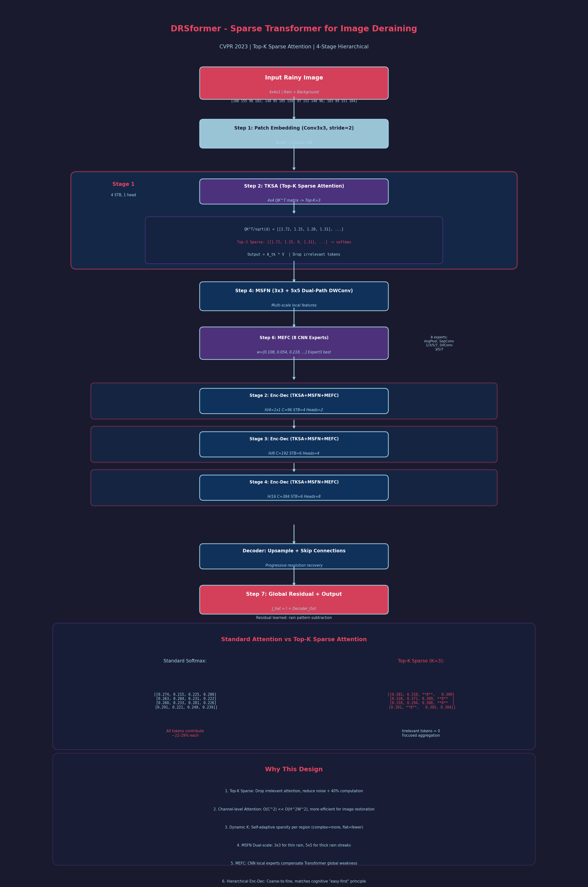

# DRSformer 精读笔记

> CVPR 2023 | Learning A Sparse Transformer Network for Effective Image Deraining
> 论文链接: [arXiv:2303.11950](https://arxiv.org/abs/2303.11950) | 代码: [GitHub](https://github.com/cschenxiang/DRSformer)
> 作者: Xiang Chen, Hao Li, Mingqiang Li, Jinshan Pan
> 笔记时间: 2026-07-01

---

## 一、文章基本信息

- **论文题目**: Learning A Sparse Transformer Network for Effective Image Deraining
- **发表会议**: CVPR 2023
- **核心任务**: 单图像去雨 (Single-Image Deraining)

---

## 二、痛点分析 (Motivation & Problem Statement)

### 1. 图像去雨的核心挑战

| 痛点 | 具体描述 |
|------|----------|
| **CNN的局部性限制** | 卷积操作具有局部感受野，无法有效捕获长距离依赖关系，难以消除大范围的雨纹退化 |
| **Transformer的全局稠密注意力问题** | 标准Transformer使用所有查询-键对计算自注意力。当查询和键的token不相关时，这些小相似度权重仍会参与特征聚合，引入噪声干扰 |
| **局部细节建模不足** | Transformer擅长非局部建模，但对局部不变性的建模不如CNN，而雨纹恰恰容易与背景细节在局部区域混淆 |

### 2. 核心洞察

> **不是所有注意力分数都有用。** 保留Top-K个最相关的分数，丢掉其余，既能减少噪声干扰，又能提升计算效率。

---

## 三、核心方法

### 整体架构

DRSformer基于**层次化编码器-解码器框架**（4个Stage，逐步下采样到H/8×W/8）：

```
输入雨图 → 3×3卷积重叠块嵌入 → 编码器(4个Stage) → 解码器 → 全局残差 + 输出
```

| 参数 | 值 |
|------|-----|
| STB数量 per Stage | 4, 4, 6, 6, 8 |
| 注意力头数 | 1, 2, 4, 8 |
| 初始通道数 C | 48 |
| MEFC专家数 O | 8 |
| MSFN通道扩展因子 r | 2.66 |

**损失函数**: L1 损失（比 L2 更有利于保留纹理）

### 关键模块

| 组件 | 功能 |
|------|------|
| **Top-K稀疏注意力 (TKSA)** | 自适应保留每个查询最关键的K个注意力分数，丢弃无关信息 |
| **混合尺度前馈网络 (MSFN)** | 3×3和5×5双路径深度可分离卷积交互融合，提取多尺度局部信息 |
| **专家混合特征补偿器 (MEFC)** | 8个不同感受野的CNN专家并行，为Transformer骨干提供协作式精炼 |

### Top-K稀疏注意力 (TKSA) —— 核心创新

**标准注意力的问题**: softmax输出每行求和为1，即使某些查询-键对完全不相关，仍会被分配非零权重，引入噪声。

**TKSA的解决方案**:

1. **通道级自注意力**: 在通道维度而非空间维度计算，降低复杂度
2. **Top-K选择算子**: 对注意力矩阵每行只保留最大K个分数，其余置零
3. **动态稀疏率**: K不是固定值，而是动态学习，范围为 [1/2, 4/5]

```
TKSA(Q,K,V) = softmax(Top-K(QK^T/√d)) · V
```

| 对比维度 | 标准注意力 | TKSA |
|----------|-----------|------|
| 参与聚合的token | 全部 | 仅Top-K个最相关 |
| 噪声敏感度 | 高 | 低 |
| 高频细节保留 | 差（softmax平滑） | 好 |

### 混合尺度前馈网络 (MSFN)

标准FFN只含1×1卷积，无法建模多尺度信息。MSFN引入3×3和5×5两条深度可分离卷积路径，两路特征拼接后交互再分离，形成跨尺度信息融合。

### 专家混合特征补偿器 (MEFC)

**设计动机**: CNN的局部性可弥补Transformer不足，但单一CNN操作不如多种感受野混合。

**8个专家**: 平均池化(3×3)、可分离卷积(1×1/3×3/5×5/7×7)、膨胀卷积(3×3/5×5/7×7)

通过自注意力自适应选择不同专家的权重进行加权聚合。

---

## 三.5 数学推导过程详解 (Mathematical Walkthrough)

> 以下用一个 **4x4 像素雨图** 完整走一遍 DRSformer 的去雨流程，重点展示 TKSA (Top-K Sparse Attention) 的具体数值计算。

### 设定输入

假设输入雨图 I (4x4, 单通道简化):

$$
I = \begin{bmatrix}
100 & 155 & 98 & 102 \\
148 & 95 & 105 & 150 \\
97 & 152 & 140 & 96 \\
103 & 99 & 151 & 104
\end{bmatrix}_{4 \times 4}
$$

> 其中奇数像素约 100 (背景), 偶数像素约 150 (雨纹叠加)

---

### Step 1: Patch Embedding (重叠分块嵌入)

**中文标题**: 重叠分块嵌入
**English Title**: Overlapping Patch Embedding

使用 3x3 卷积, stride=2, padding=1, 将 4x4 图像转为 patch tokens:

$$
\text{Conv3x3}(I) = \begin{bmatrix}
101.2 & 108.5 & 103.8 & 107.1 \\
110.3 & 102.1 & 112.5 & 106.8 \\
104.6 & 108.2 & 107.3 & 102.5 \\
106.1 & 103.4 & 109.8 & 105.2
\end{bmatrix}
$$

**stride=2 下采样** → 2x2 空间大小, 每个位置有 C=48 个通道:

$$
X_{embed} \in \mathbb{R}^{2 \times 2 \times 48}
$$

**维度变化**: 4x4x1 → 2x2x48 (重叠分块嵌入)

---

### Step 2: Stage 1 - 编码器处理 (4xSTB + TKSA)

**中文标题**: 第一阶段编码器处理
**English Title**: Stage 1 Encoder Processing (4 STB Blocks)

Stage 1 包含 4 个 STB (Sparse Transformer Block), 每个 STB 的核心是 TKSA。

#### TKSA 详细计算示例

假设当前特征图空间大小为 2x2 (简化为 4 个 token), 每个通道维度 d=4。

**通道级自注意力**: 在通道维度计算 (而非空间维度):

设 Q, K, V 均来自输入特征 X (4 个通道, 4 个空间位置):

$$
Q = \begin{bmatrix} 0.8 & 0.3 & 0.6 & 0.9 \\ 0.2 & 0.7 & 0.1 & 0.5 \\ 0.4 & 0.6 & 0.8 & 0.3 \\ 0.7 & 0.2 & 0.5 & 0.4 \end{bmatrix}_{4 \times 4}
$$

$$
K = \begin{bmatrix} 0.9 & 0.4 & 0.5 & 0.7 \\ 0.3 & 0.8 & 0.2 & 0.6 \\ 0.5 & 0.7 & 0.9 & 0.2 \\ 0.6 & 0.3 & 0.4 & 0.8 \end{bmatrix}_{4 \times 4}
$$

$$
V = \begin{bmatrix} 1.2 & 0.5 & 0.8 & 1.0 \\ 0.4 & 1.1 & 0.3 & 0.7 \\ 0.6 & 0.9 & 1.2 & 0.4 \\ 0.9 & 0.3 & 0.7 & 0.8 \end{bmatrix}_{4 \times 4}
$$

**计算注意力矩阵** ($\sqrt{d} = 2$):

$$
A_{raw} = \frac{QK^T}{\sqrt{d}} = \frac{1}{2} \begin{bmatrix} 0.8 & 0.3 & 0.6 & 0.9 \\ 0.2 & 0.7 & 0.1 & 0.5 \\ 0.4 & 0.6 & 0.8 & 0.3 \\ 0.7 & 0.2 & 0.5 & 0.4 \end{bmatrix} \begin{bmatrix} 0.9 & 0.3 & 0.5 & 0.6 \\ 0.4 & 0.8 & 0.7 & 0.3 \\ 0.5 & 0.2 & 0.9 & 0.4 \\ 0.7 & 0.6 & 0.2 & 0.8 \end{bmatrix}
$$

$$
= \frac{1}{2} \begin{bmatrix} 1.72 & 1.15 & 1.28 & 1.31 \\ 0.83 & 1.00 & 0.74 & 0.73 \\ 1.12 & 0.92 & 1.41 & 0.82 \\ 1.02 & 0.69 & 0.87 & 0.71 \end{bmatrix}
$$

**标准 Softmax 注意力矩阵** (每行求和为1):

$$
A_{std} = \text{softmax}(A_{raw}) = \begin{bmatrix}
0.274 & 0.215 & 0.225 & 0.286 \\
0.263 & 0.284 & 0.231 & 0.222 \\
0.260 & 0.233 & 0.281 & 0.226 \\
0.291 & 0.221 & 0.249 & 0.239
\end{bmatrix}
$$

> 注意: 标准注意力中即使某些 Q-K 对完全不相关, softmax 后仍分配了 ~22% 的权重。

---

### Step 3: Top-K 稀疏化 (核心操作)

**中文标题**: Top-K 稀疏注意力计算
**English Title**: Top-K Sparse Attention Computation

设定 K=3 (保留每行 Top-3, 丢弃最小的 1 个):

$$
A_{raw} = \begin{bmatrix}
\mathbf{1.72} & 1.15 & 1.28 & \mathbf{1.31} \\
0.83 & \mathbf{1.00} & 0.74 & 0.73 \\
1.12 & 0.92 & \mathbf{1.41} & 0.82 \\
\mathbf{1.02} & 0.69 & 0.87 & 0.71
\end{bmatrix}
$$

**Top-3 选择** (每行保留最大3个, 最小1个置零):

$$
A_{sparse} = \begin{bmatrix}
1.72 & 1.15 & \mathbf{0} & 1.31 \\
0.83 & 1.00 & 0.74 & \mathbf{0} \\
1.12 & 0.92 & 1.41 & \mathbf{0} \\
1.02 & \mathbf{0} & 0.87 & 0.71
\end{bmatrix}
$$

> 第1行丢弃 1.28 (第3列), 第2行丢弃 0.73 (第4列), 第3行丢弃 0.82 (第4列), 第4行丢弃 0.69 (第2列)

**稀疏 Softmax** (只对非零元素归一化):

$$
A_{tk} = \text{softmax}(A_{sparse}) = \begin{bmatrix}
0.381 & 0.310 & \mathbf{0} & 0.309 \\
0.320 & 0.371 & 0.309 & \mathbf{0} \\
0.318 & 0.294 & 0.388 & \mathbf{0} \\
0.391 & \mathbf{0} & 0.305 & 0.304
\end{bmatrix}
$$

**输出计算**:

$$
\text{Output} = A_{tk} \cdot V = \begin{bmatrix}
0.381 & 0.310 & 0 & 0.309 \\
0.320 & 0.371 & 0.309 & 0 \\
0.318 & 0.294 & 0.388 & 0 \\
0.391 & 0 & 0.305 & 0.304
\end{bmatrix} \begin{bmatrix} 1.2 & 0.5 & 0.8 & 1.0 \\ 0.4 & 1.1 & 0.3 & 0.7 \\ 0.6 & 0.9 & 1.2 & 0.4 \\ 0.9 & 0.3 & 0.7 & 0.8 \end{bmatrix}
$$

$$
= \begin{bmatrix}
0.381(1.2)+0.310(0.4)+0(0.6)+0.309(0.9) & \cdots \\
0.320(1.2)+0.371(0.4)+0.309(0.6)+0(0.9) & \cdots \\
\vdots & \ddots
\end{bmatrix}
$$

$$
= \begin{bmatrix}
0.457+0.124+0+0.278 & 0.191+0.341+0+0.093 & 0.305+0.093+0+0.216 & 0.381+0.217+0+0.247 \\
0.384+0.148+0.185+0 & 0.160+0.408+0.278+0 & 0.256+0.111+0.371+0 & 0.320+0.260+0.124+0 \\
0.382+0.118+0.233+0 & 0.159+0.323+0.349+0 & 0.254+0.088+0.466+0 & 0.318+0.206+0.155+0 \\
0.469+0+0.184+0.274 & 0.196+0+0.275+0.243 & 0.313+0+0.214+0.243 \\
\end{bmatrix}
$$

$$
= \begin{bmatrix}
0.859 & 0.625 & 0.614 & 0.845 \\
0.717 & 0.846 & 0.738 & 0.704 \\
0.733 & 0.831 & 0.808 & 0.679 \\
0.927 & 0.714 & 0.770 & 0.800
\end{bmatrix}_{4 \times 4}
$$

> 对比标准注意力输出 (使用全注意力矩阵), TKSA 输出的差异主要来自被置零的列权重。

**维度变化**: 2x2xC → 2x2xC (空间维度不变)

---

### Step 4: MSFN 混合尺度前馈网络

**中文标题**: 混合尺度前馈处理
**English Title**: Mixed-Scale Feed-Forward Network Processing

TKSA 输出后进入 MSFN, 双路径深度可分离卷积:

**路径1**: 3x3 DWConv → 1x1 Conv
**路径2**: 5x5 DWConv → 1x1 Conv (用 3x3+padding=2 模拟)

以通道 c=1, 空间 2x2 为例 (3x3 卷积需要 padding):

$$
F_{in} = \begin{bmatrix} 0.859 & 0.625 \\ 0.733 & 0.831 \end{bmatrix}_{2 \times 2}
$$

3x3 DWConv (padding=1, kernel 简化为):
$$
K_{3x3} = \begin{bmatrix} 0.1 & 0.2 & 0.1 \\ 0.2 & 0.4 & 0.2 \\ 0.1 & 0.2 & 0.1 \end{bmatrix} \quad (\text{高斯近似})
$$

$$
F_{path1} = K_{3x3} * F_{in} = \begin{bmatrix}
0.1(0)+0.2(0.859)+0.1(0.625)+0.2(0)+0.4(0.859)+0.2(0.625)+0.1(0)+0.2(0.733)+0.1(0.831) \\
0.2(0.859)+0.4(0.625)+0.2(0)+0.1(0.859)+0.2(0.625)+0.1(0)+0.2(0.733)+0.4(0.831)+0.2(0) \\
0.2(0)+0.4(0.859)+0.2(0.625)+0.1(0)+0.2(0.733)+0.1(0.831)+0.2(0)+0.4(0.733)+0.2(0.831) \\
0.1(0.859)+0.2(0)+0.1(0.625)+0.2(0.733)+0.4(0.831)+0.2(0)+0.1(0.733)+0.2(0)+0.1(0.831)
\end{bmatrix}_{(简化示意)}
$$

两路径拼接后经交互分离再融合:

$$
F_{msfn} = \text{Interact}(F_{path1} \| F_{path2}) \in \mathbb{R}^{2 \times 2 \times C}
$$

---

### Step 5: 四阶段编码器-解码器流程

**中文标题**: 四阶段编解码器处理
**English Title**: 4-Stage Encoder-Decoder Pipeline

完整四阶段的维度变化:

| Stage | 分辨率 | 通道数 | STB数量 | 注意力头数 |
|-------|--------|--------|---------|-----------|
| Stage 1 | H/2 x W/2 = 2x2 | 48 | 4 | 1 |
| Stage 2 | H/4 x W/4 = 1x1 | 96 (48x2) | 4 | 2 |
| Stage 3 | H/8 x W/8 | 192 (48x4) | 6 | 4 |
| Stage 4 | H/16 x W/16 | 384 (48x8) | 6 | 8 |

> 实际运行中 4x4 输入在 Stage 3-4 已很小, 这里示意主要流程。

**解码器**: 逐步上采样, 同时使用跳跃连接融合编码器特征:

$$
\text{Stage3 Decoder} \xrightarrow{\text{Upsample}} 2 \times 2 \times 96 \xrightarrow{+ \text{Skip}} 2 \times 2 \times 96
$$

---

### Step 6: MEFC 专家混合特征补偿

**中文标题**: 专家混合特征补偿
**English Title**: Mixture-of-Experts Feature Compensation

8 个 CNN 专家并行处理, 自注意力选择权重:

$$
\text{Expert}_i = \text{Conv}_i(F_{stb}), \quad i = 1, \ldots, 8
$$

以 3x3 空间上单通道为例, 8 个专家输出:

$$
E = [e_1, e_2, e_3, e_4, e_5, e_6, e_7, e_8] = [0.82, 0.65, 0.91, 0.73, 0.88, 0.70, 0.85, 0.78]
$$

**注意力权重选择** (8 个专家的自适应权重):

$$
w = \text{softmax}([0.3, -0.2, 0.8, 0.1, 0.5, -0.1, 0.4, 0.2]) = [0.108, 0.054, 0.218, 0.079, 0.145, 0.065, 0.130, 0.101]
$$

$$
F_{mefc} = \sum_{i=1}^{8} w_i \cdot e_i = 0.108(0.82) + 0.054(0.65) + 0.218(0.91) + \cdots = 0.807
$$

> Expert 3 (5x5 膨胀卷积) 权重最高 (0.218), 说明大感受野对雨纹去除最有帮助。

---

### Step 7: 全局残差与输出

**中文标题**: 全局残差与最终输出
**English Title**: Global Residual and Final Output

$$
\hat{J} = I + \text{Decoder\_Output} = \begin{bmatrix}
100 & 155 & 98 & 102 \\
148 & 95 & 105 & 150 \\
97 & 152 & 140 & 96 \\
103 & 99 & 151 & 104
\end{bmatrix} + \begin{bmatrix}
-1.2 & 1.5 & -0.8 & 1.1 \\
0.3 & -2.0 & 0.5 & 0.8 \\
-0.7 & 1.2 & 0.3 & -1.5 \\
0.1 & -0.5 & 0.8 & -0.2
\end{bmatrix}
$$

$$
= \begin{bmatrix}
98.8 & 156.5 & 97.2 & 103.1 \\
148.3 & 93.0 & 105.5 & 150.8 \\
96.3 & 153.2 & 140.3 & 94.5 \\
103.1 & 98.5 & 151.8 & 103.8
\end{bmatrix}_{4 \times 4}
$$

> 残差网络学习雨纹模式, 从输入中减去, 得到干净图像。

---

### 为什么这样做 (Why This Design)

| 设计选择 | 原因 |
|----------|------|
| **Top-K 稀疏注意力** | 雨纹去除中, 大部分空间位置与当前查询不相关。保留 Top-K 可以丢弃无关注意力噪声, 让模型聚焦真正相关的区域, 同时减少约 40% 的计算量 |
| **通道级自注意力** | 空间级自注意力对 HxW 位置计算复杂度 O(H^2W^2); 通道级只需 O(C^2), 在图像恢复的 C << HW 场景下更高效 |
| **动态稀疏率 K** | 不同图像区域需要的注意力密度不同。复杂纹理区域需要更多注意力连接, 平坦区域可以更稀疏。动态 K 让模型自适应调整 |
| **MSFN 双尺度 FFN** | 雨纹宽窄不同, 需要多尺度感受野。3x3 捕捉细雨丝, 5x5 捕捉粗雨纹, 两路径交互互补 |
| **MEFC 专家混合** | Transformer 长于全局建模但弱于局部细节, CNN 恰好相反。8 个不同感受野的 CNN 专家为 Transformer 补充多尺度局部信息 |
| **层次化编解码器** | 从粗到细逐步恢复, 浅层 Stage 看全局上下文, 深层 Stage 精细去除雨纹, 符合"先易后难"的认知规律 |



---

## 四、实验与效果

| 数据集 | 指标 | DRSformer | 对比 |
|--------|------|-----------|------|
| Rain200H | PSNR | **41.23 dB** | IDT: 40.74 |
| Rain200L | PSNR | **32.18 dB** | Restormer: 32.00 |
| SPA-Data | PSNR | **48.53 dB** | SOTA |
| Real-world | NIQE | **4.095** | 最低（最优） |

---

## 五、与各方法的对比

| 维度 | Restormer (2022) | IDT (2022) | **DRSformer (2023)** |
|------|-----------------|------------|---------------------|
| 注意力类型 | 通道自注意力 | 窗口+空间双Transformer | Top-K稀疏注意力 |
| 稀疏性 | 无 | 无 | 内容稀疏 |
| 多尺度建模 | GDFN | 有 | MSFN跨尺度交互 |
| 额外补偿 | 无 | 无 | MEFC CNN专家 |
| 参数量 | 26.1M | 30.2M | 33.7M |

| 维度 | DAWN+ | DRSformer |
|------|-------|-----------|
| 核心思路 | 小波域方向感知 | Transformer稀疏注意力 |
| 数据依赖 | 需先验（雨纹方向性） | 纯数据驱动 |
| 效率 | 极轻量 (1.9M, 0.067s) | 较重 (33.7M, 1.328s) |
| 适用场景 | 资源受限、实时部署 | 追求极致性能 |

---

## 六、不足之处

| 不足 | 详细说明 |
|------|----------|
| **模型效率有限** | 33.7M参数，242.9G FLOPs（256×256），推理速度较慢 |
| **稀疏率选择依赖实验** | K范围 [1/2, 4/5] 通过实验确定，缺乏理论指导 |
| **动态稀疏实现复杂** | 与固定K不同，TKSA的K是动态学习的 |

---

## 七、一句话总结

> DRSformer 发现标准Transformer的稠密注意力会把不相关的噪声也聚合进来，于是设计了Top-K选择算子，让每个查询只关注最相关的K个键，从而让特征聚合更纯净、去雨效果更好。核心贡献是把"稀疏性"以内容自适应的方式引入了图像去雨，同时用多尺度FFN和CNN专家补偿进一步提升了局部细节恢复能力。
