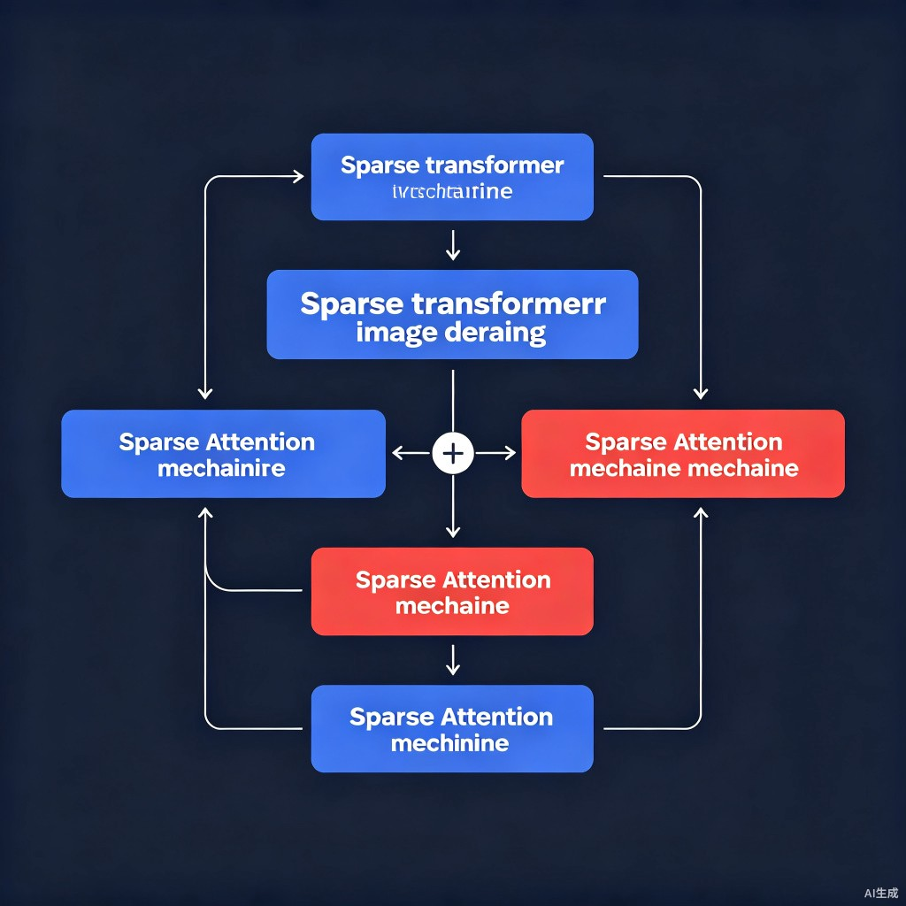

# Learning A Sparse Transformer Network for Effective Image Deraining (DRSformer) 精读笔记

> [📄 arXiv](https://arxiv.org/abs/2303.11950) | 🎯 CVPR 2023 (Highlight) | [💻 代码](https://github.com/cschenxiang/DRSformer)

## 一、基本信息

| 属性 | 内容 |
|------|------|
| **论文标题** | Learning A Sparse Transformer Network for Effective Image Deraining |
| **发表会议** | CVPR 2023 (Highlight 论文) |
| **作者** | Xiang Chen, Hao Li, Mingqiang Li, Jinshan Pan（通讯作者） |
| **单位** | 南京理工大学 计算机科学与工程学院，中国电子科技集团公司 信息科学研究院 |
| **核心创新** | 可学习 Top-K 稀疏注意力（TKSA）+ 混合尺度前馈网络（MSFN）+ 混合专家特征补偿器（MEFC） |
| **适用任务** | 图像去雨（合成雨 + 真实雨） |
| **关键指标** | 在 5 个去雨基准上达到 SOTA，平均 PSNR 比 IDT 高约 0.4 dB |
| **数据集** | Rain200L, Rain200H, DID-Data (Test1200), DDN-Data (Test1400), SPA-Data |
| **评估指标** | PSNR/SSIM（YCbCr Y 通道），NIQE/BRISQUE（无参考） |

## 二、痛点分析

| 痛点 | 深层原因 | 现有方法的局限 | DRSformer 的解决方案 |
|------|---------|---------------|---------------------|
| 标准 Transformer 全连接注意力引入噪声 | query-key 对间全部相似度参与聚合，不相关 token 的注意力值仍被纳入特征交互 | 密集计算模式放大较小相似度权重，冗余/无关表征干扰恢复 | TKSA：Top-K 自适应选择最有用的注意力值 |
| CNN 局部感受野 vs Transformer 缺乏局部建模 | CNN 受限于局部感受野且与输入无关；Transformer 不擅长建模局部不变特性 | CNN 难消除长程雨退化；Transformer 难捕捉细节纹理 | MSFN：3×3 + 5×5 双分支混合尺度前馈网络 |
| 前馈网络缺乏多尺度信息 | 标准 FFN 单尺度卷积，无法捕捉不同尺度雨纹间的相关性 | 单尺度表示不足以处理多密度、多方向雨纹 | MSFN 引入多尺度深度卷积提取多尺度局部信息 |
| 数据稀疏性与内容稀疏性未联合探索 | 雨分布揭示退化位置与程度，但现有方法未有效利用 | 单一稀疏机制无法同时处理数据和内容层面的稀疏性 | MEFC：混合专家特征补偿器，用注意力作为专家切换器 |

## 三、核心方法

### 3.1 整体架构



DRSformer 基于**层次化编码器-解码器**（改造自 Restormer）：

```
输入雨图 I_rain
  → 3×3 Patch Embedding
  → 4 层级 STB（Sparse Transformer Block）堆叠
    ├── 层级 1-3: 下采样（pixel-unshuffle）+ N 个 STB
    └── 层级 4: N 个 STB + 上采样（pixel-shuffle）
  → Skip Connection 桥接中间特征
  → 全局残差: I_derain = F(I_rain) + I_rain
```

在早期与最终阶段放置 N₀ 个 **MEFC**（混合专家特征补偿器），提供互补特征精炼。

### 3.2 STB（Sparse Transformer Block）

每个 STB 由两个子模块组成：

$$X_l' = X_{l-1} + \text{TKSA}(\text{LN}(X_{l-1}))$$

$$X_l = X_l' + \text{MSFN}(\text{LN}(X_l'))$$

即 STB = **TKSA**（Top-K 稀疏注意力）+ **MSFN**（混合尺度前馈网络），均带 LayerNorm 和残差连接。

### 3.3 TKSA（Top-K 稀疏注意力）— 核心创新

#### 设计动机

标准点积注意力对所有 query-key 对密集计算：

$$\text{Att}(Q,K,V)=\text{softmax}\!\left(\frac{QK^\top}{\sqrt{d}}\right)V$$

但 key 中的 token 并不总是与 query 相关，不相关 token 的注意力值仍参与聚合，干扰清晰图像恢复。

#### TKSA 的关键设计

1. **通道维度注意力**（继承自 Restormer MDTA）：注意力矩阵为 C×C 而非 (HW)×(HW)，对空间维度线性复杂度
2. **Q/K/V 编码**：1×1 卷积 + 3×3 深度卷积
3. **L2 归一化**：对 Q、K 做 `F.normalize(dim=-1)`，保证注意力稳定
4. **可学习温度**：τ 为可学习参数，形状 `(num_heads,1,1)`
5. **Top-K 自适应选择**：不使用单一 k，而是**同时构造 4 种不同稀疏度的掩码并加权融合**

#### 4 路 Top-K 掩码详解

| 掩码 | 保留通道数 k（C 为每头通道数） | 稀疏比例 |
|------|-------------------------------|---------|
| mask1 | C/2 | 50% |
| mask2 | 2C/3 | ~67% |
| mask3 | 3C/4 | 75% |
| mask4 | 4C/5 | 80% |

对每个掩码：
```python
index = torch.topk(attn, k=k_i, dim=-1, largest=True)[1]
mask.scatter_(-1, index, 1.)
attn_i = torch.where(mask > 0, attn, torch.full_like(attn, float('-inf')))
attn_i = attn_i.softmax(dim=-1)    # 非 top-k 位置经 -inf → 0
out_i = attn_i @ v
```

#### 门控融合

$$\text{out} = \sum_{i=1}^{4} \alpha_i \cdot (\text{softmax}(A_i) \cdot V)$$

其中 α_i 为 4 个**可学习标量权重**，均初始化为 0.2。

> **核心洞察**：DRSformer 不去"猜"一个最佳稀疏比，而是让 4 个不同 top-k 比例的稀疏注意力并行计算，再由可学习权重自适应加权融合——这既实现了内容稀疏性，又保留了多粒度信息。

### 3.4 MSFN（混合尺度前馈网络）

**动机**：多尺度雨纹之间存在相关性，单尺度卷积不足。

**结构**：
```python
class MSFN(nn.Module):
    # project_in: 1×1 Conv, dim → hidden_features*2
    # 双路并行:
    #   路径1: 3×3 DWConv → ReLU → chunk → 3×3 DWConv → ReLU
    #   路径2: 5×5 DWConv → ReLU → chunk → 5×5 DWConv → ReLU
    # 两路交叉拼接 → project_out: 1×1 Conv → dim
```

**数据流**：
```
x → 1×1 Conv → split → [x1, x2]
x1 → 3×3 DWConv → ReLU → chunk(2) → [a1, a2]
x2 → 5×5 DWConv → ReLU → chunk(2) → [b1, b2]
→ cat([a1, b1]) → 3×3 DWConv → ReLU  } cat → 1×1 Conv → out
→ cat([a2, b2]) → 5×5 DWConv → ReLU  }
```

### 3.5 MEFC（混合专家特征补偿器）

**动机**：联合探索数据稀疏性与内容稀疏性。

**专家集合**（8 种并行 CNN 操作）：
- 可分离卷积：1×1, 3×3, 5×5, 7×7
- 空洞卷积：3×3, 5×5, 7×7
- 平均池化：3×3

**与传统 MoE 的区别**：不附加外部门控网络，而是用（自）注意力作为专家切换器，根据输入自适应选择不同表征的重要性。

**结构**：
- `OALayer`：GAP → FC → ReLU → FC → softmax，生成专家权重
- `GroupOLs`：按权重对各专家操作做加权组合

> **注意**：Rain200L 与 SPA-Data 不使用 MEFC（因雨纹较简单），需改用 `DRSformer_arch_200L+SPA.py`。

## 三.5 数学推导过程详解

### 通道注意力降复杂度

标准空间自注意力复杂度：
$$O(N^2 \cdot d), \quad N = H \times W$$

DRSformer 通道注意力复杂度：
$$O(C^2 \cdot N)$$

当 C << N（如 C=128, N=256×256=65536）时，通道注意力远比空间注意力高效。

### Top-K 稀疏选择

给定注意力矩阵 $A \in \mathbb{R}^{C \times C}$，对第 i 个掩码：

$$M_i = \text{TopK}(A, k_i)$$

$$A_i[j,k] = \begin{cases} A[j,k] & \text{if } (j,k) \in M_i \\ -\infty & \text{otherwise} \end{cases}$$

$$\hat{A}_i = \text{softmax}(A_i, \text{dim}=-1)$$

$$\text{out} = \sum_{i=1}^{4} \alpha_i \cdot (\hat{A}_i \cdot V)$$

**数值示例**（C=8, 仅展示 mask1, k=4）：
```
原始注意力行: [0.3, 0.1, 0.25, 0.05, 0.15, 0.08, 0.02, 0.05]
Top-4 索引:     ✓              ✓      ✓             ✓
掩码后:       [0.3, -∞, 0.25, -∞, 0.15, -∞, -∞, -∞]
softmax:      [0.42, 0, 0.32, 0, 0.18, 0, 0, 0, 0]
→ 不相关 token 权重归零，聚合更聚焦
```

### 损失函数

$$\mathcal{L} = \|I_{derain} - I_{gt}\|_1$$

简洁的 L1 损失，全局残差连接：$I_{derain} = F(I_{rain}) + I_{rain}$

## 为什么这样做

| 设计选择 | 原因 | 不这样做的后果 |
|---------|------|---------------|
| 通道注意力而非空间注意力 | 空间注意力 O(N²) 对大图不可行 | 显存爆炸、计算缓慢 |
| Top-K 稀疏而非密集注意力 | 不相关 token 的注意力值干扰恢复 | 噪声特征被聚合，恢复质量下降 |
| 4 路不同 k 值融合 | 不同稀疏度捕捉不同粒度的相关性 | 单一 k 值无法适应不同雨纹密度 |
| 可学习门控权重 | 让网络自适应选择最佳稀疏比组合 | 固定权重无法适应不同输入 |
| MSFN 双尺度（3×3 + 5×5） | 多尺度雨纹需要多尺度感受野 | 单尺度 FFN 遗漏尺度间相关性 |
| MEFC 混合专家 | 不同雨纹区域需要不同处理策略 | 单一卷积核无法适应多变的雨纹 |
| MEFC 仅在重雨数据集使用 | 轻雨数据集雨纹简单，MEFC 增加冗余 | 简单数据上过拟合 |
| L2 归一化 Q/K | 防止注意力值过大导致不稳定 | 注意力分布过于尖锐或平坦 |
| 可学习温度 τ | 自适应调节注意力锐度 | 固定温度无法适应不同输入 |

## 四、实验与效果

### 数据集

| 数据集 | 训练 | 测试 | 类型 |
|--------|------|------|------|
| Rain200L | 1800 | 200 | 合成轻雨 |
| Rain200H | 1800 | 200 | 合成重雨 |
| DID-Data | 12000 | 1200 | 多密度多方向 |
| DDN-Data | 12600 | 1400 | 多密度 |
| SPA-Data | 638492 | 1000 | 真实世界大雨 |

### 评估指标

- **有参考**：PSNR / SSIM，在 YCbCr 空间的 Y 通道计算
- **无参考**：NIQE / BRISQUE（Internet-Data 随机取 20 张真实雨图）

### 主要结果

DRSformer 在全部 5 个去雨基准上达到 SOTA：

- 在**平均 PSNR 上比并发方法 IDT 高约 0.4 dB**
- 在 DID-Data 与 DDN-Data 上提升尤为显著，表明能正确处理多种空间变化的雨纹
- 在 SPA-Data（真实世界）上取得最高 PSNR/SSIM，展示泛化优势
- 无参考指标 NIQE/BRISQUE 均为最优，感知质量更好

### 对比方法

| 类型 | 方法 |
|------|------|
| 先验类 | DSC, GMM |
| CNN 类 | DDN, RESCAN, PReNet, MSPFN, RCDNet, MPRNet, DualGCN, SPDNet |
| Transformer 类 | Uformer, Restormer, IDT |

### 消融实验

| 消融维度 | 结论 |
|---------|------|
| Top-K 选择有效性 | HPF 可视化显示 top-k 能重建更精细特征，减少长程不相关上下文干扰 |
| MSFN vs 其他 FFN | 对比常规 FN、DFN、GDFN（Restormer 所用），MSFN 因多尺度信息更优 |
| MEFC 有效性 | 消融验证 MEFC 对最终性能的贡献（重雨数据集上） |
| Top-K 候选比例 | 4 档（C/2, 2C/3, 3C/4, 4C/5）本身就是多粒度稀疏的消融设计 |

## 五、对比总结

| 维度 | DRSformer | Restormer | IDT | Uformer | MPRNet |
|------|-----------|-----------|-----|---------|--------|
| 架构类型 | 稀疏 Transformer | 通道注意力 Transformer | 物理引导 Transformer | U-Net Transformer | 多阶段 CNN |
| 注意力机制 | TKSA（4路 Top-K） | MDTA（通道注意力） | 物理引导注意力 | 窗口注意力 | SE 通道注意力 |
| FFN | MSFN（3×3+5×5） | GDFN（门控深度卷积） | 标准 | 标准 | N/A |
| 去雨 SOTA | ✅ 最优 | 次优 | 第三 | 中等 | 中等 |
| 核心优势 | 自适应稀疏注意力 | 高效通道注意力 | 物理可解释 | 局部-全局兼顾 | 多阶段渐进 |
| 模型复杂度 | 较高 | 较高 | 中等 | 中等 | 中等 |

> DRSformer 的核心贡献在于**首次将可学习 Top-K 稀疏注意力引入图像恢复**，通过 4 路不同稀疏度的自适应融合，在保持计算效率的同时显著提升恢复质量。后续 DAWN+ 等工作在达到竞争性能的同时大幅降低了参数量。

## 六、不足与局限

1. **模型复杂度较高**：论文明确承认模型复杂度较高，未来计划通过剪枝或蒸馏进行模型压缩
2. **4 路并行注意力开销**：同时计算 4 个 Top-K 掩码的注意力带来额外显存和计算开销
3. **Top-K 算子不可微**：`torch.topk` 的索引选择不可微，需用 scatter 近似梯度传播
4. **MEFC 仅适用于重雨**：轻雨数据集（Rain200L）和 SPA-Data 不使用 MEFC，需切换架构
5. **基于 Restormer 改造**：架构受限于 Restormer 的层次化设计，灵活性有限

## 七、一句话总结

DRSformer 通过可学习 Top-K 稀疏注意力（4 路不同稀疏度自适应融合）+ 混合尺度前馈网络 + 混合专家特征补偿器，在 5 个去雨基准上达到 SOTA，是稀疏注意力在图像恢复领域的开创性工作。

---

## 八、生活化例子：小明的"旧影修复工作室"

> **场景三：暴雨中的婚纱照**

这一天，工作室来了一位愁眉苦脸的新娘。她最珍贵的**暴雨中拍摄的婚纱照**被雨水毁得面目全非——雨纹密密麻麻，像无数银针扎在照片上，新郎的脸都快看不清了。

"这比上次的斜雨丝难多了！"小明心想。他想起了 DRSformer 的"稀疏注意力"——**不是每个像素都值得关注，只抓最重要的**：

"就像在一堆乱麻中找线头，我不会一根根地去拉，而是找到几个关键的'结'，解开它们，整团乱麻就散开了。"小明用"Top-K"的思路，在照片里只关注**最有用的像素关系**——哪些像素是背景、哪些是雨纹、哪些是新娘的脸。

他还用了"混合专家"的策略：有的地方雨纹细如发丝（用小刷子），有的地方雨纹粗如手指（用大刷子），不同区域请不同的"专家"来处理。

最后，新娘看着修复好的照片，眼泪掉下来——"我老公的脸……终于看清楚了！"

小明悟到了：**信息太多时，学会"抓重点"比"全抓"更有效。**

---

> 小明的工作室名气越来越大，甚至有大客户找上门来……

## 附录

### TKSA 伪代码

```python
class TKSA(nn.Module):
    def __init__(self, dim, num_heads, bias):
        self.num_heads = num_heads
        self.temperature = nn.Parameter(torch.ones(num_heads, 1, 1))
        # 4 个可学习门控权重，初始化为 0.2
        self.attn1 = nn.Parameter(0.2)
        self.attn2 = nn.Parameter(0.2)
        self.attn3 = nn.Parameter(0.2)
        self.attn4 = nn.Parameter(0.2)

    def forward(self, x):
        q = F.normalize(self.q_dwconv(self.q(x)), dim=-1)
        k = F.normalize(self.k_dwconv(self.k(x)), dim=-1)
        v = self.v_dwconv(self.v(x))

        attn = (q @ k.transpose(-2, -1)) * self.temperature

        C = attn.shape[-1]
        outputs = []

        for k_val, alpha in [(C//2, self.attn1), (2*C//3, self.attn2),
                              (3*C//4, self.attn3), (4*C//5, self.attn4)]:
            # Top-K 选择
            index = torch.topk(attn, k=k_val, dim=-1, largest=True)[1]
            mask = torch.zeros_like(attn).scatter_(-1, index, 1.)
            attn_sparse = torch.where(mask > 0, attn, torch.full_like(attn, float('-inf')))
            attn_sparse = attn_sparse.softmax(dim=-1)
            out_i = attn_sparse @ v
            outputs.append(alpha * out_i)

        out = sum(outputs)
        out = self.project_out(out)
        return out

### MSFN 伪代码

class MSFN(nn.Module):
    def forward(self, x):
        x = self.project_in(x)           # 1×1 Conv → hidden*2
        x1, x2 = x.chunk(2, dim=1)

        # 路径1: 3×3
        x1 = self.dwconv3x3(x1)
        x1 = F.relu(x1)
        x1_a, x1_b = x1.chunk(2, dim=1)

        # 路径2: 5×5
        x2 = self.dwconv5x5(x2)
        x2 = F.relu(x2)
        x2_a, x2_b = x2.chunk(2, dim=1)

        # 交叉拼接
        out1 = F.relu(self.dwconv3x3_1(torch.cat([x1_a, x2_a], dim=1)))
        out2 = F.relu(self.dwconv5x5_1(torch.cat([x1_b, x2_b], dim=1)))
        out = torch.cat([out1, out2], dim=1)

        out = self.project_out(out)      # 1×1 Conv → dim
        return out
```
