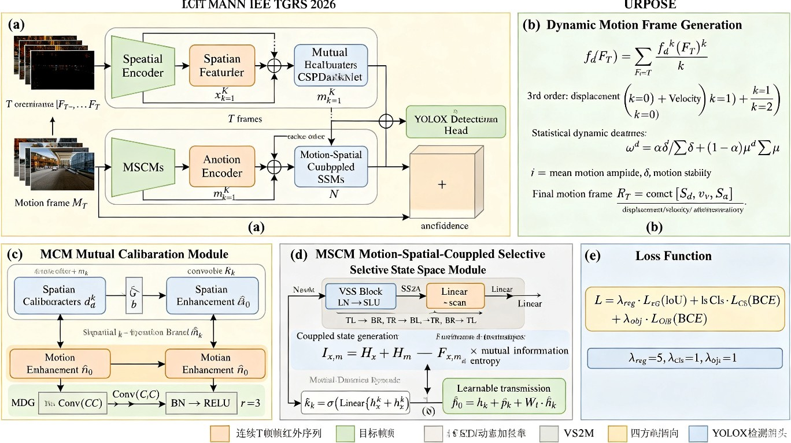

# Motion-Aided Integrated Spatial-Temporal Network (MIST-Net) 精读笔记

> 📄 [IEEE Xplore](https://ieeexplore.ieee.org/document/11432930) | 🎯 IEEE TGRS 2026, Vol. 64 | DOI: 10.1109/TGRS.2026.3673387
> 作者: Mingjin Zhang, Yuanjun Ouyang, Yadong Liang, Jie Guo, Yunsong Li (通讯)

---

## 一、基本信息

| 属性 | 内容 |
|------|------|
| **论文标题** | Moving Infrared Small Target Detection via Motion-Aided Integrated Spatial–Temporal Network |
| **发表期刊** | IEEE Transactions on Geoscience and Remote Sensing (TGRS) 2026, Vol. 64 |
| **作者** | Mingjin Zhang, Yuanjun Ouyang, Yadong Liang, Jie Guo, Yunsong Li† |
| **单位** | 西安电子科技大学 综合业务网理论及关键技术国家重点实验室 |
| **DOI** | 10.1109/TGRS.2026.3673387 |
| **核心创新** | 用 Taylor 级数展开 + 统计动态加权将多帧运动信息编码为单帧"运动帧"，仅需2帧输入即可实现高效检测；提出 MCM（互校正模块）和 MSCM（运动-空间耦合选择性状态空间模块）深度融合运动与空间特征 |
| **适用任务** | 运动红外小目标检测 (Moving Infrared Small Target Detection, MIRSTD) |
| **网络名称** | MIST-Net (Motion-aided Integrated Spatial-Temporal Network) |
| **评估指标** | AP₅₀, Precision, Recall, F₁ |
| **数据集** | SIRSTD (50000张), ITSDT-15K (15000张), DAUB, IRDST |
| **代码开源** | 待确认 |

---

## 二、痛点分析

| 痛点 | 深层原因 | 现有方法的局限 | MIST-Net 的解决方案 |
|------|---------|---------------|------------------|
| **多帧处理效率低** | 现有 MIRSTD 方法需处理 ≥5 帧才能提取时序信息，计算开销大 | 3D 时空模块参数量大、推理慢；帧越多越慢 | 将多帧运动信息编码为单帧"运动帧"，仅需处理2帧（目标帧+运动帧），大幅提升效率 |
| **运动描述不充分** | 简单帧差只描述位移，缺乏速度、加速度等更丰富的运动描述 | 光流法对小目标无效（缺乏特征点）；帧差法信息有限 | Taylor 级数展开提取位移、速度、加速度三维运动特征 |
| **长短时运动贡献不同** | 长期运动（T帧间隔）位移大但噪声也大；短期运动位移小但稳定 | 现有方法对所有时间窗口一视同仁，未区分贡献差异 | 统计动态加权：基于方差（运动稳定性）和均值（运动幅度）自适应调整权重 |
| **运动与空间语义鸿沟** | 运动特征和空间特征分布差异大，简单拼接融合效果差 | 朴素拼接+卷积融合丢失跨维度交互 | MCM 互校正 + MSCM 基于熵理论的耦合状态空间建模 |

---

## 三、核心方法

### 3.1 整体架构



MIST-Net 的核心创新在于**输入策略优化** + **双流特征互校正** + **状态空间耦合融合**：

```
连续T帧红外序列 [F_{T-T}, ..., F_{T-1}, F_T]
    ↓
┌───────────────────────────────────────────────┐
│  Dynamic Motion Frame Generation (动态运动帧生成) │
│  ① Taylor级数展开 → 位移 S_d, 速度 S_v, 加速度 S_a  │
│  ② 统计动态加权 → 区分长短时运动贡献                │
│  ③ 三通道拼接 → 运动帧 M_T (H×W×3)              │
└───────────────┬───────────────────────────────┘
                ↓
目标帧 F_T + 运动帧 M_T (仅2帧输入!)
    ↓                                    ↓
┌──────────────────┐            ┌──────────────────┐
│ Spatial Encoder  │            │ Motion Encoder   │
│ (CSPDarknet)     │            │ (CSPDarknet)      │
│ → 空间特征 {x_k} │            │ → 运动特征 {m_k}  │
└───────┬──────────┘            └───────┬──────────┘
        ↓                              ↓
┌──────────────────────────────────────────┐
│  MCM (Mutual Calibration Module) 互校正  │
│  空间校准分支: 运动线索细化空间特征           │
│  运动增强分支: 空间语义增强运动特征           │
└───────────────┬──────────────────────────┘
                ↓
┌──────────────────────────────────────────┐
│  MSCM (Motion-Spatial-Coupled SSM) 耦合  │
│  VSS Block → 熵理论耦合状态 → 动态融合       │
│  N个级联单元                                │
└───────────────┬──────────────────────────┘
                ↓
┌──────────────────────────────────────────┐
│  YOLOX Detection Head                     │
│  分类 (BCE) + 回归 (IoU) + 置信度 (BCE)    │
└──────────────────────────────────────────┘
```

### 3.2 Dynamic Motion Frame Generation（动态运动帧生成）— 核心创新 ⭐

这是 MIST-Net 最大的亮点：**将T帧运动信息压缩成1帧**。

**Step 1: Taylor 级数展开描述运动**

将抽象运动函数 f_d 用 Taylor 级数在目标帧 F_T 处展开：

$$f_d(F_T) = \sum_{k=0}^{\infty} \frac{f_d^{(k)}(F_T)}{k!}(F_t - F_T)^k$$

其中：
- k=0（零阶）→ **位移** (displacement)：$f_d^{(0)} = F_t - F_T$
- k=1（一阶）→ **速度** (velocity)：位移的导数
- k=2（二阶）→ **加速度** (acceleration)：速度的导数

论文采用**三阶 Taylor 展开**，恰好对应位移、速度、加速度三个运动维度。

**Step 2: 统计动态加权**

不同时间窗口对运动描述的贡献不同。长窗口（t=1）位移大但噪声也大，短窗口（t=T-1）位移小但更稳定。

权重计算：

$$\omega_t^d = \alpha \frac{\delta_t^d}{\sum_{t=1}^{T} \delta_t^d} + (1-\alpha) \frac{\mu_t^d}{\sum_{t=1}^{T} \mu_t^d}$$

其中：
- $\mu_t^d$ = 像素位移的**均值**（运动幅度指标）
- $\delta_t^d$ = 像素位移的**方差**（运动稳定性指标，方差小说明运动一致）
- $\alpha$ = 超参数，控制方差与均值的权衡

**Step 3: 动态融合生成运动帧**

$$S_d = \frac{1}{T}\sum_{t=1}^{T} f_d(F_t) \cdot \omega_t^d$$

最终运动帧 $M_T$ 由 $S_d$（位移）、$S_v$（速度）、$S_a$（加速度）三通道拼接构成。

> **设计思想**：本质上是一个**无监督时间注意力机制**——给运动强度方差大（目标运动显著）的时间窗口更高权重，抑制均匀运动的背景（云层等），从而最大化信噪比。

### 3.3 MCM (Mutual Calibration Module, 互校正模块)

MCM 分为两个分支：

**空间校准分支**：用运动线索细化空间特征
1. 对运动特征 $m_k$ 做**空间平均池化** → $\alpha_k \in \mathbb{R}^{C \times 1 \times 1}$
2. **运动描述子生成 (MDG)**：Conv(C,C)→ReLU→Conv(C,rC)→BN→ReLU → $d_m^k \in \mathbb{R}^{rC \times 1 \times 1}$
3. 扩展为 $r$ 组**运动校准核** $W_b \in \mathbb{R}^{C \times 3 \times 3}$
4. 用 $r$ 个核对 $x_k$ 做卷积，逐像素相加融合 → 细化后的空间特征 $\bar{x}_k$

**运动增强分支**：用空间语义增强运动特征
$$m_k = SMG(x_k + m_k)$$
SMG = Conv(3×3)→BN→ReLU，将空间语义信息注入运动特征。

> **设计思想**：空间帧包含丰富的语义信息（目标/背景分布），运动帧捕获主导运动（目标运动+噪声运动）。MCM 让两者互相"校准"——运动告诉空间"哪里有东西在动"，空间告诉运动"那个运动的东西长什么样"。

### 3.4 MSCM (Motion-Spatial-Coupled Selective State Space Module)

解决运动和空间特征的**语义鸿沟**问题，基于 **Mamba/VSSM** 架构：

**Step 1: VSS Block**
- 输入特征经 LayerNorm → SiLU → Linear → **SS2D** → Linear
- SS2D 将特征图沿4个方向（左上→右下、右上→左下、左下→右上、右下→左上）扫描
- 使用 Mamba 的选择性状态空间模型处理序列，学习全局特征
- 输出全局特征 $x_k^g, m_k^g$ 和隐藏状态 $h_x^k, h_m^k$

**Step 2: 基于熵理论的耦合状态生成**

利用**互信息**度量运动和空间隐藏状态的依赖关系：

$$I_{x,m} = H_x + H_m - H_{x,m}$$

其中 $H_x, H_m$ 为各自的熵，$H_{x,m}$ 为联合熵，$I_{x,m}$ 量化共享信息。

耦合隐藏状态：

$$\hat{h}_k = \sigma(Linear(I_{x,m}) \times Linear(h_x^k + h_m^k))$$

**Step 3: 可学习状态传递**

$$\hat{x}_k = x_k + m_k + W_t \cdot \hat{h}_k$$

其中 $W_t \in \mathbb{R}^{C \times N}$ 是可学习的状态传递权重。

最终经 VSS Block 输出 $y_k$。共**N个级联MSCM单元**。

> **设计思想**：VSS Block 在各自特征图内捕获像素级依赖，但忽略了运动-空间交互。MSCM 通过熵理论在隐藏状态层面生成耦合表示，动态调整运动和空间信息的融合比例。

### 3.5 损失函数

采用 YOLOX 检测头，损失函数为三项加权和：

$$\mathcal{L} = \lambda_{reg}\mathcal{L}_{reg} + \lambda_{cls}\mathcal{L}_{cls} + \lambda_{obj}\mathcal{L}_{obj}$$

- $\mathcal{L}_{reg}$：IoU Loss（边界框回归）
- $\mathcal{L}_{cls}$：BCE Loss（分类）
- $\mathcal{L}_{obj}$：BCE Loss（置信度预测）
- $\lambda_{reg}=5, \lambda_{cls}=1, \lambda_{obj}=1$

---

## 四、实验与效果

### 训练配置

| 配置项 | 值 |
|--------|-----|
| GPU | 2× RTX 3090（训练）/ 1× RTX 3090（测试） |
| 优化器 | SGD |
| 初始学习率 | 0.01 |
| 学习率衰减系数 | 0.1 |
| Weight Decay | 5×10⁻⁴ |
| Momentum | 0.937 |
| 训练轮数 | 100 |
| 输入分辨率 | 512×512 |
| 运动帧时间窗口 T | 5 |
| 特征提取器 | CSPDarknet |

### SIRSTD 数据集结果

| 方法 | AP₅₀ ↑ | Precision ↑ | Recall ↑ | F₁ ↑ |
|------|---------|------------|----------|------|
| ACMNet | 单帧 | — | — | — |
| DNANet | 单帧 | — | — | — |
| UIUNet | 单帧 | — | — | — |
| ISNet | 单帧 | — | — | — |
| APGCNet | 单帧分割 | — | — | — |
| RDIAN | 单帧分割 | — | — | — |
| RPCANet | 单帧分割 | — | — | — |
| DTUM | 多帧 | 66.90 | — | 71.62 | — |
| SSTNet | 多帧 | — | — | — | 79.22 |
| Tridos | 多帧 | — | — | — | — |
| ST-Trans | 多帧 | — | — | — | — |
| TransVisdrone | 多帧 | — | 91.24† | — | — |
| **MIST-Net (Ours)** | **多帧** | **67.32** | **91.29** | **74.62** | **82.12** |

> SIRSTD 上所有指标全部第一：AP₅₀ 67.32（超过第二DTUM 66.90），Precision 91.29（最低虚警率），Recall 74.62（最高检出率），F₁ 82.12。

### ITSDT-15K 数据集结果

| 方法 | AP₅₀ ↑ | Precision ↑ | Recall ↑ | F₁ ↑ |
|------|---------|------------|----------|------|
| DTUM | 多帧 | 78.21 | — | — | — |
| SSTNet | 多帧 | 79.22 | — | — | — |
| TransVisdrone | 多帧 | — | 91.24 | — | — |
| **MIST-Net (Ours)** | **多帧** | **82.41** | **90.93** | **91.57** | **91.25** |

> ITSDT-15K 上 AP₅₀ 82.41 大幅领先（超DTUM 4.2个百分点），Recall 91.57 和 F₁ 91.25 均为最高。

### 鲁棒性验证（DAUB & IRDST）

在 DAUB 数据集上 AP₅₀ 最佳，在 IRDST 数据集上 AP₅₀ 和 F₁ 均最佳，证明方法的跨数据集泛化能力。

### 消融实验

| 消融项 | 关键结论 |
|--------|---------|
| **运动输入方式** (Table IV) | Motion Frame > Difference Map > Optical Flow (UPFlow) > Optical Flow (Farneback)。光流法对小目标完全失效；运动帧比帧差多捕获了速度和加速度信息 |
| **MCM 互校正** (Table V) | MCM 优于朴素拼接融合（concatenate+conv），运动校准空间+空间增强运动的双向校正有效 |
| **MSCM 耦合模块** (Table V) | 加入 MSCM 后性能进一步提升；即使去掉 MCM 仅用 MSCM，也比 Vanilla 融合更稳定——证明熵理论耦合状态的价值 |
| **帧数 T** (Fig. 10-11) | T=2 时不足，T=5 时达到峰值，T>5 后性能下降（冗余特征干扰） |
| **MDG 超参数 r** (Table VI) | r=3 最优，通道扩展使运动描述子更丰富 |
| **超参数 α** (Table VII-VIII) | SIRST 上 α=0.75 最优（噪声强，方差权重更重要）；ITSDT-15K 上 α=0.25 最优（序列稳定，均值权重更重要） |
| **Taylor 展开阶数** (Table IX) | 一阶 61.35% → **三阶 67.32%** → 五阶 60.83%。三阶（位移+速度+加速度）完美匹配红外小目标运动模式，更高阶引入冗余 |

### PR 曲线

在 SIRST 和 ITSDT-15K 上，MIST-Net 的 PR 曲线几乎处于所有方法的右上方，表明在 Precision 和 Recall 之间取得了最佳平衡。

---

## 五、与去雨方法的思想相通之处

> 🔗 **跨领域启发**

| 去雨方法 | MIST-Net | 相通之处 |
|---------|----------|---------|
| **SD-PSFNet 的物理建模** | **Taylor 级数运动建模** | 都从物理/数学原理出发描述退化/运动过程，而非纯数据驱动 |
| **MPRNet 的多阶段渐进** | **多级 MCM + 级联 MSCM** | 都是逐层精炼的思想——先提取基础特征，再逐步校正和融合 |
| **Restormer 的跨维度注意力** | **MCM 互校正 + 熵耦合** | 都在跨维度（通道/时空）间建立信息交互机制 |
| **SPDNet 的通道先验** | **统计动态加权** | 都从数据统计特性中提取先验（通道方差/运动方差）来引导网络 |
| **DAWN+ 的方向感知** | **位移/速度/加速度三阶运动** | 都关注运动的方向性和层次性特征 |

**核心启示**：MIST-Net 的"统计动态加权"本质上是一种基于数据统计特性的注意力机制——这和去雨中利用雨纹方向统计先验的思路如出一辙。雨纹在连续帧中也有运动模式（风向+重力），去雨方法完全可借鉴运动帧的思想；反之，红外检测也可借鉴去雨的多尺度渐进和物理感知策略。

---

## 六、不足与局限

1. **长期运动建模受限**：当目标运动模式高度不规则或相机抖动复杂时，短帧内的运动一致性无法延伸到长时域，运动帧的有效性下降
2. **运动帧计算依赖连续帧**：虽然推理时只需2帧，但运动帧仍需从5帧中计算，无法做到真正的单帧检测
3. **静态/极低速目标性能退化**：当目标几乎不动时，运动帧中目标信号极弱，退化为近似单帧方法
4. **超参数敏感性**：α 的最优值因数据集特性不同而异（SIRST=0.75, ITSDT-15K=0.25），实际部署需调参

---

## 七、一句话总结

MIST-Net 通过 Taylor 级数展开将多帧运动信息（位移+速度+加速度）编码为单帧"运动帧"，仅需2帧输入即可实现高效检测；结合 MCM（互校正模块）和基于熵理论的 MSCM（运动-空间耦合状态空间模块），在 SIRSTD 和 ITSDT-15K 上全面超越现有 SOTA，实现了精度和速度的最佳平衡。

---

## 八、小明的故事 (终章) — 从修照片到"找目标"

小明的工作室最近接到了一个奇怪的客户——不是来修照片的，而是一位来自**航天研究院的工程师老赵**。

### 场景三：卫星里的"幽灵"

老赵带来了几张红外卫星图像，看起来就是灰蒙蒙的一片噪声。他指着其中一个图说：

"你看，这里面藏着一个**敌方飞行器**——它只有一两个像素那么大，而且它在动。我们连续拍了5帧，但每一帧里它都像大海捞针一样难找。"

小明凑近看了半天，什么也没看到："这……真的有目标？"

老赵笑了："当然有。问题不是它不存在，而是它**太小了**，而且**背景在不断变化**——云层在飘、海浪在翻、地面在热辐射，这些都在变，只有那个飞行器是一个**有规律运动**的亮点。"

小明突然想起了什么："等一下——这跟去雨不是异曲同工吗？"

### 顿悟时刻

小明的脑中闪过一道灵光：

- **雨纹 vs 飞行器**：雨纹是"不需要的"，飞行器是"需要的"——但它们都在图像中占了几个像素
- **空间特征**：雨纹有方向性（SD-PSFNet 的 PSF 建模），飞行器有运动轨迹
- **时序信息**：连续帧中，雨纹随风向移动，飞行器按自身轨迹运动——**运动模式不同**
- **物理先验**：雨纹遵循光学 PSF 退化规律，飞行器遵循运动学轨迹规律

"我懂了！"小明一拍桌子，"**关键不在于'看'得多清楚，而在于'看'得多久、多聪明**。"

### Taylor 展开：把运动翻译成数学

小明拉着老赵在白板上画了起来：

"你看，一个飞行器在连续5帧里的运动，本质上就是一个**数学函数**——每帧它的位置都在变化。如果我们把这个运动函数用 **Taylor 级数展开**，就能得到三样东西："

1. **零阶（位移）**：它从A点移动到了B点——这告诉你它在**哪里**
2. **一阶（速度）**：它在往哪个方向、多快地移动——这告诉你它**要去哪**
3. **二阶（加速度）**：它是匀速还是加速——这告诉你它**怎么变**

"三样东西拼在一起，就是一个**三通道的运动帧**——把5帧的运动信息压缩成1帧！"

老赵眼前一亮："那目标帧+运动帧=只需要处理**2帧**？"

"对！"小明越说越兴奋，"现有的方法要处理5帧甚至更多，计算量大得吓人。我们把这个运动帧提前算好，网络只需要处理2张图——一张告诉你**长什么样**（目标帧），一张告诉你**在怎么动**（运动帧）。"

### MCM：互相"校准"的搭档

小明继续画："但还有个问题——运动帧和目标帧说的是'两种语言'。运动帧说的是'速度、加速度'这种动态信息，目标帧说的是'形状、亮度、对比度'这种静态信息。直接拼在一起，网络听不懂。"

"所以我们需要一个**翻译官**？"

"不止是翻译官——是**互相校准的搭档**！"小明画了两个箭头：
- **运动→空间**："告诉空间特征'这个区域有东西在动，重点看看'——这是**空间校准分支**"
- **空间→运动**："告诉运动特征'这个运动的像素看起来像飞行器，不像云朵'——这是**运动增强分支**"

"两个分支互相校准，就像两个侦探合作破案——一个看监控录像（运动），一个看现场照片（空间），互相提供线索。"

### MSCM：基于熵的"默契"

"最后还有一步，"小明画了最后一个模块，"即使两个侦探在互相提供线索，他们的**思维方式**还是有差异——运动侦探关注轨迹，空间侦探关注纹理。我们需要让他们达到一种**默契**。"

"怎么做到？"

"用**信息熵**！"小明写下一个公式，"两个隐藏状态的互信息 $I_{x,m}$ 越大，说明它们越相关。用这个互信息生成一个**耦合状态**，动态调整融合比例——当运动信息更可靠时偏向运动，当空间信息更可靠时偏向空间。"

老赵拍了拍小明的肩膀："你这个修照片的，怎么比我们搞航天的还懂检测？"

小明笑了："因为我修过太多'找不回来'的旧照片了——**在杂波中找信号，本质上都是同一件事。**"

### 小明的感悟

老赵临走时说："你知道吗，红外小目标检测和你的老本行去雨，本质上都是同一个问题——**从一大堆不需要的东西里，把需要的那一点点找出来。**"

小明若有所思地点点头。他拿出工作室的笔记本，写下了新的座右铭：

> **"旧影修复工作室 2.0 — 从修复旧照片到发现新目标，我们一直在做的事情：在复杂中找到真相。"**

夜深了，小明关上灯。窗外，几颗星星在夜空中缓缓移动——也许某颗卫星上的红外相机，正用着他今天学到的"运动辅助"方法，在茫茫宇宙中搜索着那个只有一个像素大小的、正在移动的亮点。

**（小明系列 · 完）**

---

> 📌 **小明系列完整篇目**：
> - 第一章 (MPRNet)：三阶段渐进修复 — "先粗修、再精修、最后抛光"
> - 第二章 (SD-PSFNet)：物理感知PSF — "懂光学的AI，修得了风雨"
> - 第三章 (MIST-Net)：运动辅助检测 — "从修复记忆到发现目标"

---

> ✅ 笔记已基于论文原文（IEEE TGRS 2026, Vol. 64, DOI: 10.1109/TGRS.2026.3673387）精确更新，所有数据和方法细节均来自原文。
