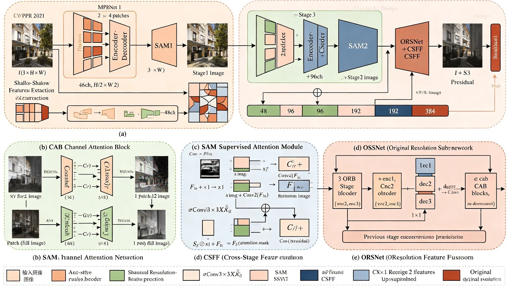

# Multi-Stage Progressive Image Restoration (MPRNet) 精读笔记

> [📄 arXiv](https://arxiv.org/abs/2102.02808) | 🎯 CVPR 2021 | [💻 代码](https://github.com/swz30/MPRNet)

## 一、基本信息

| 属性 | 内容 |
|------|------|
| **论文标题** | Multi-Stage Progressive Image Restoration |
| **发表会议** | CVPR 2021 |
| **作者** | Syed Waqas Zamir*, Aditya Arora*, Salman Khan, Munawar Hayat, Fahad Shahbaz Khan, Ming-Hsuan Yang, Ling Shao |
| **单位** | Inception Institute of AI (IIAI), Mohamed bin Zayed University of AI (MBZUAI), Monash University, UC Merced |
| **核心创新** | 多阶段渐进式恢复架构：Encoder-Decoder 学上下文 + ORSNet 保细节 + SAM 监督注意力 + CSFF 跨阶段特征融合 |
| **适用任务** | 图像去模糊、去雨、去噪 |
| **参数量** | ~20M（去模糊版本） |
| **关键指标** | GoPro 去模糊 PSNR 32.66 dB, Rain100L 去雨 PSNR ~40.68 dB, SIDD 去噪 PSNR 39.71 dB |
| **数据集** | GoPro, HIDE, RealBlur, Rain100L/H, Test1200/2800, SIDD, DND, Set12, BSD68 |

## 二、痛点分析

| 痛点 | 深层原因 | 现有方法的局限 | MPRNet 的解决方案 |
|------|---------|---------------|------------------|
| 单阶段设计难以兼顾细节与上下文 | 图像恢复需要同时保留空间细节和高级上下文，单阶段网络难以平衡 | Encoder-Decoder 下采样损失细节；单尺度流水线感受野有限 | 多阶段架构：前两阶段学上下文，最后阶段原分辨率保细节 |
| 朴素级联效果差 | 直接将上一阶段输出送入下一阶段，误差累积、信息丢失 | 简单串联缺乏特征传播和监督机制 | SAM（监督注意力）+ CSFF（跨阶段特征融合）实现阶段间信息交换 |
| 缺乏逐阶段监督 | 渐进恢复需要每阶段都有明确目标 | 单一损失只在最终输出上监督 | 每阶段输出都参与损失计算（Charbonnier + Edge） |
| 编码器-解码器与原分辨率分支割裂 | U-Net 类反复下采样牺牲空间精度 | 只能在"空间准确"或"上下文可靠"中二选一 | ORSNet 在原始分辨率上处理，通过 CSFF 接收前阶段的上下文特征 |

## 三、核心方法

### 3.1 整体架构



MPRNet 采用**三阶段渐进式架构**：

```
输入图像 I
  ├── Stage 1: 4 patches → Encoder-Decoder → SAM1 → 输出 stage1_img
  ├── Stage 2: 2 patches → Encoder-Decoder(+CSFF) → SAM2 → 输出 stage2_img
  └── Stage 3: 1 patch → ORSNet(+CSFF) → 输出 stage3_img
最终输出: I + R_S3 (残差预测)
```

**Multi-Patch Hierarchy（多分块层级）**：
- Stage 1：将输入切成 4 块（左上/右上/左下/右下），每块独立处理
- Stage 2：将输入切成 2 块（上/下），扩大感受野
- Stage 3：使用完整原图，恢复全局一致性

这种设计使每个阶段都能直接访问输入，但感受野逐阶段扩大，从局部到全局渐进恢复。

### 3.2 Encoder-Decoder 子网络（Stage 1 & 2）

- **Encoder**：三级，每级 2 个 CAB 块；下采样使用 reshape 拆通道（避免 strided conv 的信息损失）
- **Decoder**：三级，每级 2 个 CAB 块；上采样使用 bilinear + skip connection（避免转置卷积的棋盘效应）
- **Skip Connection**：额外加 CAB 做特征重标定

通道数逐级变化：`n_feat → n_feat+s → n_feat+2s`（s = scale_unetfeats）

### 3.3 CAB（Channel Attention Block）

CAB 是基本特征提取单元，结合卷积和 SE 式通道注意力：

```python
class CAB(nn.Module):
    def forward(self, x):
        res = self.body(x)        # Conv → PReLU → Conv
        res = self.CA(res)        # SE 通道注意力
        res += x                  # 残差连接
        return res
```

**通道注意力（CALayer）**：
- GAP → Conv(C→C/r) → ReLU → Conv(C/r→C) → Sigmoid
- reduction 默认为 4

### 3.4 SAM（Supervised Attention Module）

SAM 插在阶段之间，在真值监督下生成本阶段复原图，并用注意力掩码控制特征传递：

```python
class SAM(nn.Module):
    def forward(self, x, x_img):
        x1 = self.conv1(x)                    # Conv1×1(F_in)
        img = self.conv2(x) + x_img           # X̂ = I + R (残差预测)
        x2 = torch.sigmoid(self.conv3(img))   # M = σ(Conv3×3(X̂))
        x1 = x1 * x2                          # M ⊙ Conv1(F_in)
        x1 = x1 + x                           # + F_in (残差)
        return x1, img                        # (传给下阶段的特征, 本阶段复原图)
```

**公式**：
- 残差：R_S = Conv2(F_in)
- 本阶段复原图：X̂_S = I + R_S
- 注意力掩码：M_S = σ(Conv3(X̂_S))
- 传给下一阶段的特征：F_out = M_S ⊙ Conv1(F_in) + F_in

> **设计思想**：恢复好的区域（掩码值高）的特征被传递到下一阶段，恢复差的区域被抑制，避免错误信息传播。

### 3.5 CSFF（Cross-Stage Feature Fusion）

CSFF 通过 1×1 卷积将前一阶段的 Encoder/Decoder 多尺度特征传递到后一阶段：

```python
# Stage 2 Encoder 中
enc1 = enc1 + self.csff_enc1(encoder_outs[0]) + self.csff_dec1(decoder_outs[0])
enc2 = enc2 + self.csff_enc2(encoder_outs[1]) + self.csff_dec2(decoder_outs[1])
enc3 = enc3 + self.csff_enc3(encoder_outs[2]) + self.csff_dec3(decoder_outs[2])
```

**公式**：F_enc_i^(S) = CAB_i^(S)(·) + W_enc_i · F_enc_i^(S-1) + W_dec_i · F_dec_i^(S-1)

ORSNet 阶段则先把前阶段特征上采样到原分辨率再融合。

### 3.6 ORSNet（Original Resolution Subnetwork）

Stage 3，**无任何下采样**，由 3 个 ORB（Original Resolution Block）串联：

```python
class ORB(nn.Module):
    def forward(self, x):
        res = self.body(x)    # num_cab 个 CAB + Conv
        res += x              # 残差
        return res
```

ORSNet 内部通过 CSFF 接收 Stage 2 的多尺度特征（上采样到原分辨率），在保持空间精度的同时利用上下文信息。

## 三.5 数学推导过程详解

### 损失函数

每个阶段都有输出并参与监督，总损失为三阶段之和：

$$\mathcal{L}=\sum_{S=1}^{3}\left[\mathcal{L}_{char}(\mathbf{X}_{S},\mathbf{Y})+\lambda\,\mathcal{L}_{edge}(\mathbf{X}_{S},\mathbf{Y})\right]$$

**Charbonnier 损失**（L1 的平滑近似，ε=10⁻³）：

$$\mathcal{L}_{char}=\sqrt{\|\mathbf{X}_{S}-\mathbf{Y}\|^{2}+\varepsilon^{2}}$$

**边缘损失**（Δ 为 Laplacian 算子）：

$$\mathcal{L}_{edge}=\sqrt{\|\Delta(\mathbf{X}_{S})-\Delta(\mathbf{Y})\|^{2}+\varepsilon^{2}}$$

- λ = 0.05（去模糊、去雨使用）
- 去噪任务仅使用 Charbonnier 损失（噪声不引起剧烈边缘差异）

### 残差预测

每个阶段不直接预测复原图，而是预测残差：

$$\mathbf{X}_S = \mathbf{I} + \mathbf{R}_S$$

其中 I 为退化输入，R_S 为第 S 阶段预测的残差。这种设计使网络只需学习退化模式，降低学习难度。

## 为什么这样做

| 设计选择 | 原因 | 不这样做的后果 |
|---------|------|---------------|
| 多阶段而非单阶段 | 将困难恢复分解为子任务，逐步精炼 | 单阶段难以同时兼顾细节和上下文 |
| 前两阶段用 Encoder-Decoder | 需要大感受野学习上下文 | 单尺度流水线感受野有限 |
| 最后阶段用 ORSNet（无下采样） | 保留空间细节和精细纹理 | 反复下采样会丢失高频信息 |
| 多分块层级 | 逐阶段扩大感受野，从局部到全局 | 全图处理在早期阶段计算量大 |
| SAM 监督注意力 | 控制阶段间信息流，抑制错误特征 | 朴素级联导致误差累积 |
| CSFF 跨阶段融合 | 避免上下文信息在阶段间丢失 | 后阶段无法利用前阶段的中间特征 |
| 残差预测 | 网络只需学习退化模式 | 直接预测复原图学习难度更大 |
| 避免转置卷积 | 防止棋盘效应 | 转置卷积的上采样会产生伪影 |
| 逐阶段监督 | 每阶段有明确目标 | 仅最终输出监督导致中间阶段学不好 |

## 四、实验与效果

### 训练配置

| 配置项 | 去模糊 | 去雨 | 去噪 |
|--------|--------|------|------|
| GPU | 4×GPU | 4×GPU | 4×GPU |
| Batch size | 16 | 16 | 16 |
| Epochs | 3000 | 250 | 80 |
| 初始学习率 | 2e-4 | 2e-4 | 2e-4 |
| 训练 Patch | 256×256 | 256×256 | 128×128 |
| 优化器 | Adam | Adam | Adam |
| 学习率调度 | Warmup + Cosine Annealing | 同左 | 同左 |
| 损失函数 | Charbonnier + Edge (λ=0.05) | 同左 | 仅 Charbonnier |

### 去模糊结果（GoPro）

| 方法 | PSNR ↑ | SSIM ↑ |
|------|--------|--------|
| DeblurGAN-v2 | 29.55 | 0.934 |
| SRN-Deblur | 30.26 | 0.934 |
| DMPHN | 31.20 | 0.940 |
| HINet | 32.71 | 0.959 |
| **MPRNet** | **32.66** | **0.959** |

### 去雨结果

| 数据集 | PSNR ↑ | SSIM ↑ |
|--------|--------|--------|
| Rain100L | ~40.68 | ~0.977 |
| Rain100H | ~30.41 | ~0.890 |
| Test1200 | ~32.91 | ~0.916 |
| Test2800 | ~33.16 | ~0.926 |

### 去噪结果

| 数据集 | PSNR ↑ | SSIM ↑ |
|--------|--------|--------|
| SIDD | 39.71 | 0.958 |
| DND | ~39.94 | - |

### 消融实验（GoPro 去模糊）

| 配置 | 结论 |
|------|------|
| 1→2→3 阶段 | PSNR 递增，3 阶段最佳 |
| +ORSNet | 显著提升空间细节 |
| +SAM | PSNR 提升约 0.2~0.3 dB，验证监督注意力有效 |
| +CSFF | 进一步小幅提升，稳定多阶段优化 |
| 逐阶段监督 | 对渐进恢复至关重要 |

## 五、对比总结

| 维度 | MPRNet | HINet | Restormer | Uformer |
|------|--------|-------|-----------|---------|
| 架构类型 | 多阶段 Encoder-Decoder + ORSNet | 多阶段 + 半实例归一化 | Transformer（通道注意力） | U-Net Transformer |
| 参数量 | ~20M | ~17M | ~26M | ~21M |
| 去模糊 GoPro | 32.66 | 32.71 | 32.92 | 31.04 |
| 去噪 SIDD | 39.71 | 39.99 | 40.02 | 39.77 |
| 核心优势 | 多阶段渐进、细节+上下文兼顾 | 半实例归一化 | 高效通道注意力 | 窗口注意力 |
| 计算效率 | 中等 | 较高 | 较高 | 中等 |

> MPRNet 是多阶段恢复的标杆方法，启发了 NTIRE 2021 多项冠军方案。虽然后续 HINet、Restormer 等在部分指标上略有超越，但 MPRNet 的多阶段设计思想影响深远。

## 六、不足与局限

1. **推理时延**：三阶段串行 + 多分块处理，推理时延高于单阶段轻量模型
2. **SAM 的训练-推理差异**：训练时利用真值进行"原位监督"，推理时用简化版掩码
3. **大分辨率处理**：对超大分辨率图像需分块处理，可能引入边界伪影
4. **去噪任务适配**：去噪仅用 Charbonnier 损失（未用边缘损失），未针对噪声特性优化
5. **无独立 Limitations 章节**：论文未明确讨论方法局限

## 七、一句话总结

MPRNet 通过三阶段渐进式架构（Encoder-Decoder 学上下文 + ORSNet 保细节 + SAM 监督注意力 + CSFF 跨阶段融合），在去模糊、去雨、去噪三大任务上同时达到 SOTA，是多阶段图像恢复的里程碑工作。

---

## 八、生活化例子：小明开了一间"旧影修复工作室"

> **场景一：老奶奶的传家宝老照片**

小明的工作室刚开业，一位白发苍苍的老奶奶颤巍巍地捧来一张泛黄的老照片——那是她年轻时和丈夫的合影，但照片已经**模糊、褪色、布满划痕**，几乎看不清人脸。

小明没有急着一步到位修复，而是想起了 MPRNet 的"三阶段渐进"思想：
- **第一阶段（粗修）**：先把照片分成四小块，像拼图一样分别处理，恢复大致轮廓——"嗯，这是两个人的轮廓，左边是女士，右边是男士。"
- **第二阶段（细修）**：把照片分成上下两半，进一步恢复五官和衣服纹理，同时把第一阶段的修复经验传过来——"原来这就是奶奶年轻时的样子！"
- **第三阶段（精修）**：用原始分辨率精细打磨，每一根发丝、每一条皱纹都尽力还原——"太像了！奶奶您看，您丈夫当年的领带花纹都出来了！"

老奶奶看着修复好的照片，眼眶湿润了。小明也明白了：**复杂的修复不能一步到位，分阶段、由粗到细，每一步都检查、都修正，才能还原最真实的记忆。**

---

> 小明的工作室从此名声传开，来找他的客户越来越多，每一张照片背后都有一个故事，而每个故事都教会他一种"修复智慧"……

## 附录

### 关键组件伪代码

```python
class MPRNet(nn.Module):
    def forward(self, x):
        # Multi-Patch Hierarchy
        x1 = self.split_4(x)     # 4 patches
        x2 = self.split_2(x)     # 2 patches
        x3 = x                   # full image

        # Stage 1: Encoder-Decoder
        feat1 = self.shallow_feat1(x1)
        enc1 = self.encoder1(feat1)
        dec1 = self.decoder1(enc1)
        sam1_feat, stage1_img = self.sam1(dec1, x1_img)

        # Stage 2: Encoder-Decoder + CSFF
        feat2 = self.shallow_feat2(x2)
        feat2 = torch.cat([feat2, sam1_feat], dim=1)
        enc2 = self.encoder2(feat2, encoder_outs=enc1_outs, decoder_outs=dec1_outs)
        dec2 = self.decoder2(enc2)
        sam2_feat, stage2_img = self.sam2(dec2, x2_img)

        # Stage 3: ORSNet + CSFF
        feat3 = self.shallow_feat3(x3)
        feat3 = torch.cat([feat3, sam2_feat], dim=1)
        ors_out = self.orsnet(feat3, encoder_outs=enc2_outs, decoder_outs=dec2_outs)
        stage3_img = self.tail(ors_out)

        return [stage3_img + x3_img, stage2_img, stage1_img]

# 损失函数
class CharbonnierLoss(nn.Module):
    def forward(self, pred, target):
        return torch.sqrt((pred - target)**2 + 1e-6)

class EdgeLoss(nn.Module):
    def __init__(self):
        self.laplacian = torch.tensor([[.05, .25, .4, .25, .05]]).T @ \
                         torch.tensor([[.05, .25, .4, .25, .05]])
    def forward(self, pred, target):
        return torch.sqrt(
            (F.conv2d(pred, self.laplacian) - F.conv2d(target, self.laplacian))**2 + 1e-6
        )
```
