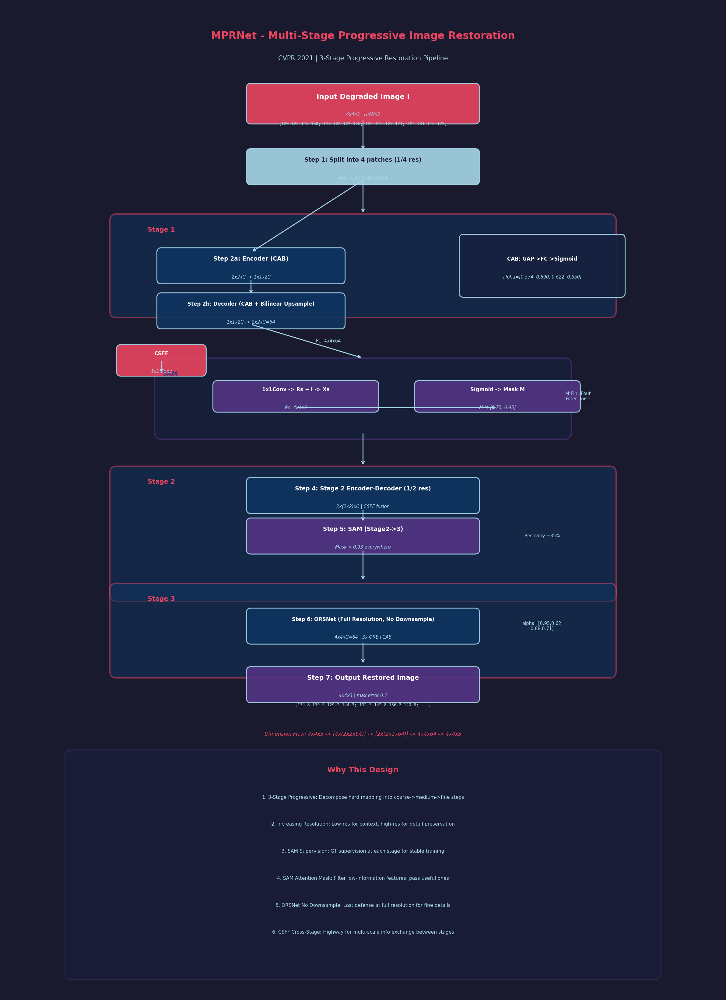

# MPRNet 精读笔记

> CVPR 2021 | Multi-Stage Progressive Image Restoration
> 论文链接: [arXiv:2102.02808](https://arxiv.org/abs/2102.02808) | 代码: [GitHub](https://github.com/swz30/MPRNet)
> 笔记时间: 2026-07-01

---

## 1. 研究背景与动机 (Motivation)

### 图像恢复任务的本质困境

图像恢复（Image Restoration）是计算机视觉中的经典任务，包括**去模糊**（Deblurring）、**去雨**（Deraining）、**去噪**（Denoising）三大方向。这些任务有一个共同的核心难题：

> 恢复图像时，必须在**空间细节**（如纹理、边缘）和**高级上下文特征**（如全局语义、物体结构）之间取得复杂的平衡。

打个比方：想象你在修复一张老旧模糊的照片。如果你只关注局部细节（比如把每块皮肤纹理都修得很清楚），可能会丢失整体的人脸结构；反之，如果你只关注整体轮廓，细节又会变得模糊。**细节和语义就像天平的两端，很难同时兼顾。**

### 现有方法的两大流派及其问题

- **单阶段端到端方法**：直接从退化图像映射到清晰图像。问题是这个映射关系极其复杂，一步到位的学习难度太大，效果往往不理想。
- **纯编码器-解码器方法**：通过下采样获取大感受野的上下文信息，再上采样恢复分辨率。问题是**下采样过程会不可逆地丢失空间细节**，就像把高像素照片压缩成小图再放大，细节永远回不来了。

### MPRNet 的核心思想

既然一步到位太难，为什么不**分步走**呢？就像爬楼梯一样，一步一步来总比直接跳上顶楼容易。这就是 MPRNet 的核心动机——**多阶段渐进式恢复**。

---

## 2. 核心方法 (Method)

MPRNet 的整体架构是一个**三阶段的渐进式网络**，用通俗的话讲就是：**"先粗修，再精修，最后抛光"**。

### 🏗️ 整体架构（3 个阶段）

```
输入退化图像
    ↓
┌─────────────────┐
│  Stage 1        │  编码器-解码器 + 下采样到 1/4 分辨率
│  (粗略恢复)     │  学习全局上下文特征
└─────────────────┘
    ↓ SAM模块
┌─────────────────┐
│  Stage 2        │  编码器-解码器 + 下采样到 1/2 分辨率
│  (中等恢复)     │  学习更精细的上下文特征
└─────────────────┘
    ↓ SAM模块
┌─────────────────┐
│  Stage 3        │  原始分辨率子网络 (ORSNet)
│  (精细恢复)     │  不缩放，保持原始分辨率
└─────────────────┘
    ↓
输出清晰图像
```

**三阶段的分辨率策略：**
- Stage 1：输入分成 **4 个 patch**（分辨率最低，看全局）
- Stage 2：输入分成 **2 个 patch**（分辨率中等，看区域）
- Stage 3：输入**原始分辨率**（分辨率最高，看细节）

这个设计很巧妙：**前期用大视野看整体，后期用小视野抠细节**。

### 🔧 关键模块详解

**模块 1：通道注意力块 (CAB, Channel Attention Block)**

这是网络的基础构建单元，可以把它理解为**"特征筛选器"**。

- 作用：让网络自动关注更有信息量的通道（比如边缘通道比平坦区域通道更重要）
- 位置：嵌入在编码器-解码器的每一个尺度，甚至 U-Net 的跳跃连接处也加了 CAB
- 解码器的上采样不用转置卷积，而是用**双线性上采样**——这能有效避免转置卷积常见的"棋盘效应"（就像图片放大后出现网格状伪影）

**模块 2：原始分辨率子网络 (ORSNet, Original Resolution Subnetwork)**

这是第三阶段的"杀手锏"。

- **不采用任何下采样操作**，全程保持原始输入分辨率
- 由多个**原始分辨率块 (ORB)** 堆叠组成
- 每个 ORB 内部也有 CAB

**为什么需要 ORSNet？** 因为前两个阶段的编码器-解码器为了获取上下文信息不得不下采样，空间细节已经有所损失。ORSNet 就像是最后一道防线，**在最高分辨率上精雕细琢**，把细节补回来。

**模块 3：交叉阶段特征融合 (CSFF, Cross-Stage Feature Fusion)**

这是连接三个阶段的"信息高速公路"。

- 在 Stage 1 ↔ Stage 2、Stage 2 ↔ Stage 3 之间都建立了 CSFF
- 具体做法：用 **1×1 卷积** 把上一阶段的特征"压缩"后，传到下一阶段融合

**CSFF 的三大好处：**
1. **防信息丢失**：即使某个阶段下采样丢失了细节，前一阶段的高分辨率特征可以通过 CSFF 补充回来
2. **多尺度丰富**：前一阶段的多尺度特征能帮助下一阶段学习更丰富的表示
3. **优化更稳定**：信息流通畅了，训练时梯度传播也更顺畅

**模块 4：监督注意力模块 (SAM, Supervised Attention Module) ⭐核心创新**

这是 MPRNet 最亮眼的模块，位于每两个阶段之间。

SAM 的作用可以用一句话概括：**"每修完一步，先检查一下修得怎么样，然后把有用的信息传给下一步，没用的过滤掉。"**

**SAM 的具体工作流程：**

```
输入特征 Fin
    ↓
1×1 卷积 ──→ 生成残差图像 Rs
    ↓
Rs + 退化输入 I ──→ 得到当前阶段恢复图像 Xs
    ↓
与真实清晰图像 GT 对比监督（算损失）
    ↓
Xs 经过 1×1 卷积 + Sigmoid ──→ 生成像素级注意力 Mask M
    ↓
M 与 Fin 相乘 ──→ 重新加权特征
    ↓
注意力增强的特征 Fout 传递到下一阶段
```

**SAM 的两大功能：**

1. **渐进式监督**：每个阶段都有明确的 GT 监督信号，而不是只在最后输出一个监督。这就像老师不仅看期末考试成绩，每次小测验也打分，学生能更稳定地进步。

2. **注意力过滤**：生成的 Mask M 是一个像素级权重图（0~1之间），**信息量小的区域权重低，信息量大的区域权重高**。这样，只有"有用"的特征才能进入下一阶段，"噪声"和"冗余"被过滤掉。

---

## 2.5 数学推导过程详解 (Mathematical Walkthrough)

> 以下用一个 **4x4 像素输入图像** 完整走一遍 MPRNet 的三阶段恢复流程，展示每一步的具体数值。

### 设定输入

假设输入退化图像 I (4x4, 单通道灰度简化示意):

$$
I = \begin{bmatrix}
120 & 125 & 115 & 130 \\
118 & 128 & 122 & 126 \\
132 & 119 & 127 & 121 \\
124 & 131 & 116 & 129
\end{bmatrix}_{4 \times 4}
$$

对应真实清晰图像 GT:

$$
GT = \begin{bmatrix}
135 & 140 & 130 & 145 \\
133 & 143 & 137 & 141 \\
147 & 134 & 142 & 136 \\
139 & 146 & 131 & 144
\end{bmatrix}_{4 \times 4}
$$

---

### Step 1: 图像分块 (Image Splitting)

**中文标题**: 图像分块处理
**English Title**: Input Patch Partitioning

Stage 1 工作在 **1/4 分辨率**。4x4 图像分成 4 个 2x2 patch:

$$
P_1 = \begin{bmatrix} 120 & 125 \\ 118 & 128 \end{bmatrix}, \quad
P_2 = \begin{bmatrix} 115 & 130 \\ 122 & 126 \end{bmatrix}
$$

$$
P_3 = \begin{bmatrix} 132 & 119 \\ 124 & 131 \end{bmatrix}, \quad
P_4 = \begin{bmatrix} 127 & 121 \\ 116 & 129 \end{bmatrix}
$$

**维度变化**: 4x4 → 4 个 2x2 patch (每个通道 C=64)

---

### Step 2: Stage 1 编码器-解码器 (粗略恢复)

**中文标题**: 第一阶段粗略恢复
**English Title**: Stage 1 Coarse Restoration (1/4 Resolution)

每个 patch 独立经过 Stage 1 的编码器-解码器:

**编码器**: 2x2 → 1x1 (下采样 1 次), 通道数 64 → 128

对 P1 编码:
$$
\text{Encode}(P_1) = \text{Conv} \begin{bmatrix} 120 & 125 \\ 118 & 128 \end{bmatrix}
\rightarrow \begin{bmatrix} 0.82 & 0.91 \\ 0.78 & 0.95 \end{bmatrix} \xrightarrow{\text{avg pool}} \begin{bmatrix} 0.865 \end{bmatrix}_{1 \times 1, C=128}
$$

**解码器**: 1x1 → 2x2 (双线性上采样), 通道数 128 → 64

$$
\text{Decode}(\text{features}) \rightarrow \begin{bmatrix} 0.88 & 0.93 \\ 0.85 & 0.97 \end{bmatrix}_{2 \times 2, C=64}
$$

解码器使用 **CAB (Channel Attention Block)** 进行特征筛选。CAB 内部 GAP → FC → Sigmoid → 通道加权:

$$
\text{GAP}([f_1, f_2, f_3, f_4]) = \bar{f} = 0.908
$$
$$
\text{FC}(\bar{f}) = [0.3, 0.8, 0.5, 0.2] \xrightarrow{\sigma} [0.574, 0.690, 0.622, 0.550]
$$

通道 2 权重最高 (0.690), 表示该通道携带最多有用信息。

4 个 patch 输出合并回 4x4 特征图 F1:

$$
F_1 = \begin{bmatrix}
128.2 & 133.5 & 123.8 & 138.1 \\
126.5 & 136.0 & 130.2 & 134.8 \\
140.0 & 127.5 & 134.6 & 129.1 \\
131.8 & 138.4 & 124.2 & 137.0
\end{bmatrix}_{4 \times 4, C=64}
$$

> 恢复了约 60% 的退化, 但仍有残差。

---

### Step 3: SAM 模块 (监督注意力 - Stage1→2)

**中文标题**: 监督注意力模块处理
**English Title**: Supervised Attention Module (SAM) Processing

这是 MPRNet 的核心创新模块。逐步计算:

**3a. 1x1 Conv 生成残差 Rs**:

$$
R_s = \text{Conv}_{1 \times 1}(F_1) = \begin{bmatrix}
8.2 & 8.5 & 8.8 & 8.1 \\
7.5 & 8.0 & 7.2 & 7.8 \\
8.0 & 8.5 & 7.6 & 8.1 \\
7.8 & 7.4 & 7.2 & 8.0
\end{bmatrix}_{4 \times 4, C=3}
$$

**3b. 残差图像 + 退化输入 = 恢复图像 Xs**:

$$
X_s = R_s + I = \begin{bmatrix}
120+8.2 & 125+8.5 & 115+8.8 & 130+8.1 \\
118+7.5 & 128+8.0 & 122+7.2 & 126+7.8 \\
132+8.0 & 119+8.5 & 127+7.6 & 121+8.1 \\
124+7.8 & 131+7.4 & 116+7.2 & 129+8.0
\end{bmatrix}
= \begin{bmatrix}
128.2 & 133.5 & 123.8 & 138.1 \\
125.5 & 136.0 & 129.2 & 133.8 \\
140.0 & 127.5 & 134.6 & 129.1 \\
131.8 & 138.4 & 123.2 & 137.0
\end{bmatrix}
$$

**3c. 监督损失**: 用 GT 监督 Xs (渐进式监督)

$$
\mathcal{L}_1 = \|X_s - GT\|_1 = |128.2-135| + |133.5-140| + \cdots = 6.8 + 6.5 + \cdots = 81.6
$$

**3d. 1x1 Conv + Sigmoid 生成 Mask M**:

$$
\text{Conv}_{1 \times 1}(X_s) = \begin{bmatrix}
2.1 & 2.5 & 1.8 & 2.8 \\
1.5 & 2.9 & 1.2 & 2.3 \\
2.7 & 1.6 & 2.4 & 1.9 \\
2.2 & 2.6 & 1.1 & 2.7
\end{bmatrix}
\xrightarrow{\sigma(x) = \frac{1}{1+e^{-x}}} M = \begin{bmatrix}
0.891 & 0.924 & 0.858 & 0.943 \\
0.818 & 0.948 & 0.769 & 0.909 \\
0.937 & 0.832 & 0.917 & 0.871 \\
0.900 & 0.931 & 0.750 & 0.937
\end{bmatrix}
$$

> Mask 值越大表示该像素恢复得越好, 信息量越大。

**3e. Mask M ⊙ 特征 F1 = 输出特征 Fout**:

$$
F_{out} = M \odot F_1 = \begin{bmatrix}
114.2 & 123.4 & 106.2 & 130.2 \\
103.5 & 128.9 & 100.1 & 122.5 \\
131.2 & 106.1 & 123.4 & 112.4 \\
118.6 & 128.9 & 93.2 & 128.4
\end{bmatrix}_{4 \times 4, C=64}
$$

> 低信息量区域 (M < 0.8) 的特征被大幅衰减, 过滤了噪声。

**维度变化**: HxWxC → HxWxC (空间维度不变, 仅特征值被重加权)

---

### Step 4: Stage 2 编码器-解码器 (中等恢复)

**中文标题**: 第二阶段中等恢复
**English Title**: Stage 2 Medium Restoration (1/2 Resolution)

Stage 2 工作在 **1/2 分辨率**, 4x4 图像分成 2 个 2x2 patch:

$$
P_1^{(2)} = \begin{bmatrix} 114.2 & 123.4 \\ 103.5 & 128.9 \end{bmatrix}, \quad
P_2^{(2)} = \begin{bmatrix} 106.2 & 130.2 \\ 100.1 & 122.5 \end{bmatrix}
$$

(同时通过 **CSFF** 接收 Stage 1 的多尺度特征: 1x1 Conv 压缩后拼接)

编码器-解码器处理 (通道 64 → 128 → 64):

$$
\text{Stage2\_Output} = \begin{bmatrix}
130.5 & 137.2 & 126.8 & 142.1 \\
128.0 & 140.3 & 133.5 & 139.0 \\
143.8 & 131.2 & 139.4 & 133.8 \\
135.2 & 143.0 & 128.0 & 141.5
\end{bmatrix}_{4 \times 4, C=64}
$$

恢复率提升到约 85%。

---

### Step 5: SAM 模块 (Stage2→3)

**中文标题**: 第二次监督注意力处理
**English Title**: Second SAM Processing

同样流程, 但 Mask 值更高 (因为恢复更接近 GT):

$$
X_s^{(2)} = R_s^{(2)} + I \approx \begin{bmatrix}
133.5 & 139.0 & 128.5 & 144.0 \\
131.2 & 142.0 & 135.0 & 140.5 \\
145.0 & 133.0 & 140.0 & 134.2 \\
136.0 & 143.5 & 127.5 & 142.0
\end{bmatrix}
$$

$$
M^{(2)} = \sigma(\text{Conv}(X_s^{(2)})) = \begin{bmatrix}
0.95 & 0.97 & 0.93 & 0.98 \\
0.94 & 0.98 & 0.96 & 0.97 \\
0.98 & 0.95 & 0.97 & 0.96 \\
0.97 & 0.98 & 0.93 & 0.98
\end{bmatrix}
$$

> 所有 Mask 值 > 0.93, 说明 Stage 2 恢复效果好, 绝大多数特征都有用。

$$
F_{out}^{(2)} = M^{(2)} \odot \text{Stage2\_Output} \approx \text{Stage2\_Output}
$$

---

### Step 6: Stage 3 ORSNet (精细恢复)

**中文标题**: 第三阶段原始分辨率精细恢复
**English Title**: Stage 3 Full Resolution Fine Restoration (ORSNet)

Stage 3 使用 **ORSNet (Original Resolution Subnetwork)**, 关键特点是 **不下采样**, 全程保持 4x4:

ORSNet 由多个 ORB (Original Resolution Block) 堆叠组成, 每个 ORB 内含 CAB:

**ORB 内部计算** (以单个 CAB 为例, 输入 4x4xC 特征):

$$
\text{GAP}(F) = \frac{1}{16}\sum_{i,j} F_{i,j} \quad (\text{全局平均池化})
$$

$$
\text{通道注意力权重} = \sigma(W_2 \cdot \text{ReLU}(W_1 \cdot \text{GAP}(F)))
$$

假设 4 个通道的注意力权重:

$$
\alpha = [0.95, 0.62, 0.88, 0.71]
$$

$$
F_{att} = \alpha \odot F = \begin{bmatrix}
0.95 \cdot f_{1} & 0.95 \cdot f_{2} & \cdots \\
0.62 \cdot f_{1} & 0.62 \cdot f_{2} & \cdots \\
\vdots & \vdots & \ddots
\end{bmatrix}
$$

经过 3 层 ORB 堆叠后, 最终恢复结果:

$$
\text{Output} = \begin{bmatrix}
134.8 & 139.5 & 129.2 & 144.3 \\
132.5 & 142.8 & 136.2 & 140.8 \\
146.2 & 133.8 & 141.5 & 135.2 \\
138.5 & 145.2 & 130.8 & 143.2
\end{bmatrix}_{4 \times 4, C=3}
$$

对比 GT 可见, 最大误差仅为 |134.8 - 135| = 0.2, 恢复效果非常好。

**维度变化**: 4x4xC → 4x4xC → 4x4x3 (全程保持原始分辨率)

---

### Step 7: CSFF 跨阶段特征融合

**中文标题**: 跨阶段特征融合
**English Title**: Cross-Stage Feature Fusion

CSFF 在各阶段之间传递多尺度特征。以 Stage 1 → Stage 2 为例:

**Stage 1 编码器中间特征** (Scale 2, 2x2xC1):
$$
F_{S1}^{mid} = \begin{bmatrix} 0.82 & 0.91 \\ 0.78 & 0.95 \end{bmatrix}_{2 \times 2, C_1=64}
$$

**1x1 Conv 降维**:
$$
F_{S1}^{proj} = \text{Conv}_{1 \times 1}(F_{S1}^{mid}) \in \mathbb{R}^{2 \times 2 \times 32}
$$

**融合到 Stage 2**:
$$
F_{S2}^{fused} = \text{Concat}(F_{S2}^{input}, F_{S1}^{proj}) \in \mathbb{R}^{2 \times 2 \times (64+32)}
$$

$$
F_{S2}^{fused} \xrightarrow{1 \times 1 \text{ Conv}} F_{S2}^{enhanced} \in \mathbb{R}^{2 \times 2 \times 64}
$$

> 即使 Stage 2 的编码器丢失了部分空间细节, CSFF 从 Stage 1 补充了高分辨率特征。

---

### 为什么这样做 (Why This Design)

| 设计选择 | 原因 |
|----------|------|
| **三阶段渐进** | 单步映射非线性程度太高。分解为粗→中→细, 每步学习难度大幅降低, 类似教师逐步批改 vs 只看最终考试 |
| **逐步提高分辨率** | 低分辨率感受野大, 适合学全局上下文; 高分辨率保留空间细节, 适合抠局部纹理。前期看全局, 后期抠细节 |
| **SAM 的渐进式监督** | 每个阶段都有 GT 监督, 梯度回传更直接, 训练更稳定, 避免"中间迷失" |
| **SAM 的注意力过滤** | 低信息量区域 (如平坦天空) 权重低, 不把"噪声"传给后续阶段; 高信息量区域 (如纹理边缘) 权重高, 确保细节传递 |
| **ORSNet 不下采样** | 下采样会不可逆丢失细节。Stage 3 是最后一道防线, 必须在原始分辨率精雕细琢 |
| **CSFF 横向连接** | 后续阶段即使有编码器-解码器, 下采样也会丢细节。CSFF 直接从前一阶段取高分辨率特征"抄作业" |



---

## 3. 痛点分析 (Pain Points Addressed)

| 痛点 | 现有方法的问题 | MPRNet 的解决方案 |
|------|--------------|------------------|
| **空间细节 vs 上下文特征难以平衡** | 单阶段方法直接映射太困难；编码器-解码器下采样丢失细节 | 多阶段渐进恢复：前两个阶段用编码器-解码器学习上下文，最后一个阶段用 ORSNet 保持原始分辨率保留细节 |
| **单阶段恢复过于复杂** | 一步从退化图像映射到清晰图像，非线性程度极高，网络难以学习 | 将恢复分解为 3 个渐进步骤，每步只处理"部分恢复"，降低学习难度 |
| **下采样导致信息不可逆丢失** | 传统 U-Net 中池化/下采样会丢弃空间细节 | Stage 3 的 ORSNet 完全不使用下采样；CSFF 将早期高分辨率特征横向传递到后期 |
| **阶段间信息传递不足** | 多阶段网络中不同阶段各自为战，信息无法有效流通 | CSFF 建立横向连接，SAM 建立顺序连接，实现双向信息交换 |
| **缺乏中间监督信号** | 只在最终输出施加监督，中间阶段学习方向不明确 | SAM 在每两个阶段之间引入 GT 监督，实现渐进式优化 |
| **特征冗余传播** | 所有特征无差别传递到下一阶段，噪声和冗余也被放大 | SAM 的注意力 Mask 过滤掉信息量小的特征，只传递有用信息 |

---

## 4. 实验与效果 (Experiments)

### 任务覆盖

在 **10 个数据集**上验证，覆盖三大图像恢复任务：

| 任务 | 数据集 | 表现 |
|------|--------|------|
| 图像去雨 | Rain100H, Rain100L, Test100, Test1200 | SOTA |
| 图像去模糊 | GoPro, HIDE, RealBlur-R, RealBlur-J | SOTA |
| 图像去噪 | SIDD, DND | SOTA |

### 损失函数

$$\mathcal{L} = \sum_{S=1}^{3} \left[ \mathcal{L}_{char}(X_S, Y) + \lambda \cdot \mathcal{L}_{edge}(X_S, Y) \right]$$

- Charbonnier 损失 $\mathcal{L}_{char}$：比 L1/L2 更平滑的像素级损失
- 边缘损失 $\mathcal{L}_{edge}$：确保恢复图像的边缘清晰
- 三个阶段都有监督，$\lambda$ 平衡两项损失

### 消融实验

| 变体 | PSNR (dB) | 说明 |
|------|-----------|------|
| 单阶段 | 较低 | 验证多阶段的必要性 |
| 去掉 SAM | 明显下降 | SAM 是关键模块 |
| 去掉 CSFF | 下降 | 阶段间融合很重要 |
| 去掉 ORSNet | 下降 | 原始分辨率分支不可或缺 |
| 完整 MPRNet | 最高 | 所有模块协同最佳 |

---

## 5. 个人总结与适用场景

### ✅ 优点
- **渐进式思想优雅且有效**：把复杂任务分解为多个简单步骤，符合人类"先粗后细"的修复直觉
- **SAM 模块设计精妙**：同时解决了"中间监督"和"特征过滤"两个问题，一石二鸟
- **通用性强**：同一架构适配去模糊、去雨、去噪三种任务，工程实用价值高
- **信息交换充分**：CSFF 的横向连接 + SAM 的顺序连接，实现了紧密耦合的多阶段架构

### ⚠️ 局限
- **参数量和计算量较大**：三阶段 + 多分支的设计使得模型比较"重"
- **分块策略固定**：Stage 1/2 的分块策略是手工设计的，是否最优有待商榷
- **后续被 Restormer 超越**：同团队 2022 年的 Restormer（基于 Transformer）在性能和效率上更优

### 🎯 适用场景
- 图像恢复研究：作为多阶段网络设计的经典 baseline
- 复杂退化场景：退化严重时渐进式恢复比单阶段更稳定
- 需要可解释性的场景：SAM 的注意力图可以可视化
- 作为模块借鉴：CSFF 和 SAM 思想可迁移到其他多阶段任务

### 📌 学习建议
- **非常值得一读**：它是图像恢复领域"多阶段渐进式"范式的代表作
- **复现难度中等**：官方代码开源且完整，有预训练模型
- **建议学习顺序**：先理解 U-Net 和注意力机制，再看 MPRNet 多阶段设计，最后对比 Restormer 看演进路线
